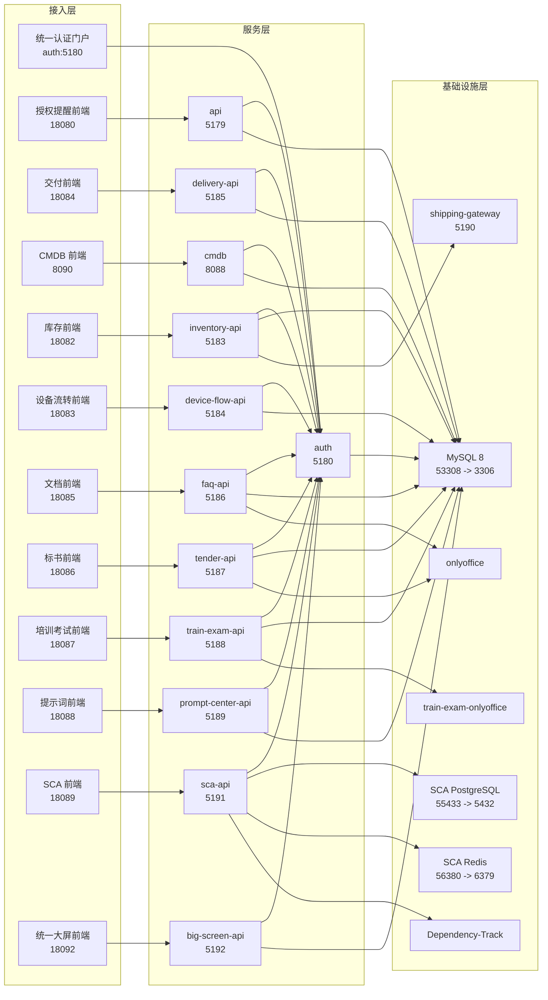

# 系统运行架构总览（含 MySQL 拓扑）

更新时间：2026-06-14

## 结论

当前 `codex-new` 以 11 个现役业务系统为统一口径：

1. 授权到期提醒
2. 交付系统
3. CMDB
4. 库存管理
5. 设备流转
6. 文档管理
7. 标书协同
8. 培训考试
9. 提示词管理中心
10. 软件成分分析平台
11. 统一大屏展示中心

历史兼容资产包括 `ticketing` / `web-ticketing` 和 `sec-impl`。它们仍可用于数据核对、迁移和回溯，但不再计入现役系统口径。

核心拓扑特点：

- 所有现役业务入口由统一认证门户聚合。
- MySQL 仍是单实例多 Schema，但现役业务 Schema 使用独立最小权限运行账号。
- SCA 独立使用 PostgreSQL、Redis、Celery 和扫描 Worker。
- FAQ 与 Tender 共用 OnlyOffice；Train Exam 使用独立 OnlyOffice。
- 每个现役业务后端统一暴露 `/api/health`、`/api/ready`、`/api/version`、`/api/build`、`/api/metrics`。
- 每个现役业务后端统一返回 `X-Request-Id`，结构化访问日志包含 `request_id`、状态码和 `duration_ms`。

## 系统级架构图

## 现役系统总表

| 系统 | 前端入口 | 后端服务 | 主数据存储 | 运行账号 | 关键依赖 |
| --- | --- | --- | --- | --- | --- |
| 授权到期提醒 | `18080` | `api:5179` | `juxin_reminder` | `reminder_user` | Auth、MySQL |
| 交付系统 | `18084` | `delivery-api:5185` | `juxin_delivery` | `delivery_user` | Auth、MySQL |
| CMDB | `8090` | `cmdb:8088` | `cmdb` | `cmdb_user` | Auth、MySQL |
| 库存管理 | `18082` | `inventory-api:5183` | `juxin_inventory` | `inventory_user` | Auth、MySQL、Shipping Gateway |
| 设备流转 | `18083` | `device-flow-api:5184` | `juxin_device_flow` | `device_flow_user` | Auth、MySQL |
| 文档管理 | `18085` | `faq-api:5186` | `juxin_faq` + 文件卷 | `faq_user` | Auth、MySQL、OnlyOffice |
| 标书协同 | `18086` | `tender-api:5187` | `juxin_tender` + 文件卷 | `tender_user` | Auth、MySQL、OnlyOffice |
| 培训考试 | `18087` | `train-exam-api:5188` | `juxin_train_exam` + 文件卷 | `train_exam_user` | Auth、MySQL、独立 OnlyOffice |
| 提示词管理中心 | `18088` | `prompt-center-api:5189` | `juxin_prompt_center` | `prompt_center_user` | Auth、MySQL |
| 软件成分分析平台 | `18089` | `sca-api:5191` | `juxin_sca` | `sca_user` | Auth、PostgreSQL、Redis、Worker |
| 统一大屏展示中心 | `18092` | `big-screen-api:5192` | `juxin_big_screen` | `big_screen_user` | Auth、MySQL、SCA、Train Exam、Reminder |

## MySQL 拓扑

当前整套系统常驻运行的 MySQL 只有一个容器：

- Compose 服务：`mysql`
- 容器内端口：`3306`
- 宿主机映射：`53308 -> 3306`
- 数据卷：`mysql-data`

| Schema | 现役使用方 | 运行账号 | 密码变量 |
| --- | --- | --- | --- |
| `juxin_reminder` | 授权到期提醒、Auth | `reminder_user` / `auth_user` | `REMINDER_MYSQL_PASSWORD` / `AUTH_MYSQL_PASSWORD` |
| `juxin_delivery` | 交付系统 | `delivery_user` | `DELIVERY_MYSQL_PASSWORD` |
| `cmdb` | CMDB | `cmdb_user` | `CMDB_MYSQL_PASSWORD` |
| `juxin_inventory` | 库存管理 | `inventory_user` | `INVENTORY_MYSQL_PASSWORD` |
| `juxin_device_flow` | 设备流转 | `device_flow_user` | `DEVICE_FLOW_MYSQL_PASSWORD` |
| `juxin_faq` | 文档管理、培训考试附加读取 | `faq_user` | `FAQ_MYSQL_PASSWORD` |
| `juxin_tender` | 标书协同 | `tender_user` | `TENDER_MYSQL_PASSWORD` |
| `juxin_train_exam` | 培训考试 | `train_exam_user` | `TRAIN_EXAM_MYSQL_PASSWORD` |
| `juxin_prompt_center` | 提示词管理中心 | `prompt_center_user` | `PROMPT_CENTER_MYSQL_PASSWORD` |
| `juxin_big_screen` | 统一大屏展示中心 | `big_screen_user` | `BIG_SCREEN_MYSQL_PASSWORD` |

## 运维接口口径

每个现役业务后端都应提供：

| 接口 | 用途 |
| --- | --- |
| `/api/health` | 进程存活检查，不访问深层依赖 |
| `/api/ready` | 就绪检查，应覆盖数据库等关键依赖 |
| `/api/version` | 返回服务名和应用版本 |
| `/api/build` | 返回版本、提交号和构建时间 |
| `/api/metrics` | 返回进程级 HTTP 请求量、错误数、并发数、耗时和状态码分布 |

CMDB 后端未直接映射宿主机端口，需通过容器内地址或前置代理检查。

## 历史兼容资产

`ticketing` / `web-ticketing` 与 `sec-impl` 属于历史兼容资产。后续治理原则：

- 不再作为 README、高层设计和门户入口的现役业务系统统计项。
- 保留必要的数据迁移、审计追溯和回归验证能力。
- 新需求优先落入交付系统，不再扩展历史入口。
