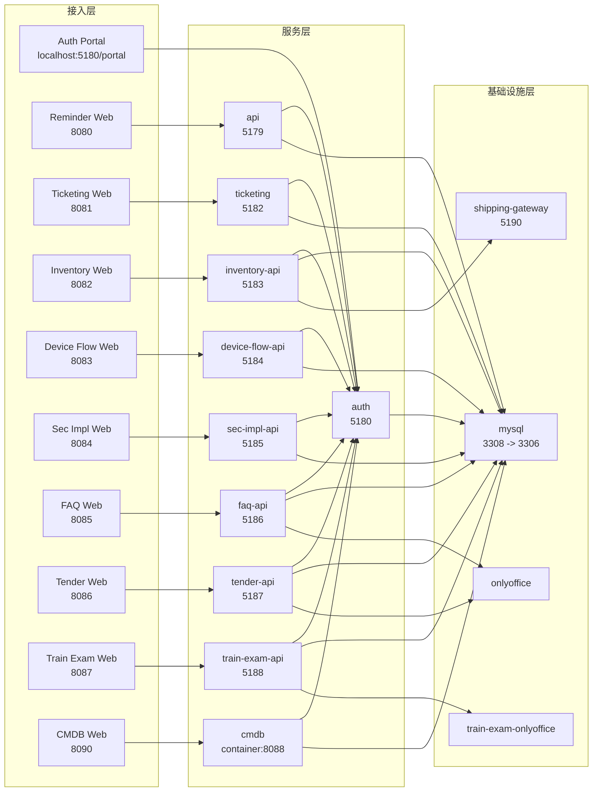

# 系统运行架构总览（含 MySQL 拓扑）

更新时间：2026-03-12

## 结论

当前这套 `codex-new` 本地运行环境，核心特点是：

- 所有业务系统运行在同一个 Compose 项目中
- 常驻 MySQL 只有一个容器：`codex-new-mysql-1`
- 所有业务系统共享同一个认证中心：`codex-new-auth-1`
- 部分系统还共享文档中间件或其他基础设施
- 实际形态是“单 MySQL 容器 + 多业务库 + 多业务服务”，不是“每系统一套独立数据库容器”

## 系统级架构图

阅读说明：

- 这张图是系统级依赖图，不是每个容器端口和网络的完整部署图
- `mysql` 是全系统共享的单实例关系型数据库
- `train-exam-api` 实际还会额外访问 `juxin_faq`，为了保持图面简洁，没有在图里单独拆出第二条 FAQ 数据库分支

## 基础设施总览

| 基础设施 | Compose 服务 | 运行容器 | 对外端口 | 作用 | 备注 |
| --- | --- | --- | --- | --- | --- |
| MySQL | `mysql` | `codex-new-mysql-1` | `3308 -> 3306` | 所有关系型业务库 | 唯一常驻 MySQL 实例 |
| 统一认证 | `auth` | `codex-new-auth-1` | `5180` | 登录、权限、门户入口 | 各业务系统共享 |
| FAQ/Tender 文档中台 | `onlyoffice` | `codex-new-onlyoffice-1` | 无宿主机映射 | FAQ、Tender 在线文档编辑 | 容器内服务 |
| Train Exam 文档中台 | `train-exam-onlyoffice` | `codex-new-train-exam-onlyoffice-1` | 无宿主机映射 | 培训考试在线文档编辑 | 独立 OnlyOffice 实例 |
| 库存物流网关 | `shipping-gateway` | `codex-new-shipping-gateway-1` | `5190` | 库存物流查询聚合 | `inventory-api` 依赖 |
| CMDB MySQL 初始化任务 | `cmdb-mysql-init` | 一次性任务容器 | 无 | 初始化 `cmdb` 库 | 不是第二个 MySQL 实例 |

## 业务系统总表

| 系统 | 前端服务 / 入口 | 前端容器 | 后端服务 / 入口 | 后端容器 | 数据库 | 运行账号 | 中间件依赖 | 备注 |
| --- | --- | --- | --- | --- | --- | --- | --- | --- |
| 主系统 Reminder | `web` / `http://localhost:18080` | `codex-new-web-1` | `api` / `http://localhost:5179` | `codex-new-api-1` | `juxin_reminder` | `juxin` | `mysql`、`auth` | 与 `ticketing`、`auth` 共用提醒主库 |
| 统一认证中心 | 无独立前端容器，入口 `http://localhost:5180/portal` | `codex-new-auth-1` | `auth` / `http://localhost:5180` | `codex-new-auth-1` | `juxin_reminder` | `auth_user` | `mysql` | 提供统一登录、权限、门户导航 |
| 工单系统 | `web-ticketing` / `http://localhost:18081` | `codex-new-web-ticketing-1` | `ticketing` / `http://localhost:5182` | `codex-new-ticketing-1` | `juxin_reminder` | `juxin` | `mysql`、`auth` | 与主系统共库 |
| 库存系统 | `web-inventory` / `http://localhost:18082` | `codex-new-web-inventory-1` | `inventory-api` / `http://localhost:5183` | `codex-new-inventory-api-1` | `juxin_inventory` | `juxin` | `mysql`、`auth`、`shipping-gateway` | 物流能力来自 `shipping-gateway` |
| 设备流转 | `web-device-flow` / `http://localhost:18083` | `codex-new-web-device-flow-1` | `device-flow-api` / `http://localhost:5184` | `codex-new-device-flow-api-1` | `juxin_device_flow` | `juxin` | `mysql`、`auth` | 独立业务库 |
| 等保实施 | `web-sec-impl` / `http://localhost:18084` | `codex-new-web-sec-impl-1` | `sec-impl-api` / `http://localhost:5185` | `codex-new-sec-impl-api-1` | `juxin_sec_impl` | `sec_impl_user` | `mysql`、`auth` | 独立账号、独立库 |
| FAQ | `web-faq` / `http://localhost:18085` | `codex-new-web-faq-1` | `faq-api` / `http://localhost:5186` | `codex-new-faq-api-1` | `juxin_faq` | `faq_user` | `mysql`、`auth`、`onlyoffice` | 依赖 FAQ 专属数据卷 |
| 招投标 | `web-tender` / `http://localhost:18086` | `codex-new-web-tender-1` | `tender-api` / `http://localhost:5187` | `codex-new-tender-api-1` | `juxin_tender` | `tender_user` | `mysql`、`auth`、`onlyoffice` | 共享 FAQ/Tender 的 OnlyOffice |
| 培训考试 | `web-train-exam` / `http://localhost:18087` | `codex-new-web-train-exam-1` | `train-exam-api` / `http://localhost:5188` | `codex-new-train-exam-api-1` | `juxin_train_exam` | `train_exam_user` | `mysql`、`auth`、`train-exam-onlyoffice` | 主业务库 |
| 培训考试附带 FAQ 访问 | 无独立前端 | 无 | `train-exam-api` 内部附加连接 | `codex-new-train-exam-api-1` | `juxin_faq` | `faq_user` | `mysql` | 培训考试还会额外访问 FAQ 库 |
| CMDB | `web-cmdb` / `http://localhost:8090` | `codex-new-web-cmdb-1` | `cmdb` / 容器内 `:8088` | `codex-new-cmdb-1` | `cmdb` | `cmdb_user` | `mysql`、`auth` | 后端未直接映射宿主机端口 |

## 当前运行容器现状

基于当前 `docker compose ps`，正在运行的主要容器包括：

- `codex-new-mysql-1`
- `codex-new-auth-1`
- `codex-new-api-1`
- `codex-new-ticketing-1`
- `codex-new-inventory-api-1`
- `codex-new-device-flow-api-1`
- `codex-new-sec-impl-api-1`
- `codex-new-faq-api-1`
- `codex-new-tender-api-1`
- `codex-new-train-exam-api-1`
- `codex-new-cmdb-1`
- `codex-new-onlyoffice-1`
- `codex-new-train-exam-onlyoffice-1`
- 对应的各套前端 `web-*` 容器

说明：

- `cmdb` 后端只开放容器内 `8088/tcp`，外部访问主要走 `web-cmdb:8090`
- `onlyoffice` 与 `train-exam-onlyoffice` 都没有宿主机端口映射
- `cmdb-mysql-init` 是一次性初始化任务，不属于常驻运行容器

## MySQL 拓扑

### 单实例结论

当前整套系统常驻运行的 MySQL 只有一个容器：

- 容器名：`codex-new-mysql-1`
- Compose 服务名：`mysql`
- 容器内端口：`3306`
- 宿主机映射端口：`3308`

### 当前存在的业务库

根据当前 `SHOW DATABASES`，该单实例中已有业务库：

- `cmdb`
- `juxin_reminder`
- `juxin_inventory`
- `juxin_device_flow`
- `juxin_sec_impl`
- `juxin_faq`
- `juxin_tender`
- `juxin_train_exam`

### 系统到数据库映射

| 系统 | 后端服务 | 运行容器 | MySQL 主机 | 库名 | 运行账号 | 备注 |
| --- | --- | --- | --- | --- | --- | --- |
| 主系统 Reminder | `api` | `codex-new-api-1` | `mysql:3306` | `juxin_reminder` | `juxin` | 与 `ticketing` 共库 |
| 认证中心 | `auth` | `codex-new-auth-1` | `mysql:3306` | `juxin_reminder` | `auth_user` | 与主系统共库，单独账号 |
| 工单系统 | `ticketing` | `codex-new-ticketing-1` | `mysql:3306` | `juxin_reminder` | `juxin` | 与主系统共库 |
| 库存系统 | `inventory-api` | `codex-new-inventory-api-1` | `mysql:3306` | `juxin_inventory` | `juxin` | 独立业务库 |
| 设备流转 | `device-flow-api` | `codex-new-device-flow-api-1` | `mysql:3306` | `juxin_device_flow` | `juxin` | 独立业务库 |
| 等保实施 | `sec-impl-api` | `codex-new-sec-impl-api-1` | `mysql:3306` | `juxin_sec_impl` | `sec_impl_user` | 独立业务库 |
| FAQ | `faq-api` | `codex-new-faq-api-1` | `mysql:3306` | `juxin_faq` | `faq_user` | 独立业务库 |
| 招投标 | `tender-api` | `codex-new-tender-api-1` | `mysql:3306` | `juxin_tender` | `tender_user` | 独立业务库 |
| 培训考试 | `train-exam-api` | `codex-new-train-exam-api-1` | `mysql:3306` | `juxin_train_exam` | `train_exam_user` | 主业务库 |
| 培训考试附加 FAQ 库 | `train-exam-api` | `codex-new-train-exam-api-1` | `mysql:3306` | `juxin_faq` | `faq_user` | 额外连接 FAQ 库 |
| CMDB | `cmdb` | `codex-new-cmdb-1` | `mysql:3306` | `cmdb` | `cmdb_user` | 依赖 MySQL 与 Auth |

## 账号与授权现状

当前 MySQL 中可见的主要业务账号有：

- `auth_user`
- `faq_user`
- `juxin`
- `sec_impl_user`
- `tender_user`
- `train_exam_user`
- `cmdb_user`
- `root`

已核对到的授权关系：

- `auth_user` 仅授权 `juxin_reminder`
- `faq_user` 仅授权 `juxin_faq`
- `train_exam_user` 仅授权 `juxin_train_exam`
- `tender_user` 仅授权 `juxin_tender`
- `sec_impl_user` 仅授权 `juxin_sec_impl`
- `juxin` 已授权：
  - `juxin_reminder`
  - `juxin_inventory`
  - `juxin_device_flow`

这说明：

- 当前不是“每个系统一个 MySQL 容器”，而是“一个 MySQL 容器承载多个业务库”
- 账号隔离做了一部分，但风格还不统一
- `inventory`、`device-flow`、主系统、`ticketing` 仍然复用了 `juxin`
- `cmdb` 已切换为独立账号 `cmdb_user`，运行态不再直接使用 `root`

## 共享关系与特殊点

### 共库关系

- 主系统 `api`
- `auth`
- `ticketing`

这三者共用 `juxin_reminder`。

### 共享文档中台

- FAQ 与 Tender 共用 `onlyoffice`
- Train Exam 使用独立的 `train-exam-onlyoffice`

### 多数据库访问

- `train-exam-api` 除了自己的 `juxin_train_exam` 外，还额外连接 `juxin_faq`

### 多中间件依赖

- `inventory-api` 除 MySQL、Auth 外，还依赖 `shipping-gateway`
- `cmdb` 依赖 MySQL、Auth 和一次性初始化任务 `cmdb-mysql-init`

## Compose 关键配置位置

- MySQL 服务定义：[docker-compose.yml](/Users/zhanglei/Documents/codex-new/docker-compose.yml#L2)
- 主系统 Reminder：[docker-compose.yml](/Users/zhanglei/Documents/codex-new/docker-compose.yml#L15)
- Auth：[docker-compose.yml](/Users/zhanglei/Documents/codex-new/docker-compose.yml#L40)
- Ticketing：[docker-compose.yml](/Users/zhanglei/Documents/codex-new/docker-compose.yml#L80)
- Inventory：[docker-compose.yml](/Users/zhanglei/Documents/codex-new/docker-compose.yml#L162)
- Device Flow：[docker-compose.yml](/Users/zhanglei/Documents/codex-new/docker-compose.yml#L198)
- Sec Impl：[docker-compose.yml](/Users/zhanglei/Documents/codex-new/docker-compose.yml#L234)
- FAQ：[docker-compose.yml](/Users/zhanglei/Documents/codex-new/docker-compose.yml#L271)
- Tender：[docker-compose.yml](/Users/zhanglei/Documents/codex-new/docker-compose.yml#L317)
- Train Exam：[docker-compose.yml](/Users/zhanglei/Documents/codex-new/docker-compose.yml#L379)
- FAQ/Tender OnlyOffice：[docker-compose.yml](/Users/zhanglei/Documents/codex-new/docker-compose.yml#L443)
- Train Exam OnlyOffice：[docker-compose.yml](/Users/zhanglei/Documents/codex-new/docker-compose.yml#L457)
- CMDB MySQL 初始化任务：[docker-compose.yml](/Users/zhanglei/Documents/codex-new/docker-compose.yml#L471)
- CMDB：[docker-compose.yml](/Users/zhanglei/Documents/codex-new/docker-compose.yml#L490)

## 排查建议

如果后续你要继续排查“某个系统到底连了什么”，建议优先按下面顺序看：

1. 看 `docker compose ps`，确认服务和容器是否真的在运行
2. 看 `docker-compose.yml`，确认环境变量里的 `MYSQL_HOST`、`MYSQL_DATABASE`、`AUTH_SERVICE_URL`
3. 如果怀疑账号权限问题，再查 `mysql.user` 和 `SHOW GRANTS`
4. 如果怀疑服务间调用问题，再看 `depends_on` 和容器内服务名

如果目标是后续做环境治理，优先级更高的工作不是“先拆多个 MySQL 容器”，而是：

- 先统一各系统数据库账号边界
- 再决定是否要按系统拆库实例
- 最后才考虑把共享中间件进一步拆开
