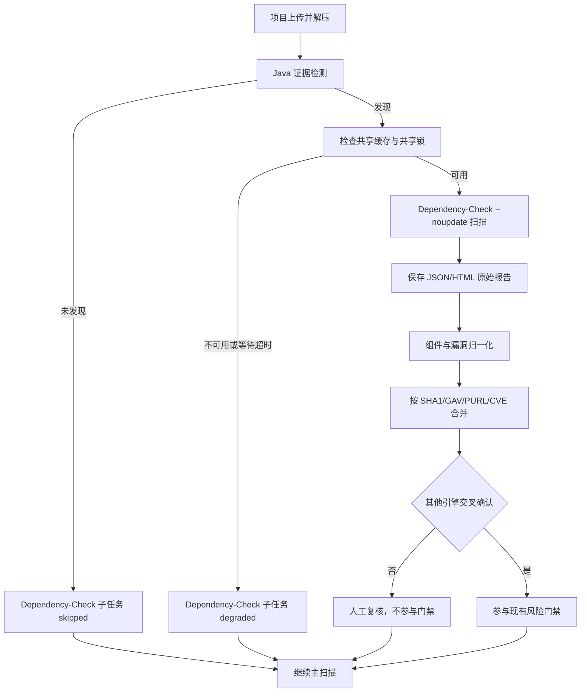

# SCA Dependency-Check Java 深度扫描设计

## 背景

现有 SCA 平台已接入 OpenSCA、Syft、Trivy 和 Dependency-Track，具备项目上传、组件识别、漏洞归一化、多引擎合并、风险门禁和原始报告留存能力。

当前方案对通用制品和 SBOM 覆盖较好，但 Java 项目的 JAR/WAR/EAR、Maven/Gradle 元数据与 CPE 证据仍需要一个专门的本地深度分析器。OWASP Dependency-Check 可以补充这部分证据，但其 CPE 推断存在误报风险，因此不能把单独命中直接当作阻断依据。

本设计将 Dependency-Check 作为现有扫描编排中的可选子扫描器接入，不建设独立微服务，也不替代 Dependency-Track。

## 目标

1. Java 项目或 Java 制品被识别后，自动运行 Dependency-Check。
2. 使用固定版本、共享持久化漏洞数据库缓存，项目扫描期间不在线更新。
3. 保留 Dependency-Check JSON、HTML 原始报告，并归一化到现有组件和漏洞模型。
4. 将 Dependency-Check 结果与 OpenSCA、Trivy、Dependency-Track 结果合并。
5. Dependency-Check 单引擎命中只进入人工复核；跨引擎确认后才参与风险门禁。
6. Dependency-Check 失败、超时或缓存异常时，不使项目主扫描失败。
7. 提供缓存新鲜度、扫描耗时、失败率、独立发现数和交叉确认率等可观测信息。

## 非目标

1. 不以 Dependency-Check 替代 Dependency-Track。
2. 不让所有项目无条件运行 Dependency-Check。
3. 不在项目扫描时从 NVD 或其他外部数据源更新漏洞数据库。
4. 第一版不提供 suppression XML 的前端编辑器。
5. 第一版不建设独立的 Dependency-Check 服务、队列或数据库。
6. 第一版不允许 Dependency-Check 单引擎结果直接阻断发布。

## 核心决策

### 作为扫描器适配器接入

Dependency-Check 复用现有扫描器客户端、Celery 子任务、原始制品、归一化和合并流程。这样可以保持任务状态、日志、报告下载和错误处理一致，避免新增一套服务治理。

### 按 Java 证据自动触发

扫描准备阶段递归检查解压后的项目目录。发现以下任一文件时启用 Dependency-Check：

- `*.jar`
- `*.war`
- `*.ear`
- `pom.xml`
- `build.gradle`
- `build.gradle.kts`

检测结果包含是否启用、触发原因和有限数量的匹配路径。路径列表设置上限，防止大型项目产生过量任务元数据。

没有 Java 证据时创建一个状态为 `skipped` 的子任务，明确记录跳过原因，方便用户区分“未触发”和“执行失败”。

### 共享持久化缓存

scanner-worker 挂载持久化目录 `/data/dependency-check`。独立的周期任务负责更新漏洞数据，项目扫描固定使用 `--noupdate`，避免扫描耗时和结果受外部网络波动影响。

缓存更新与项目扫描通过文件锁协调：

- 更新任务取得独占锁。
- 项目扫描取得共享锁。
- 扫描等待锁超过配置时限后降级跳过 Dependency-Check，不影响其他扫描器。

缓存更新时间、状态、工具版本和错误摘要使用现有 `SystemSetting` 能力持久化，不新建专用数据表。

### 单引擎结果不进入门禁

Dependency-Check 的 CPE 模糊匹配适合作为补充线索，不适合作为唯一阻断证据。

归一化和合并后，每个漏洞结果具有以下确认状态：

- `single_source`：只有 Dependency-Check 命中，进入人工复核，不参与门禁。
- `cross_confirmed`：Dependency-Check 与 OpenSCA、Trivy 或 Dependency-Track 至少一个引擎对同一组件和漏洞形成稳定匹配，可以参与门禁。
- `rejected`：经 suppression 或人工判定排除，不参与门禁。

门禁只消费 `gate_eligible=true` 的结果。Dependency-Check 单引擎结果不得写入会被现有门禁直接消费的规范漏洞记录；只有交叉确认后才可晋升为门禁候选。

## 总体流程



## 模块设计

### Java 项目检测器

新增轻量检测模块，输入为已解压项目根目录，输出结构化结果：

```text
enabled: boolean
reasons: string[]
matched_paths: string[]
```

检测规则需要：

- 忽略符号链接指向的项目目录外路径。
- 复用现有扫描忽略目录配置。
- 限制遍历文件数、目录深度和匹配路径数量。
- 路径只保存相对项目根目录的安全形式。

### Dependency-Check 客户端

新增 `dependency_check_client.py`，复用现有 `run_scanner_command()` 执行、超时、日志截断和报告路径处理能力。

扫描参数包括：

- 项目标识。
- 扫描根目录。
- JSON 和 HTML 输出。
- 数据目录 `/data/dependency-check`。
- `--noupdate`。
- 全局 suppression XML。

命令参数必须以数组形式构造，不拼接 shell 字符串。项目名称、路径和外部配置不得写入可执行片段。

第一版固定 Dependency-Check `12.1.9`。后续升级只能通过受控版本变更完成，并同步验证报告结构和数据缓存兼容性。

### 缓存更新任务

新增 Celery 任务 `sca.update_dependency_check_data`，由 beat 周期触发，默认每日低峰运行一次。

更新任务职责：

1. 取得独占文件锁。
2. 运行 Dependency-Check 数据更新。
3. 将日志写入受控目录并限制大小。
4. 更新 `SystemSetting` 中的开始时间、成功时间、状态、工具版本和错误摘要。
5. 更新失败时保留上一次可用缓存，不删除现有数据。

`NVD_API_KEY` 仅通过环境变量注入。日志、任务结果和 API 响应不得输出密钥。

部署后首次没有可用缓存时，项目扫描降级跳过，并在界面显示“漏洞库尚未初始化”；由运维先执行一次更新任务。

### 原始报告

每次成功执行至少保存：

- `dependency-check-report.json`
- `dependency-check-report.html`
- 标准输出日志
- 标准错误日志

报告通过现有 `RawScanArtifact` 和 `ScannerTaskResult` 注册，不设计新的文件下载机制。报告路径必须经过现有安全路径校验。

### 归一化

新增 `dependency_check_normalizer.py`，将报告映射到现有结构：

- `NormalizedComponentData`
- `NormalizedVulnerabilityData`

组件证据优先级：

1. 文件 SHA1。
2. Maven GAV。
3. PURL。
4. 明确的软件坐标和版本。
5. CPE 推断。

漏洞归一化至少保留：

- CVE 或其他漏洞标识。
- 严重等级和 CVSS。
- 受影响组件名称、版本、PURL、CPE、SHA1、GAV。
- Dependency-Check evidence 和匹配置信度。
- 描述、参考链接和修复版本。
- suppression 状态。
- 原始报告中的定位信息。

仅有 CPE 推断、缺少稳定组件标识的结果标记为低置信度和 `single_source`。

### 多引擎合并

组件合并按以下顺序匹配：

1. 相同 SHA1。
2. 相同规范化 Maven GAV。
3. 相同 PURL。
4. 相同生态、包名和版本。
5. CPE 模糊匹配，仅作为候选，不单独形成交叉确认。

漏洞合并要求漏洞标识一致，并且组件满足前四种稳定匹配之一。仅 CVE 相同但组件不一致时不得交叉确认。

现有 `confidence_engine` 和 `vulnerability_merger` 增加 Dependency-Check 来源规则，但保持其他引擎既有行为不变。

### 门禁规则

合并结果增加或明确计算以下字段：

- `confirmation_status`
- `gate_eligible`
- `confirmation_engines`
- `review_reason`

规则如下：

| 场景 | 人工复核 | 参与门禁 |
| --- | --- | --- |
| Dependency-Check 单独命中 | 是 | 否 |
| Dependency-Check 与任一现有漏洞引擎稳定匹配 | 按现有置信度规则 | 是 |
| 仅 CPE 模糊匹配 | 是 | 否 |
| 已 suppression | 否 | 否 |
| Dependency-Check 执行失败或跳过 | 不适用 | 不改变其他引擎门禁结果 |

实现前需要沿现有门禁调用链确认其实际消费表。修改应放在统一门禁查询或规范漏洞晋升位置，不能只在前端隐藏单引擎结果。

## 任务编排

在现有项目扫描步骤中增加：

1. Java 证据检测。
2. Dependency-Check 扫描或跳过。
3. Dependency-Check 归一化。

Dependency-Check 与其他独立扫描器可并行执行，但其归一化必须在组件和漏洞最终合并前完成。

子任务状态使用现有状态体系，并补充可识别的结果语义：

- `success`
- `skipped`
- `degraded`
- `failed`

若现有数据库枚举不支持 `degraded`，第一版使用现有失败状态加结构化 `non_blocking=true` 元数据，不为单个扫描器扩展全局枚举。

Dependency-Check 子任务失败后：

- 保存可用日志。
- 记录非阻断错误摘要。
- 继续其他归一化、合并、报告和门禁流程。
- 项目扫描结果标记“部分扫描器不可用”，而不是整体失败。

## 配置与部署

计划增加以下配置，名称最终遵循现有配置模块风格：

| 配置 | 默认值 | 说明 |
| --- | --- | --- |
| Dependency-Check 启用开关 | `true` | 全局紧急停用 |
| 数据目录 | `/data/dependency-check` | 持久化漏洞库 |
| 扫描超时 | `30m` | 单项目最大运行时间 |
| 锁等待超时 | `2m` | 更新期间扫描等待上限 |
| 更新周期 | `24h` | beat 调度周期 |
| 缓存过期阈值 | `72h` | 超过后提示过期 |
| suppression 文件 | `/etc/dependency-check/suppression.xml` | 全局误报规则 |
| NVD API Key | 无 | 仅环境变量提供 |

`Dockerfile.scanner` 增加固定版本 Dependency-Check，并保持最终容器非 root 运行。Compose 为 scanner-worker 增加持久化 volume 和只读 suppression 配置挂载。

项目扫描阶段除读取本地缓存外，不允许 Dependency-Check 主动访问外部漏洞源。缓存更新任务是唯一允许的数据更新入口。

## 前端设计

项目扫描详情沿用现有任务和原始报告界面，增加 Dependency-Check 展示：

- 子任务状态。
- 自动触发或跳过原因。
- 使用的工具版本。
- 漏洞库最近成功更新时间和新鲜度。
- 独立发现数量。
- 交叉确认数量。
- 非阻断错误摘要。
- JSON、HTML 原始报告链接。

漏洞列表增加来源和确认状态展示：

- “Dependency-Check 独立发现”。
- “已被 Trivy/OpenSCA/Dependency-Track 确认”。
- “待人工复核”。
- “不参与门禁”。

第一版不增加 suppression 编辑入口。误报规则由受控配置文件维护并通过代码评审发布。

## 安全与资源控制

1. 固定工具版本和下载校验值。
2. scanner-worker 继续以非 root 用户运行。
3. 扫描路径限制在项目工作目录内。
4. 禁止 shell 字符串拼接。
5. 限制扫描超时、日志大小、报告大小和并发数。
6. 更新任务与扫描任务通过锁避免缓存损坏。
7. NVD API Key 不入库、不入日志、不进入任务参数。
8. HTML 报告作为下载附件提供，不直接以内联可信页面执行。
9. suppression XML 只读挂载，并在启动或更新时校验 XML 格式。

## 可观测性

平台应记录并展示：

- 漏洞库最近更新时间和距今天数。
- 数据更新成功率和最近错误。
- Dependency-Check 扫描数量、跳过数量、失败数量。
- P50/P95 扫描耗时。
- 每个项目的独立发现数量。
- 每个项目的交叉确认数量。
- 独立发现转为交叉确认的比例。

第一版优先复用现有任务统计和系统设置接口，不引入新的监控基础设施。

## 测试策略

### 单元测试

1. Java 标记文件触发和非 Java 项目跳过。
2. 符号链接、忽略目录、深度和数量限制。
3. Dependency-Check JSON 正常、缺字段和异常结构解析。
4. SHA1、GAV、PURL、包名版本和 CPE 的合并优先级。
5. 单引擎结果为 `single_source` 且 `gate_eligible=false`。
6. 稳定组件匹配加同一漏洞标识后转为 `cross_confirmed`。
7. 仅 CVE 相同、组件不同不得交叉确认。
8. suppression 结果不参与门禁。

### 集成测试

1. 含 Maven/Gradle/JAR 证据的项目自动运行。
2. 非 Java 项目明确跳过。
3. 扫描命令包含 `--noupdate` 并使用共享数据目录。
4. JSON、HTML、stdout、stderr 被注册为原始制品。
5. Dependency-Check 超时或退出非零时主扫描继续。
6. 缓存更新任务独占锁，扫描任务按配置等待或降级。
7. 无缓存和过期缓存均产生清晰状态。
8. 交叉确认结果参与门禁，独立结果不参与门禁。

### 容器测试

1. 工具版本为固定的 `12.1.9`。
2. scanner-worker 非 root。
3. 数据 volume 可持久化并可被更新任务和扫描任务读取。
4. suppression XML 只读且格式错误时给出明确诊断。

## 验收标准

1. Java 项目自动出现 Dependency-Check 子任务，非 Java 项目显示跳过原因。
2. 连续两次扫描复用持久化缓存，项目扫描不执行在线更新。
3. 成功扫描可下载 JSON 和 HTML 报告。
4. Dependency-Check 单独发现的高危漏洞不会阻断门禁。
5. 同一组件和 CVE 被其他引擎稳定确认后，按现有严重度规则参与门禁。
6. Dependency-Check 失败不会导致项目主扫描失败。
7. 页面可查看缓存新鲜度、触发原因、独立发现数和交叉确认数。
8. 单元、集成和容器相关测试通过。

## 灰度发布

1. 在测试环境初始化共享漏洞库并验证缓存更新。
2. 选择 10 至 20 个有代表性的 Java 项目，覆盖 Maven、Gradle、JAR、WAR 和多模块项目。
3. 对比 Dependency-Check 与现有引擎的独立发现、交叉确认和误报情况。
4. 根据人工复核结果完善 suppression XML。
5. 确认扫描耗时、磁盘增长和失败率可接受后启用生产自动触发。
6. 生产初期保留全局开关，异常时只停用 Dependency-Check，不影响其他扫描器。

## 预计改动范围

后续实施计划预计涉及：

- `sca-platform/backend/app/scanners/`：Java 检测器、客户端、归一化器。
- `sca-platform/backend/app/scanners/merger/`：来源、置信度和交叉确认规则。
- `sca-platform/backend/app/celery_app.py`：项目子任务和周期更新任务。
- `sca-platform/backend/app/config.py` 及环境配置：开关、目录、超时和缓存参数。
- `sca-platform/backend/app/models.py`、`schemas.py` 或门禁查询：仅在现有字段无法表达确认状态时做最小扩展。
- `sca-platform/Dockerfile.scanner` 和 Compose 配置：固定工具版本、持久化 volume、suppression 挂载。
- `sca-platform/frontend/src/`：任务状态、确认状态、缓存新鲜度和报告入口。
- `sca-platform/backend/tests/`：检测、归一化、合并、门禁、缓存和失败隔离测试。
- `sca-platform/README.md`：部署、缓存初始化、更新和 suppression 运维说明。

具体文件与迁移方式在实施计划阶段以代码现状为准，不提前创建不必要的数据表或新服务。

## 风险与应对

| 风险 | 应对 |
| --- | --- |
| NVD 数据量导致首次初始化慢、占用磁盘 | 独立初始化、持久化缓存、展示进度和新鲜度 |
| CPE 推断误报 | 单引擎待复核、suppression、交叉确认后才进门禁 |
| Java 大型项目扫描过慢 | 超时、并发限制、可配置开关、非阻断降级 |
| 更新与扫描并发损坏缓存 | 独占/共享文件锁和保留上次可用缓存 |
| 报告格式随版本变化 | 固定版本、解析契约测试、受控升级 |
| Dependency-Check 故障影响主流程 | 独立子任务、失败隔离、其他引擎继续 |
| HTML 报告包含不可信内容 | 仅附件下载，不在业务域内联执行 |

## 参考资料

- OWASP Dependency-Check releases: <https://github.com/dependency-check/DependencyCheck/releases>
- Dependency-Check 与 Dependency-Track 对比: <https://docs.dependencytrack.org/odt-odc-comparison/>
- Dependency-Check analyzers: <https://jeremylong.github.io/DependencyCheck/analyzers/index.html>
- Dependency-Check suppressions: <https://jeremylong.github.io/DependencyCheck/general/suppression.html>
- Dependency-Check data sources: <https://jeremylong.github.io/DependencyCheck/data/index.html>
