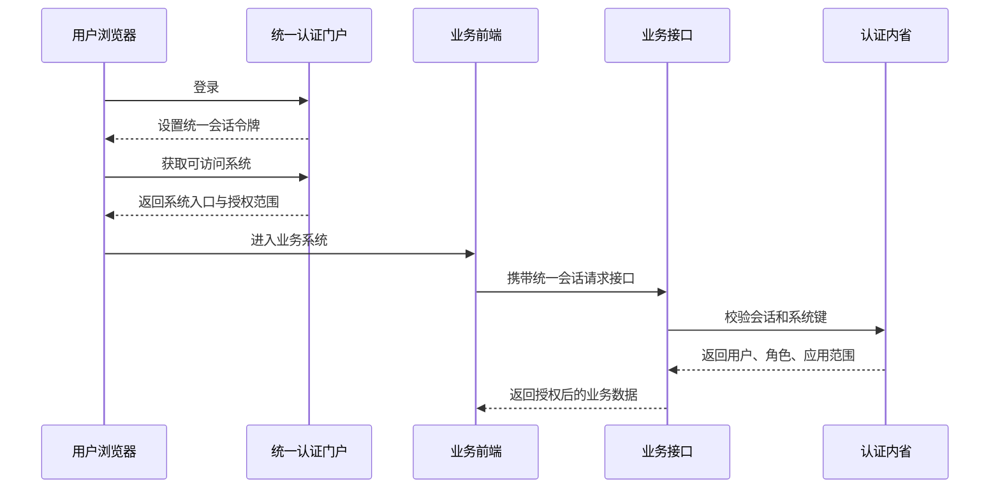

# 聚信多系统业务平台高层设计

> 文档状态：已确认设计
>
> 编制日期：2026-06-13
>
> 适用版本：`5.70.18` 及后续兼容版本
>
> 主要读者：技术负责人、研发人员、测试人员、部署与运维交接人员
>
> 现状基准：仓库根 `docker-compose.yml`、`auth/portal-routing.js` 与各系统当前实现

## 1. 文档定位

本文描述聚信多系统业务平台的当前高层架构、系统边界、数据关系、部署方式和运维要求，并给出后续演进建议。

本文采用以下口径：

- **现役业务系统**：统一门户当前可展示和授权的 11 个业务系统。
- **平台能力**：统一认证与门户、管理中心、审计中心、共享数据库和中间件。
- **兼容资产**：仓库和 Compose 中仍保留，但不再作为独立门户业务入口的历史系统。
- **未来建议**：尚未完全实现的目标能力，均使用“建议”或“目标态”标识，不与当前事实混写。

当前门户的 11 个业务系统为：

1. 授权到期提醒系统（Reminder）
2. 交付系统（Delivery）
3. CMDB 系统
4. 库存管理系统（Inventory）
5. 设备流转系统（Device Flow）
6. 文档管理系统（FAQ）
7. 标书协同制作系统（Tender）
8. 培训考试系统（Train Exam）
9. 提示词管理中心（Prompt Center）
10. 软件成分分析平台（SCA）
11. 统一大屏展示中心（Big Screen）

平台还提供两个专用中心：

- 聚信管理后台（Admin Center）
- 聚信审计中心（Audit Center）

## 2. 建设目标与非目标

### 2.1 建设目标

- 以统一登录门户承载所有现役系统入口和访问授权。
- 以明确的系统键、服务边界和数据库边界隔离业务域。
- 允许不同技术栈按业务特点独立演进，同时保持统一认证和部署规范。
- 通过 Docker Compose 提供单机或单节点环境的一键部署能力。
- 为技术负责人提供系统关系全景，为运维人员提供可执行的交接基线。
- 识别当前共享资源、兼容资产和架构风险，形成后续治理路线。

### 2.2 非目标

- 本文不替代各系统详细需求、接口契约和数据库设计文档。
- 本文不承诺当前环境已经具备多节点高可用、自动扩缩容或跨地域容灾。
- 本文不将目录存在等同于生产启用，运行边界以根 Compose 和门户路由为准。
- 本文不展开每个页面、字段、表结构和接口参数。

## 3. 全局架构

### 3.1 容器化总体分层

```mermaid
flowchart TB
  User["业务用户 / 管理员 / 审计员"] --> Auth["统一入口容器<br/>auth / 5180<br/>统一门户 / 管理后台 / 审计中心"]

  subgraph Compose["Docker Compose 网络"]
    Auth

    subgraph Web["前端容器 / Nginx"]
      WebMain["授权提醒前端<br/>web"]
      WebDelivery["交付前端<br/>web-delivery"]
      WebCmdb["配置管理前端<br/>web-cmdb"]
      WebInventory["库存前端<br/>web-inventory"]
      WebDevice["设备流转前端<br/>web-device-flow"]
      WebFaq["文档前端<br/>web-faq"]
      WebTender["标书前端<br/>web-tender"]
      WebTrain["培训考试前端<br/>web-train-exam"]
      WebPrompt["提示词前端<br/>web-prompt-center"]
      WebSca["软件成分分析前端<br/>web-sca"]
      WebScreen["统一大屏前端<br/>web-big-screen"]
    end

    subgraph Api["业务接口容器"]
      ReminderApi["授权提醒接口<br/>api"]
      DeliveryApi["交付接口<br/>delivery-api"]
      CmdbApi["配置管理接口<br/>cmdb"]
      InventoryApi["库存接口<br/>inventory-api"]
      DeviceApi["设备流转接口<br/>device-flow-api"]
      FaqApi["文档接口<br/>faq-api"]
      TenderApi["标书接口<br/>tender-api"]
      TrainApi["培训考试接口<br/>train-exam-api"]
      PromptApi["提示词接口<br/>prompt-center-api"]
      ScaApi["软件成分分析接口<br/>sca-api"]
      ScreenApi["统一大屏接口<br/>big-screen-api"]
    end

    subgraph Async["异步与集成容器"]
      ScaWorker["SCA 任务 / 扫描 / 定时<br/>sca-worker / sca-scanner-worker / sca-beat"]
      Shipping["物流网关<br/>shipping-gateway"]
      Docs["在线文档编辑<br/>onlyoffice / train-exam-onlyoffice"]
      DT["软件物料分析辅助<br/>dependency-track-apiserver / frontend"]
    end

    subgraph Data["数据与持久化容器 / 卷"]
      MySQL["MySQL 数据<br/>mysql / mysql-data"]
      PostgreSQL["SCA PostgreSQL<br/>sca-postgres / sca-postgres-data"]
      Redis["SCA Redis<br/>sca-redis / sca-redis-data"]
      Volumes["业务文件卷<br/>faq/tender/train-exam<br/>sca-upload/report/sbom/cache"]
    end
  end

  Auth --> Web
  Web --> Api
  Api --> Auth
  Api --> MySQL
  ScaApi --> PostgreSQL
  ScaApi --> Redis
  ScaApi --> ScaWorker
  ScaWorker --> PostgreSQL
  ScaWorker --> Redis
  ScaWorker --> Volumes
  InventoryApi --> Shipping
  FaqApi --> Docs
  TenderApi --> Docs
  TrainApi --> Docs
  ScreenApi --> ReminderApi
  ScreenApi --> TrainApi
  ScreenApi --> ScaApi

  Legacy["历史兼容容器<br/>ticketing / web-ticketing"] -. "门户权限归一化" .-> DeliveryApi
```



### 3.2 架构风格

平台当前是“统一认证门户 + 多业务服务 + 共享基础设施”的模块化单仓架构：

- 代码集中在同一仓库，业务系统按目录和服务独立。
- 业务服务主要通过 HTTP API 通信，不直接读取其他系统数据库。
- 关系型业务数据主要位于一个 MySQL 实例的多个 Schema。
- SCA 因异步扫描和数据模型需要，独立使用 PostgreSQL、Redis 和 Celery。
- 前端以独立静态站点部署，由 Nginx 承载。
- 根 Docker Compose 是当前完整运行拓扑的主要编排入口。

该形态适合当前统一交付和中小规模部署，但共享数据库实例、单节点中间件和分散配置会形成共同故障域。

## 4. 平台能力设计

### 4.1 统一认证与门户

统一认证服务 `auth` 同时承担以下职责：

- 登录、登出、验证码、密码修改和多因素认证。
- 通过 HttpOnly Cookie 保存统一会话。
- 签发和校验会话令牌，维护会话有效期与撤销状态。
- 提供 `/api/auth/introspect`，供业务服务校验用户身份和系统访问范围。
- 根据角色和 `app_access` 计算门户可访问系统。
- 通过 `/api/auth/apps` 返回用户可见的系统入口。
- 提供系统切换入口和专用中心跳转。

每个业务服务使用唯一系统键进行授权判断，例如 `inventory`、`delivery`、`sca`。历史键 `ticketing` 和 `sec-impl` 在门户访问控制中统一归一化为 `delivery`。

### 4.2 角色与访问模型

平台基础角色包括：

| 角色 | 高层职责 |
| --- | --- |
| `admin` | 业务管理和多数业务系统写操作 |
| `editor` | 内容、文档、培训和提示词等编辑能力 |
| `reviewer` | 内容审核和培训审核能力 |
| `user` / `sales` | 普通业务或本人数据范围访问 |
| `sysadmin` | 管理中心、账号和安全配置 |
| `auditor` | 审计中心及被授权业务域的只读审计 |

角色只是基础权限来源。业务系统仍需在后端结合系统键、资源归属和操作类型执行二次授权，不能只依赖前端菜单隐藏。

### 4.3 管理中心

管理中心由 `auth` 服务直接提供，不是独立容器。主要能力包括：

- 用户创建、编辑、删除、批量删除和导入导出。
- 用户解锁、密码重置和系统访问范围配置。
- 部门维护。
- 密码策略、会话时长、MFA 和邮件等安全配置。

管理中心默认面向 `sysadmin`，业务管理员不应自动获得平台级安全配置权限。

### 4.4 审计中心

审计中心同样由 `auth` 服务提供，负责：

- 聚合本地和已接入业务系统的操作日志。
- 按系统、用户、动作、对象和时间查询。
- 对支持签名链的业务日志执行验签。
- 导出审计结果。

当前审计中心通过 HTTP 调用多个业务服务的审计接口。它是统一查看入口，但并不意味着所有业务审计数据已经集中存储。

### 4.5 共享中间件

| 中间件 | 使用方 | 当前设计 |
| --- | --- | --- |
| MySQL 8 | Auth、Reminder、Delivery、CMDB、Inventory、Device Flow、FAQ、Tender、Train Exam、Prompt Center、Big Screen | 单实例、多 Schema |
| PostgreSQL 16 | SCA、Dependency-Track | SCA 主数据与 Dependency-Track 外部数据库 |
| Redis 7 | SCA | 缓存、Celery Broker 和结果存储 |
| OnlyOffice | FAQ、Tender | 共用实例和文档密钥 |
| Train Exam OnlyOffice | Train Exam | 独立实例和独立文档密钥 |
| Shipping Gateway | Inventory | 聚合菜鸟、顺丰、京东等物流查询 |
| Dependency-Track | SCA | SBOM 上传、项目和漏洞结果补充 |

## 5. 现役系统设计

### 5.1 授权到期提醒系统

**系统键：** `reminder`

**目录：** 根后端 `server`、前端 `web`

**技术栈：** Node.js/Express、React/Vite、MySQL

核心职责：

- 客户、联系人和授权信息台账。
- 到期规则、发送计划、自动提醒和手动补发。
- 邮件、短信、企业微信等发送配置和记录。
- 导入导出、仪表盘和操作审计。

Reminder 与 Auth 共用 `juxin_reminder`，属于当前最明显的历史共享数据边界。后续拆分时应先梳理用户、配置和业务表的所有权。

### 5.2 交付系统

**系统键：** `delivery`

**目录：** `delivery`

**技术栈：** Node.js/Express、React/Vite、MySQL

核心职责：

- 管理交付项目、交付单、项目成员、评论和排期。
- 执行 `INIT -> ASSESS -> IMPLEMENT -> TUNE -> TRIAL -> ACCEPT -> HANDOVER -> CLOSED` 固定流程。
- 对关键阶段执行强制留证。
- 支持退回重做、批量推进、导入导出和 SLA 管理。
- 使用链式哈希形成可验签审计记录。

交付系统使用独立数据库 `juxin_delivery` 和账号 `delivery_user`。它是 Ticketing 与 Sec-Impl 能力整合后的现役门户系统，并提供旧数据迁移脚本。

### 5.3 CMDB 系统

**系统键：** `cmdb`

**目录：** `cmdb`

**技术栈：** Go/Gin、React/Vite、MySQL

核心职责：

- 管理配置项（CI）、关系、生命周期和变更历史。
- 使用稳定 `ci_uid` 作为跨系统引用标识。
- 对变更操作写入审计和变更日志。
- 预留事务 Outbox 与 Kafka 事件集成能力。

根 Compose 当前设置 `OUTBOX_ENABLED=false`，且未编排 Kafka。因此事件总线属于可启用能力，不应视为当前默认运行依赖。

### 5.4 库存管理系统

**系统键：** `inventory`

**目录：** `inventory-system`

**技术栈：** Node.js/Express、React/Vite、MySQL

核心职责：

- 商品、仓位、使用位置等主数据。
- 入库、出库、盘点、发货和库存台账。
- 批次、序列号和库存流水追踪。
- 通过物流网关查询运输轨迹和状态。
- 操作日志查询与导出。

物流网关是独立服务，负责供应商适配、令牌校验、限流和超时控制。库存系统不应直接保存第三方物流供应商的调用实现。

### 5.5 设备流转系统

**系统键：** `device-flow`

**目录：** `device-flow`

**技术栈：** Node.js/Express、React/Vite、MySQL

核心职责：

- 管理设备从收货、检查、安装、测试、审批、打包到发货的固定流程。
- 阶段推进不可跳步，并支持按规则退回。
- 管理阶段附件、批量导入和批量处理。
- 提供 SLA 看板、超时统计、审计链和验签。

设备流转系统使用独立 Schema，但当前仍复用 MySQL 账号 `juxin`，属于后续账号隔离治理项。

### 5.6 文档管理系统

**系统键：** `faq`

**目录：** `faq`

**技术栈：** Node.js/Express、React/Vite、MySQL、OnlyOffice

核心职责：

- 管理文档条目、分类、部门知识库和版本。
- 支持文件上传、预览、下载、恢复和发布。
- 通过编辑会话和锁控制在线协作。
- 使用 OnlyOffice 完成在线编辑和回调保存。
- 记录内容变更和审计日志。

FAQ 的文档文件、预览、草稿和可编辑版本位于持久化卷。数据库备份不能替代文件卷备份。

### 5.7 标书协同制作系统

**系统键：** `tender`

**目录：** `tender`

**技术栈：** Node.js/Express、React/Vite、MySQL、OnlyOffice

核心职责：

- 标书项目、文档解析、章节编排和协同编辑。
- 草稿、版本、素材、水印、预览和可编辑文档管理。
- OCR、AI 辅助生成、风险检查和质量评估。
- 文档导出、审计记录和保留策略。

Tender 与 FAQ 共用 OnlyOffice 实例和文档 JWT 密钥，但使用独立数据库和文件卷。OCR 和 AI 服务属于可选外部依赖，未配置时核心文档流程应保持可用。

### 5.8 培训考试系统

**系统键：** `train-exam`

**目录：** `train-exam`

**技术栈：** Node.js/Express、React/Vite、MySQL、OnlyOffice

核心职责：

- 课程、学习路径、资源和学习进度。
- 题库、试卷、发布计划、考试会话和自动评分。
- 成绩、证书、补考、错题和复训建议。
- Excel 导题、AI 出题和模型配置。
- 本地文件或 OSS 视频资源管理。

Train Exam 使用独立 OnlyOffice 实例，避免与 FAQ/Tender 的文档密钥和编辑负载耦合。它以 `juxin_train_exam` 为主库，同时通过独立连接读取 `juxin_faq`，这是当前明确存在的跨域只读数据依赖。

### 5.9 提示词管理中心

**系统键：** `prompt-center`

**目录：** `prompt-center`

**技术栈：** Node.js/Express、React/Vite、MySQL

核心职责：

- 按部门和分类管理提示词。
- 支持创建、编辑、发布、归档和版本回滚。
- 支持收藏、使用记录和概览统计。
- 记录提示词变更审计。

提示词中心使用独立数据库 `juxin_prompt_center`。部门信息当前属于业务侧分类数据，与管理中心的平台部门配置需要明确同步或引用规则，避免形成两个互相冲突的部门主数据源。

### 5.10 软件成分分析平台

**系统键：** `sca`

**目录：** `sca-platform`

**技术栈：** Python/FastAPI、Vue 3/Element Plus、PostgreSQL、Redis、Celery

核心职责：

- 源码包上传、分片上传和项目管理。
- Maven、npm、PyPI、Go 和容器基础镜像依赖识别。
- SBOM、组件证据链、漏洞查询和风险排序。
- Syft、Trivy、Grype、OpenSCA 和 Dependency-Track 多引擎扫描。
- AI 漏洞降噪、整改闭环、持续风险监测和 DevSecOps 集成。
- 报告、SBOM、扫描结果和备份文件管理。

SCA 将 API、普通 Worker、扫描 Worker 和定时调度拆分为独立容器。长耗时扫描必须通过异步任务执行，API 仅负责创建任务、查询状态和返回结果。

SCA 依赖 OSV、NVD、GitHub Advisory、各语言包仓库和可选 AI 服务。外部服务失败时应保留扫描任务状态、错误原因和可重试能力。

### 5.11 统一大屏展示中心

**系统键：** `big-screen`

**目录：** `big-screen-center`

**技术栈：** TypeScript/Express、Vue 3、ECharts、Three.js、MySQL

核心职责：

- 聚合 SCA、Train Exam 和 Reminder 的指标数据。
- 通过适配器统一不同系统的指标格式。
- 提供模板目录、双布局大屏、草稿、发布、回滚和播放列表。
- 提供离线资源包、播放令牌和来源健康检查。
- 使用缓存、过期数据兜底和熔断降低来源系统故障影响。

Big Screen 是面向展示的 BFF，不直接读取三个来源系统的数据库。其本地数据库只保存模板、版本、播放列表、令牌和审计等自身数据。

## 6. 统一系统总表

| 类型 | 系统 | 系统键 | 前端入口 | API/服务 | 主数据存储 | 关键依赖 |
| --- | --- | --- | --- | --- | --- | --- |
| 平台 | 统一认证与门户 | - | `5180` | `auth:5180` | `juxin_reminder` | MySQL |
| 平台 | 管理中心 | `admin-center` | `5180/admin-center` | Auth 内置接口 | `juxin_reminder` | Auth |
| 平台 | 审计中心 | `audit-center` | `5180/audit-center` | Auth 聚合接口 | 本地 + 远程审计源 | Auth、业务 API |
| 业务 | 授权到期提醒 | `reminder` | `18080` | `api:5179` | `juxin_reminder` | Auth、MySQL |
| 业务 | 交付系统 | `delivery` | `18084` | `delivery-api:5185` | `juxin_delivery` | Auth、MySQL |
| 业务 | CMDB | `cmdb` | `8090` | `cmdb:8088`（容器内） | `cmdb` | Auth、MySQL |
| 业务 | 库存管理 | `inventory` | `18082` | `inventory-api:5183` | `juxin_inventory` | Auth、MySQL、物流网关 |
| 业务 | 设备流转 | `device-flow` | `18083` | `device-flow-api:5184` | `juxin_device_flow` | Auth、MySQL |
| 业务 | 文档管理 | `faq` | `18085` | `faq-api:5186` | `juxin_faq` + 文件卷 | Auth、MySQL、OnlyOffice |
| 业务 | 标书协同 | `tender` | `18086` | `tender-api:5187` | `juxin_tender` + 文件卷 | Auth、MySQL、OnlyOffice、可选 OCR/AI |
| 业务 | 培训考试 | `train-exam` | `18087` | `train-exam-api:5188` | `juxin_train_exam` + 文件卷 | Auth、MySQL、独立 OnlyOffice、可选 OSS/AI |
| 业务 | 提示词中心 | `prompt-center` | `18088` | `prompt-center-api:5189` | `juxin_prompt_center` | Auth、MySQL |
| 业务 | 软件成分分析 | `sca` | `18089` | `sca-api:5191` | `juxin_sca` + 文件卷 | Auth、PostgreSQL、Redis、Celery、扫描器 |
| 业务 | 统一大屏 | `big-screen` | `18092` | `big-screen-api:5192` | `juxin_big_screen` | Auth、MySQL、SCA、Train Exam、Reminder |

端口以当前根 Compose 为准。MySQL、PostgreSQL 和 Redis 的当前宿主机映射分别为 `53308`、`55433` 和 `56380`；生产环境不应默认向公网暴露数据库端口。

## 7. 数据架构

### 7.1 数据库映射

| 数据库 | 引擎 | 主要所有者 | 备注 |
| --- | --- | --- | --- |
| `juxin_reminder` | MySQL | Reminder、Auth | 历史上还承载 Ticketing 表 |
| `juxin_delivery` | MySQL | Delivery | 现役交付域独立库 |
| `cmdb` | MySQL | CMDB | 独立账号 `cmdb_user` |
| `juxin_inventory` | MySQL | Inventory | 当前复用账号 `juxin` |
| `juxin_device_flow` | MySQL | Device Flow | 当前复用账号 `juxin` |
| `juxin_faq` | MySQL | FAQ | Train Exam 存在附加读取连接 |
| `juxin_tender` | MySQL | Tender | 独立账号与文件卷 |
| `juxin_train_exam` | MySQL | Train Exam | 独立账号与文件卷 |
| `juxin_prompt_center` | MySQL | Prompt Center | 独立账号 |
| `juxin_big_screen` | MySQL | Big Screen | 只保存大屏自身配置与运行数据 |
| `juxin_sca` | PostgreSQL | SCA | Dependency-Track 也连接该 PostgreSQL 实例 |

### 7.2 数据所有权原则

- 一个业务域必须对自己的表结构、迁移和数据质量负责。
- 新功能禁止继续扩大 `juxin_reminder` 的跨系统共享范围。
- 跨系统读取优先通过 API；现有 Train Exam 读取 FAQ 数据库属于待治理例外。
- 文件型业务必须同时定义数据库记录与文件对象的备份、恢复和一致性策略。
- 外部系统标识应保存为稳定业务键，不保存可变展示名称作为唯一关联。

### 7.3 事务与一致性

当前大多数业务操作在单个服务和单个数据库事务内完成。跨系统流程原则上采用最终一致性：

- 调用方记录请求和结果，失败时保留可重试状态。
- 接收方接口应支持幂等键或业务唯一键。
- 长耗时操作转为异步任务，并暴露任务状态。
- 不使用跨数据库分布式事务。

CMDB 已预留 Outbox 设计，后续引入事件总线时可作为平台事件集成范式。

## 8. 集成架构

### 8.1 统一认证调用



业务 API 在认证服务不可用、会话无效或系统键未授权时应拒绝受保护操作。开发绕过能力不得在生产环境启用。

### 8.2 文档协作

- FAQ 和 Tender 共用 `onlyoffice`。
- Train Exam 使用 `train-exam-onlyoffice`。
- 业务服务负责生成编辑配置、文件下载地址和回调地址。
- OnlyOffice JWT 密钥必须通过环境变量注入，并与对应业务服务一致。
- 编辑回调应校验签名、会话和文档版本，避免旧回调覆盖新版本。

### 8.3 大屏数据聚合

Big Screen 通过三个适配器调用 SCA、Train Exam 和 Reminder：

- 适配器将来源数据转换为统一指标信封。
- 不同指标使用独立缓存时效。
- 来源失败时可返回有效期内的旧数据，并标记不可用来源。
- 连续失败触发熔断，健康接口展示来源状态。

### 8.4 SCA 外部集成

SCA 外部依赖分为四类：

- 漏洞情报：OSV、NVD、GitHub Advisory。
- 软件仓库：Maven Central、npm、PyPI、Go Proxy、GitHub。
- 扫描工具：OpenSCA、Syft、Trivy、Grype、Dependency-Track。
- 可选服务：OpenAI 兼容接口、邮件、GitHub/GitLab/Jenkins Webhook。

所有外部依赖都应设置超时，记录来源和失败原因。缺少可选凭证时应关闭对应能力，不得使用仓库内默认密钥代替生产凭证。

## 9. 部署架构

### 9.1 当前部署方式

当前部署基线是仓库根目录 `docker-compose.yml`。它不是补充脚本，而是本地、测试和中小规模交付环境的主运行拓扑。

根 Compose 编排：

- 统一认证、11 个现役业务系统及其前端。
- MySQL、SCA PostgreSQL、SCA Redis。
- SCA API、Worker、扫描 Worker 和 Beat。
- Dependency-Track API 与前端。
- 两套 OnlyOffice。
- 物流网关和 CMDB 初始化任务。
- Ticketing 历史兼容服务。

当前部署适合单机开发、测试和中小规模交付。所有服务位于同一 Compose 网络，通过服务名访问。

### 9.2 Docker Compose 分层

当前 Compose 可按五层理解：

| 层级 | Compose 服务 | 作用 |
| --- | --- | --- |
| 接入层 | `auth`、各 `web-*`、`web`、`web-cmdb` | 提供统一门户、专用中心和各系统前端静态站点 |
| 业务 API 层 | `api`、`delivery-api`、`inventory-api`、`device-flow-api`、`faq-api`、`tender-api`、`train-exam-api`、`prompt-center-api`、`sca-api`、`big-screen-api`、`cmdb` | 承载业务接口、鉴权、审计和领域逻辑 |
| 异步任务层 | `sca-worker`、`sca-scanner-worker`、`sca-beat` | 执行 SCA 长耗时扫描、持续风险监测和定时任务 |
| 集成服务层 | `shipping-gateway`、`onlyoffice`、`train-exam-onlyoffice`、`dependency-track-apiserver`、`dependency-track-frontend` | 提供物流、在线文档编辑和 SBOM/漏洞辅助分析能力 |
| 数据与初始化层 | `mysql`、`sca-postgres`、`sca-redis`、`cmdb-mysql-init` | 提供关系型数据库、缓存/队列和一次性数据库初始化 |

从高层设计角度看，Compose 同时承担三件事：

- **运行编排**：定义服务、镜像、构建上下文、端口和依赖关系。
- **环境注入**：通过 `.env`、环境变量和构建参数注入数据库、密钥、CORS、外部服务地址。
- **数据挂载**：通过命名卷保存数据库、文档、上传文件、报告、SBOM、扫描结果和缓存。

### 9.3 镜像与构建策略

Compose 中存在两类镜像来源：

- **本地构建镜像**：业务 API、业务前端、Auth、CMDB、SCA API/Worker、OnlyOffice 字体镜像等由仓库目录构建。
- **第三方基础镜像**：MySQL、PostgreSQL、Redis、Dependency-Track、Node、Nginx、Go、Alpine 等通过环境变量指定或使用默认镜像。

高层构建策略为：

- Node 系服务以 Node 20 为主，前端构建后由 Nginx 承载静态资源。
- CMDB 使用 Go 1.22 构建。
- SCA 后端使用 Python/FastAPI，并拆分普通运行镜像和扫描 Worker 镜像。
- 镜像源通过 `NODE_20_*_IMAGE`、`NGINX_ALPINE_IMAGE`、`MYSQL_IMAGE`、`ONLYOFFICE_DOCUMENTSERVER_IMAGE` 等变量覆盖，便于在国内镜像源或企业私有仓库中部署。
- 日常启动优先复用已有镜像；代码变更、首次部署或基础镜像变化时再执行重建。

### 9.4 端口暴露策略

当前端口映射按“门户、业务前端、业务 API、数据服务、辅助服务”分组：

| 类别 | 当前端口 | 说明 |
| --- | --- | --- |
| 统一门户 | `5180` | Auth、门户、管理中心、审计中心 |
| 业务前端 | `18080`、`18082`-`18089`、`18092`、`8090` | Reminder、Inventory、Device Flow、Delivery、FAQ、Tender、Train Exam、Prompt Center、SCA、Big Screen、CMDB |
| 业务 API | `5179`、`5183`-`5189`、`5191`、`5192` | 各业务后端 API |
| 集成服务 | `5190`、`18090`、`18091` | 物流网关、Dependency-Track API 和前端 |
| 数据服务 | `53308`、`55433`、`56380` | MySQL、SCA PostgreSQL、SCA Redis 的宿主机映射 |
| 历史兼容 | `18081`、`5182` | Ticketing 前后端仍存在于 Compose，但不作为现役门户入口 |

生产环境建议：

- 只通过统一 HTTPS 入口暴露门户和业务前端。
- 数据库、Redis、Dependency-Track 管理入口不直接暴露公网。
- 业务 API 优先由反向代理或内网访问控制承载。
- 端口映射应形成环境清单，避免测试环境和生产环境混用。

### 9.5 数据卷与持久化策略

当前 Compose 定义的持久化卷包括：

| 数据卷 | 主要使用方 | 保存内容 |
| --- | --- | --- |
| `mysql-data` | MySQL | Auth、Reminder、Delivery、CMDB、Inventory、Device、FAQ、Tender、Train、Prompt、Big Screen 等 MySQL 数据 |
| `faq-data` | FAQ | 上传文件、预览、草稿和可编辑文档 |
| `tender-data` | Tender | 标书上传、版本、草稿、素材、水印、预览和编辑文件 |
| `train-exam-data` | Train Exam | 课程资源、导入文件和证书 |
| `sca-postgres-data` | SCA PostgreSQL | SCA 与 Dependency-Track 关系型数据 |
| `sca-redis-data` | SCA Redis | Redis AOF、缓存、任务状态相关数据 |
| `sca-upload-data` | SCA | 源码上传文件 |
| `sca-report-data` | SCA | 报告文件 |
| `sca-sbom-data` | SCA | SBOM 和镜像分析文件 |
| `sca-backup-data` | SCA | SCA 备份文件 |
| `sca-scanner-results` | SCA Scanner Worker | 多引擎扫描原始结果 |
| `sca-trivy-cache` | SCA Scanner Worker | Trivy 缓存 |
| `dependency-track-data` | Dependency-Track | Dependency-Track 应用数据 |

备份设计必须覆盖数据库和文件卷两类对象。只备份 MySQL 会导致 FAQ、Tender、Train Exam、SCA 的文件型数据无法完整恢复。

### 9.6 启动依赖与健康检查

Compose 当前通过 `depends_on` 描述主要启动依赖：

- 大多数业务 API 依赖 `mysql` 和 `auth`。
- FAQ/Tender 依赖 `onlyoffice`。
- Train Exam 依赖 `train-exam-onlyoffice`。
- SCA API/Worker/Beat 依赖 `sca-postgres` 和 `sca-redis` 健康检查。
- Big Screen 依赖 `mysql`、`auth`、`api`、`train-exam-api` 和 `sca-api`。
- CMDB 依赖一次性任务 `cmdb-mysql-init` 完成数据库初始化。

需要注意：

- `depends_on` 只能保证容器启动顺序，不能替代业务就绪检查。
- SCA 的 PostgreSQL 和 Redis 已配置容器级健康检查，是当前较完整的就绪依赖样板。
- 其他系统仍需要补充应用级 `/health` 或 `/ready` 检查，并纳入发布验证脚本。
- 初始化任务和业务迁移应保持幂等，避免容器重启后重复写入脏数据。

### 9.7 Docker 运维命令基线

日常运维建议统一使用仓库脚本，而不是手写长命令：

```bash
# 启动已有镜像，适合日常验证
./scripts/deploy/docker-compose-aliyun.sh start

# 代码、Dockerfile 或依赖变更后重建
./scripts/deploy/docker-compose-aliyun.sh rebuild

# 只验证某个系统，可追加服务名
./scripts/deploy/docker-compose-aliyun.sh start mysql auth sca-postgres sca-redis sca-api web-sca

# 查看容器状态和日志
docker compose ps
docker compose logs -f auth sca-api web-sca
```

建议形成标准发布步骤：

1. 校验 `.env` 必填项。
2. 拉取代码和目标分支。
3. 执行最快相关测试。
4. 重建受影响服务。
5. 启动服务并检查健康接口。
6. 验证门户、系统切换、退出登录和目标业务主流程。
7. 记录版本号、镜像标签、提交号和回退点。

### 9.8 配置与密钥

- `.env.example` 只提供变量结构，真实密码和密钥必须由部署环境提供。
- 数据库密码、JWT 密钥、审计签名密钥、文档密钥和第三方令牌不得提交到 Git。
- 生产环境应启用 HTTPS、安全 Cookie 和严格安全模式。
- CORS 只允许实际使用的门户和业务域名。
- 业务容器不应以数据库 root 账号运行。

当前 Compose 仍存在开发默认值和固定示例密钥。它们可以支持本地启动，但必须列为生产部署前置检查项。

### 9.9 启停与健康检查

推荐的运维顺序：

1. 检查 `.env` 必填项和磁盘空间。
2. 启动数据库与中间件。
3. 执行一次性数据库初始化和迁移。
4. 启动 Auth。
5. 启动业务 API 和异步 Worker。
6. 启动业务前端。
7. 检查健康接口、登录、门户入口和关键依赖。

SCA 已对 PostgreSQL 和 Redis 配置 Compose 健康检查；其他业务的依赖启动条件并不完全等价于业务就绪，运维脚本仍需执行应用级健康验证。

## 10. 安全设计

### 10.1 身份与会话

- 使用统一 Cookie 名 `juxin_auth_token`。
- 会话在 Auth 侧持久化，可撤销并校验过期时间。
- 生产环境启用 HTTPS、Secure Cookie 和合理的 SameSite 策略。
- 密码策略、验证码、锁定和 MFA 由管理中心统一配置。

### 10.2 接口安全

- 所有写接口必须在服务端鉴权。
- 浏览器写操作应启用 CSRF 防护。
- 上传接口限制大小、类型、路径和下载权限。
- 外部回调和 Webhook 使用独立密钥验签。
- 批量接口限制单次记录数，避免资源耗尽。
- 错误响应不返回堆栈、SQL、密钥或内部路径。

### 10.3 审计安全

- 关键新增、修改、删除、发布、推进和配置操作必须留痕。
- 审计记录至少包含系统、用户、动作、对象、来源 IP 和时间。
- 支持签名链的系统应保留在线验签和异常定位能力。
- 审计导出必须受角色和系统范围约束。
- 审计中心聚合失败不能导致业务写入失败，但应产生可观测告警。

### 10.4 当前安全风险

- 部分 Compose 配置仍有开发默认密码或固定示例密钥。
- 共享 MySQL 实例扩大了数据库故障和误授权影响面。
- 部分业务仍复用 `juxin` 数据库账号。
- 依赖安装基线当前报告 12 个已知漏洞，需要独立排期评估和修复。
- 多个数据服务映射到宿主机端口，生产部署必须通过防火墙或网络策略限制。

## 11. 可靠性与故障处理

### 11.1 当前策略

- 单业务服务失败原则上不应阻断其他业务系统登录和使用。
- Auth 是所有受保护系统的共同依赖，当前属于关键单点。
- MySQL 是多数业务的共同依赖，当前属于共享故障域。
- SCA 通过异步 Worker 隔离扫描耗时和 API 请求。
- Big Screen 通过缓存、旧数据兜底和熔断降低来源系统抖动影响。
- 外部 OCR、AI、漏洞源和物流服务应按可选依赖处理。

### 11.2 错误处理要求

- API 返回稳定错误码、可读消息和请求关联标识。
- 超时与远程失败不得转换为无上下文的 500。
- 异步任务保存状态、进度、失败原因和重试次数。
- 批量任务按条目记录成功与失败，避免整批无差别回滚。
- 文件写入失败时清理临时文件，避免产生孤儿记录。
- 降级数据必须明确标记时间和来源状态，不能伪装成实时数据。

### 11.3 恢复目标建议

当前仓库未定义统一 RPO/RTO。建议按数据等级补充：

| 等级 | 典型数据 | 建议 RPO | 建议 RTO |
| --- | --- | --- | --- |
| 核心 | 用户、授权、交付、库存、CMDB、考试结果 | 15 分钟以内 | 2 小时以内 |
| 重要 | FAQ、Tender、Prompt、SCA 项目与整改数据 | 1 小时以内 | 4 小时以内 |
| 可重建 | 缓存、临时扫描结果、派生报表 | 24 小时以内或可重建 | 8 小时以内 |

以上为目标建议，落地前需要结合部署环境和业务 SLA 确认。

## 12. 可观测性与运维

### 12.1 当前可观测入口

- 各业务健康接口。
- Docker Compose 容器状态与日志。
- 业务操作日志和统一审计中心。
- SCA 任务、扫描和持续风险监测记录。
- Big Screen 来源健康接口。

### 12.2 建议统一指标

- HTTP 请求量、错误率和延迟。
- Auth 登录成功率、失败原因、会话数和鉴权延迟。
- 数据库连接池、慢查询、容量和备份状态。
- Worker 队列长度、任务耗时、失败率和重试次数。
- 文件卷容量、增长率和孤儿文件数量。
- 外部依赖成功率、超时率和熔断状态。

建议后续引入统一结构化日志、指标采集和分布式追踪，并为每个请求贯穿 `request_id`。

### 12.3 备份范围

运维备份不能只覆盖 MySQL：

- MySQL 全实例及按 Schema 恢复能力。
- SCA PostgreSQL。
- FAQ、Tender、Train Exam 和 SCA 文件卷。
- SCA 报告、SBOM、扫描原始结果和备份卷。
- 配置模板、部署清单和密钥管理系统中的配置版本。

至少每季度执行一次恢复演练，并记录恢复耗时和数据完整性。

## 13. 测试与质量保障

### 13.1 测试分层

| 层级 | 目标 |
| --- | --- |
| 单元测试 | 权限规则、状态机、数据转换、签名、缓存和错误映射 |
| API 测试 | 鉴权、CRUD、流程约束、分页、导入导出和失败响应 |
| 契约测试 | Auth introspection、审计聚合、Big Screen 适配器和第三方网关 |
| 集成测试 | MySQL/PostgreSQL/Redis/OnlyOffice/Celery 的真实组合 |
| 端到端测试 | 登录、系统切换、关键业务流程和退出 |
| 安全测试 | 越权、CSRF、上传、注入、会话、密钥和依赖漏洞 |
| 运维测试 | 启停、迁移、备份恢复、磁盘不足和依赖中断 |

### 13.2 发布门禁建议

- 版本自动化测试通过。
- 受影响系统的单元和 API 测试通过。
- Compose 配置可解析，服务和端口无冲突。
- 门户系统数量、系统键和入口测试通过。
- 数据库迁移具备升级与回滚说明。
- 生产密钥检查无默认值。
- 高危和严重依赖漏洞有修复或书面风险接受结论。
- 关键系统完成登录、切换、退出和角色权限回归。

## 14. 运维交接清单

### 14.1 环境资料

- 当前版本分支和提交号。
- `.env` 变量清单及密钥保管位置。
- 域名、证书、反向代理和防火墙规则。
- 数据库、文件卷和备份存储位置。
- 第三方服务账号、额度和到期时间。

### 14.2 每日检查

- Auth、MySQL、PostgreSQL、Redis 和关键业务健康状态。
- 容器重启次数、磁盘和文件卷容量。
- 登录失败、鉴权失败和异常审计事件。
- SCA 队列积压和扫描失败。
- 外部物流、漏洞源、AI、OCR 和 OSS 调用失败。

### 14.3 变更操作

- 变更前备份数据库和相关文件卷。
- 先执行配置检查和最快相关测试。
- 只重建受影响服务，避免无必要的全量重建。
- 变更后验证登录、门户、目标系统和审计记录。
- 记录版本、时间、操作者、变更内容和回退点。

## 15. 架构演进路线

### 15.1 第一阶段：事实与配置治理

- 更新 README 和旧拓扑文档，统一 11 个现役系统口径。
- 清除生产配置中的固定示例密钥和弱默认值。
- 为每个业务 Schema 使用独立最小权限账号。
- 统一健康、就绪、版本和构建信息接口。
- 建立数据库与文件卷配套恢复演练。

### 15.2 第二阶段：平台治理

- 通过统一反向代理提供域名、TLS、限流和安全头。
- 统一 Auth SDK 或中间件，减少各系统重复实现。
- 定义统一审计事件模型和接入规范。
- 明确平台部门主数据与业务部门分类的边界。
- 将 Train Exam 对 FAQ 数据库的直连替换为 API 或受控同步。

### 15.3 第三阶段：可靠性与可观测性

- 引入集中日志、指标、告警和链路追踪。
- 为 Auth、MySQL、PostgreSQL 和 Redis设计高可用方案。
- 对文件卷引入对象存储或具备版本化的共享存储。
- 为异步任务统一重试、死信、幂等和任务观测规范。

### 15.4 第四阶段：解耦与兼容资产退役

- 启用 CMDB Outbox，并按实际需要引入事件总线。
- 将跨系统同步从数据库读取逐步迁移到 API 或事件。
- 完成 Ticketing、Sec-Impl 到 Delivery 的数据核对和归档。
- 在无调用方、无未迁移数据和具备回退备份后，移除历史容器与旧系统键。

## 16. 历史兼容资产

### 16.1 Ticketing

- 目录 `ticketing` 和 Compose 服务 `ticketing`、`web-ticketing` 仍存在。
- 使用 `juxin_reminder`，宿主机入口为 `18081/5182`。
- 当前统一门户不再展示 `ticketing` 系统卡片。
- 门户权限中的 `ticketing` 历史键归一化为 `delivery`。

### 16.2 Sec-Impl

- 目录 `sec-impl` 和历史文档仍存在。
- 当前根 Compose 的 `18084/5185` 已由 `web-delivery`、`delivery-api` 使用。
- 当前统一门户不再展示 `sec-impl` 系统卡片。
- 门户权限中的 `sec-impl` 历史键归一化为 `delivery`。
- Delivery 迁移脚本可从 `juxin_sec_impl` 读取历史数据。

### 16.3 退役原则

兼容资产不得直接删除。退役前必须满足：

1. 已完成数据迁移和数量、状态、附件、审计抽样核对。
2. 已确认无用户、脚本、书签或外部系统继续访问旧入口。
3. 已保留数据库和文件备份。
4. 已明确回退窗口和负责人。
5. 已更新 README、部署脚本、测试和监控。

## 17. 快速索引

| 主题 | 主要位置 |
| --- | --- |
| 完整运行拓扑 | `docker-compose.yml` |
| 门户系统键和历史别名 | `auth/portal-routing.js` |
| 门户系统展示名称 | `auth/system-access-display.js` |
| 统一认证与专用中心 | `auth/index.js` |
| Reminder | `server`、`web` |
| Delivery | `delivery` |
| CMDB | `cmdb` |
| Inventory | `inventory-system` |
| Device Flow | `device-flow` |
| FAQ | `faq` |
| Tender | `tender` |
| Train Exam | `train-exam` |
| Prompt Center | `prompt-center` |
| SCA | `sca-platform` |
| Big Screen | `big-screen-center` |
| 部署脚本 | `scripts/deploy` |
| API 契约 | 各系统 `api/openapi` 或路由实现 |

## 18. 设计结论

平台已经形成清晰的统一门户和多业务域雏形，现役产品边界应以 11 个门户业务系统、两个平台专用中心和共享基础设施为准。

当前最重要的架构治理方向不是立即拆分所有服务，而是先完成四件事：

1. 统一文档、系统键和运行拓扑口径。
2. 收紧密钥、数据库账号和生产网络边界。
3. 补齐统一健康、备份恢复和可观测能力。
4. 消除跨库读取与历史兼容资产带来的长期耦合。

在此基础上，再根据容量、故障影响和团队边界推进高可用、事件驱动和独立部署。
