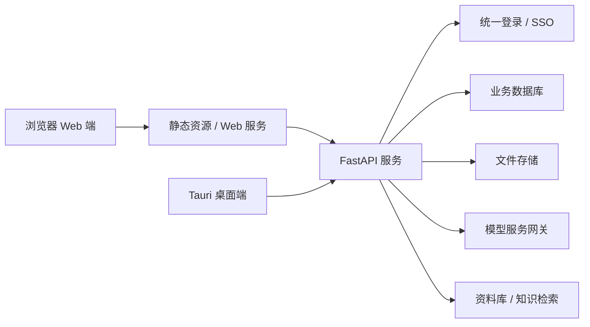

# 聚信 AI 助手 Web 版设计文档

## 背景

当前聚信 AI 助手以内测桌面端为主，桌面端基于 React + Vite + Tauri，后端基于 FastAPI。桌面形态适合本地加密、钥匙串、本地草稿、自动更新等能力，但 Windows、macOS、Linux 多平台分发和升级成本较高。

为了让员工在任意系统上都能使用 AI 助手，需要新增 Web 版。Web 版面向公网可访问场景，第一阶段只开放给聚信内部员工，架构上预留未来客户登录、客户项目空间和资料权限隔离。

## 目标

1. 让员工通过浏览器访问聚信 AI 助手，不依赖桌面客户端。
2. 复用现有 React 页面和 FastAPI 能力，避免重写一套系统。
3. 支持公网访问，但按企业 Web 系统标准设计认证、权限、上传、下载和日志安全。
4. 保留桌面端，不破坏现有 Windows/macOS/Linux 桌面打包路径。
5. 为未来客户账号、客户项目资料空间和客户协作预留权限模型。

## 非目标

1. 本阶段不做客户开放访问。
2. 本阶段不做完整 SaaS 多租户计费系统。
3. 本阶段不迁移桌面端本地钥匙串能力到浏览器。
4. 本阶段不在浏览器保存模型 API Key。
5. 本阶段不重写全部前端页面。
6. 本阶段不开放公网匿名访问。

## 产品定位

Web 版产品定位沿用当前文案：

- 产品名称：聚信 AI 助手 · 私人工作助理
- 核心定位：每个人的私人工作助理
- 用户感知能力：写材料、查资料、整理文档、生成报告、导出 Word

Web 版首页和主要功能仍以普通办公用户能理解的语言展示，不暴露 Agent、RAG、Embedding、Chunk、Tool Call、Prompt 等技术词。

## 用户范围

### 一期用户

- 聚信内部员工
- 管理员

### 预留用户

- 客户联系人
- 客户项目成员
- 客户侧管理员

一期只实现员工和管理员入口。客户相关字段和权限模型可以预留，但不开放页面和登录入口。

## 总体架构



### 核心原则

1. 前端尽量复用 `apps/desktop/src` 的 React 组件和页面。
2. 新增 Web 运行模式，用环境变量区分桌面和浏览器。
3. 桌面端保留 Tauri bridge；Web 端使用浏览器 HTTP API。
4. Web 端所有敏感能力必须由服务端鉴权后执行。
5. Word 导出、资料下载、文件预览都走服务端受控接口。

## 前端改造设计

### 目录策略

优先采用“一套前端，两种运行模式”。

建议结构：

```text
apps/desktop/
  src/
    api/
    components/
    pages/
    remote/
    web/
```

新增或调整：

- `apps/desktop/src/runtime/platform.ts`
- `apps/desktop/src/runtime/capabilities.ts`
- `apps/desktop/src/remote/webBridge.ts`
- `apps/desktop/src/remote/desktopBridge.ts`

### 平台能力分层

统一定义能力开关：

```ts
type RuntimePlatform = 'desktop' | 'web';

type RuntimeCapabilities = {
  canUseLocalKeychain: boolean;
  canUseLocalDrafts: boolean;
  canOpenLocalFile: boolean;
  canUseAutoUpdater: boolean;
  canUseServerWordExport: boolean;
  canUseUnifiedLogin: boolean;
};
```

桌面端：

- `canUseLocalKeychain = true`
- `canUseLocalDrafts = true`
- `canOpenLocalFile = true`
- `canUseAutoUpdater = true`
- `canUseServerWordExport = true`
- `canUseUnifiedLogin = true`

Web 端：

- `canUseLocalKeychain = false`
- `canUseLocalDrafts = false`
- `canOpenLocalFile = false`
- `canUseAutoUpdater = false`
- `canUseServerWordExport = true`
- `canUseUnifiedLogin = true`

### Web 端隐藏或替换的能力

| 桌面能力 | Web 端处理 |
| --- | --- |
| macOS/Windows 钥匙串保存模型 API Key | 隐藏，改为服务端统一模型配置 |
| 本地草稿 | 暂不开放，后续可改为服务端草稿 |
| 打开本地 Word 文件 | 改为浏览器下载 |
| 桌面自动更新 | 隐藏 |
| Tauri invoke 调用 | 改为 HTTP API |
| 托盘、窗口管理 | 隐藏 |

### Web 端保留能力

- 工作台
- 助手模式
- 聊天生成
- 我的资料
- 公司知识库 / 查公司知识
- 历史任务
- 工作成果
- Word 导出
- 管理员资料审核
- 模型选择，前提是模型由服务端配置

## 后端改造设计

### Web 会话认证

公网 Web 版必须使用统一登录。

建议策略：

1. 登录后服务端写入 HttpOnly Secure Cookie。
2. Cookie 设置 `SameSite=Lax` 或按 SSO 需求调整。
3. 前端不把访问令牌写入 `localStorage`。
4. 所有 API 基于服务端会话解析 `current_user`。
5. 管理接口必须校验管理员角色。

### API 分组

现有 API 可以继续使用，但要明确 Web 访问边界：

- `/api/ai/*`：AI 任务、聊天、生成、历史任务
- `/api/knowledge/*`：资料上传、检索、审核、分类
- `/api/files/*`：受控下载、预览、导出
- `/api/admin/*`：管理员配置和治理
- `/api/auth/*`：登录状态、退出、SSO 回调

### 服务端模型配置

Web 端不允许用户在浏览器保存模型 API Key。

建议：

1. 管理员在服务端配置模型供应商、Base URL、模型名称和密钥。
2. 密钥只存在服务端安全配置或密钥管理服务中。
3. 普通员工只能选择管理员允许的模型或助手模式。
4. 日志中永远不输出完整 API Key。

## 文件上传与下载安全

### 上传要求

1. 限制文件类型：
   - `txt`
   - `md`
   - `pdf`
   - `docx`
   - `xlsx`
   - `pptx`
2. 限制文件大小，默认建议：
   - 普通附件：50MB
   - 管理员资料库上传：100MB
3. 文件名服务端重命名存储。
4. 禁止路径穿越。
5. 记录上传人、上传时间、用途、资料范围。
6. 解析失败要有明确状态，不影响其他任务。

### 下载要求

1. 不暴露服务器真实路径。
2. 通过鉴权接口下载。
3. 下载前校验用户是否有权限访问该文件。
4. Word 导出文件设置有效期。
5. 过期文件可清理。

## 权限模型

### 一期角色

- `employee`：普通员工
- `admin`：管理员

### 预留角色

- `customer_user`：客户成员
- `customer_admin`：客户管理员
- `project_member`：项目成员

### 权限范围

| 资料类型 | 一期访问规则 | 未来扩展 |
| --- | --- | --- |
| 当前附件 | 仅当前任务创建人可用 | 可按项目任务共享 |
| 我的资料 | 仅上传人可用 | 可授权给项目成员 |
| 公司知识库 | 按员工角色和资料权限可查 | 可拆分客户可见正式资料 |
| 项目资料 | 一期可预留字段 | 按项目空间隔离 |
| 客户资料 | 一期不开放 | 按客户租户隔离 |

## 数据隔离设计

为未来客户开放预留以下字段：

- `tenant_id`
- `project_id`
- `owner_user_id`
- `visibility`
- `source_type`
- `approved_by`
- `approved_at`

一期可以将 `tenant_id` 默认设为 `juxin_internal`。所有查询必须带用户和权限条件，不能只按文件 ID 查询。

## 部署设计

### 一期推荐部署

```text
Nginx / Ingress
  ├── /              -> Web 静态资源
  ├── /api/*         -> FastAPI
  ├── /downloads/*   -> FastAPI 受控下载，不直出目录
  └── /auth/*        -> 统一登录回调
```

### 公网基础要求

1. 全站 HTTPS。
2. CORS 白名单。
3. 登录接口限流。
4. 上传接口限流。
5. 生成接口限流和并发控制。
6. 管理接口只允许管理员访问。
7. 错误页面不显示堆栈。
8. 服务日志脱敏。

## 桌面端与 Web 端关系

### 桌面端继续保留

桌面端适合：

- 内网测试
- 本地模型配置
- 本地密钥加密
- 本地草稿
- 自动更新
- 打开本地文件

### Web 端主打便捷访问

Web 端适合：

- 跨 Windows / macOS / Linux 使用
- 公网统一登录
- 集中模型配置
- 服务端 Word 导出
- 统一资料库治理
- 后续客户项目协作

## 分阶段实施计划

### Phase 0：Web 版边界梳理

目标：明确哪些桌面能力可以 Web 化，哪些必须隐藏。

交付：

- Web 端能力矩阵。
- API 安全清单。
- 受影响页面清单。

验收：

- 不存在“浏览器调用 Tauri invoke”的路径。
- Web 端不会显示钥匙串、本地模型、本地更新等桌面能力。

### Phase 1：前端运行模式抽象

目标：让同一套 React 能识别 `desktop` 和 `web` 两种模式。

交付：

- `runtime/platform.ts`
- `runtime/capabilities.ts`
- `webBridge.ts`
- 现有 `desktopBridge.ts` 保留

验收：

- `npm run build` 通过。
- Web 模式下不引用 Tauri-only API。
- 桌面模式原功能不受影响。

### Phase 2：Web 登录与会话

目标：Web 端只能通过统一登录访问。

交付：

- 登录态检查接口。
- 退出登录接口。
- 前端未登录跳转统一登录。
- 管理接口角色校验。

验收：

- 未登录无法访问工作台 API。
- 普通员工无法访问管理 API。
- Cookie 使用 HttpOnly / Secure。

### Phase 3：Web 文件与 Word 导出

目标：替换桌面本地文件能力。

交付：

- 服务端 Word 导出下载。
- 文件预览和下载鉴权。
- 上传文件类型和大小限制。

验收：

- Web 端点击导出 Word 后浏览器下载。
- 下载链接不暴露服务器路径。
- 无权限用户无法下载他人文件。

### Phase 4：Web 页面适配

目标：让核心页面在浏览器中可用。

交付：

- 工作台
- 助手模式
- 聊天页
- 我的资料
- 历史任务
- 工作成果
- 设置中的 Web 端可见项

验收：

- 浏览器能完成一次“输入任务 → 生成 → 导出 Word”。
- 浏览器能上传当前附件并生成内容。
- 浏览器能查看历史任务。
- 不显示桌面端不可用按钮。

### Phase 5：公网安全加固

目标：满足公网使用的基础安全要求。

交付：

- HTTPS 部署说明。
- CORS 白名单。
- API 限流策略。
- 上传/下载审计。
- 日志脱敏检查。

验收：

- 错误响应不暴露堆栈。
- 日志不含完整 API Key。
- 上传路径不能路径穿越。
- 未授权请求返回 401/403。

## 测试策略

### 前端测试

- Web 模式不加载 Tauri API。
- 桌面模式仍可加载 Tauri bridge。
- Web 端隐藏本地模型、钥匙串、自动更新入口。
- Word 导出按钮在 Web 端触发下载接口。

### 后端测试

- 未登录访问核心 API 返回 401。
- 普通员工访问管理 API 返回 403。
- 文件上传限制类型和大小。
- 文件下载必须鉴权。
- Word 导出只返回当前用户可访问内容。

### 端到端测试

核心链路：

1. 用户打开公网 Web 地址。
2. 跳转统一登录。
3. 登录后进入工作台。
4. 发送一条生成任务。
5. 得到回答。
6. 导出 Word。
7. 下载 Word。
8. 查看历史任务。

## 风险与处理

### 风险 1：现有前端直接引用 Tauri API

处理：

- 建立 `platform/capabilities`。
- Tauri API 只允许在 `desktopBridge` 中引用。
- Web 构建加测试防止误引用。

### 风险 2：公网访问暴露内部资料

处理：

- 所有资料查询按用户和角色过滤。
- 文件下载必须鉴权。
- 公司知识库按权限范围返回。

### 风险 3：Web 端模型密钥泄露

处理：

- Web 端不保存个人 API Key。
- 密钥只在服务端配置。
- 日志脱敏。

### 风险 4：桌面端被 Web 改造破坏

处理：

- 桌面和 Web 只共享 UI 与普通 HTTP API。
- 本地能力通过 capability 控制。
- 每次改造跑桌面现有测试。

## 验收标准

1. Windows、macOS、Linux 用户都能通过浏览器访问 Web 版。
2. Web 端必须统一登录，未登录不能访问核心功能。
3. 普通员工不能访问管理员功能。
4. Web 端不显示钥匙串、本地模型、本地自动更新等桌面能力。
5. Web 端可以完成聊天生成、资料上传、历史任务查看和 Word 下载。
6. 文件上传限制类型和大小。
7. 文件下载不暴露服务器路径。
8. 服务端日志不输出完整 API Key。
9. 桌面端原有功能不因 Web 版改造退化。
10. 架构预留客户账号、客户项目空间和资料隔离能力，但一期不开放客户访问。

## 推荐下一步

下一步先写实施计划，范围控制在：

1. 前端运行模式抽象。
2. Web bridge 替换 Tauri-only 调用。
3. Web 登录态和权限校验。
4. Web Word 下载链路。
5. Web 模式最小 E2E 验证。

暂时不做客户入口、不做完整多租户后台、不重写 UI。
