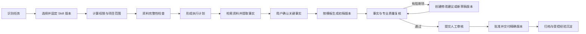

# 聚信 AI 助手 3.0——专业交付版设计规格

**日期：** 2026-07-14
**状态：** 设计完成，待评审；尚未进入业务编码
**目标产品版本：** `3.0.0`
**工作分支：** `codex/ai-assistant-3.0`
**2.0 审计基线：** `de8e3ff745b074a8a06b43f2e67175e33e005371`（`ai-assistant-v2.4.0`）
**核心目标：** 将 AI 从“生成聊天回答”升级为“按专业流程形成可审核、可追溯、可修改、可交付、可归档的正式成果”。

> 本文只定义 3.0 架构、数据、API、前端、迁移、测试和实施顺序，不进行大规模编码。现有个人工作助理和项目工作空间继续保留。

## 0. 结论先行

3.0 采用以下七项核心决策：

1. **保留两种工作模式。** 个人模式继续服务个人成果；项目模式继续提供项目范围、成员、资料、记忆、任务和活动。3.0 在两者上增加统一的专业交付能力。
2. **收敛三套成果模型。** 以现有 `WorkArtifact` / `WorkArtifactVersion` 为迁移基础，在代码层升级为统一 `Deliverable` 聚合；`ProjectArtifact` 和 `ProjectDeliverable` 进入兼容迁移，不再继续平行扩展。
3. **版本是不可变快照。** 每次 AI 生成、人工编辑、退回后修改都创建新版本；已审核、已批准、已交付版本永不原地修改。
4. **Skill、模板和规则均绑定不可变版本。** 每个成果版本必须记录实际使用的 Skill 版本和模板版本，历史版本不跟随发布版本变化。
5. **正式成果实行事实—证据门禁。** 关键事实、数字和正式结论必须有可定位、仍有效、在当前权限范围内的证据；事实、分析、推断、建议在模型和界面中明确区分。
6. **机器复核不能替代人工批准。** 自动复核覆盖事实、项目范围、一致性、专业规则、格式、敏感信息等层；评分只用于排序和提示，任何正式交付必须经过显式人工动作。
7. **3.0 不进入 4.0 范围。** 不实现无人值守外部操作、复杂事件触发和自动对外发送；“交付”在 3.0 中是批准版本的锁定、导出、登记和受控下载。

实施前有一个阻断性前置项：当前已提交 Alembic 图中 `0046_project_workspace_foundation` 指向未提交的 `0045_agent_langgraph_checkpoints`，但已提交迁移测试又期望 `0046 -> 0026`。必须先查明实际部署版本并恢复单一迁移头，之后才能编号 3.0 迁移。

---

## 1. 现有成果生成链路分析

### 1.1 审计边界

本次以 2.0 已提交基线为准，重点检查了：

- 聊天任务、上下文构建、流式输出和来源校验；
- 个人工作成果、项目成果、项目资源和 Word 导出；
- Skill 注册与执行日志、Agent Run/Step/Event；
- 项目成员权限、全局审计和项目活动；
- 文档模板、桌面成果页和项目工作区；
- Alembic 迁移及其测试。

工作区中另有大量未提交的后续 Agent、Workflow、Channel 和 6.0/7.0 文件。它们不属于稳定 2.0 基线，3.0 只能在实施阶段逐项评估复用，不能作为本文的既有能力前提。

### 1.2 个人聊天到个人成果

当前主链路为：

1. `ChatPage` 创建或继续个人 `ChatSession`。
2. 服务端准备知识、个人引用、短期对话、长期记忆、经验、模板和失败案例上下文。
3. Agent Loop 生成回答并流式输出。
4. `ChatMessageSource` 保存消息级来源，来源校验器会删除回答中未实际引用的来源。
5. 用户可把回答保存为 `WorkArtifact`，或将回答导出为 Word。
6. Word 导出会创建或递增 `WorkArtifactVersion`。

已具备的基础：

- 个人所有权过滤；
- 消息级引用和页码/章节定位；
- 回答保存、成果列表、版本列表和 Word 下载；
- 生成任务及流式事件基础；
- 内容加密基础。

关键缺口：

- `WorkArtifactVersion` 只保存摘要、文件引用和来源摘要，没有保存不可变正文快照；
- 详情页的正文仍回读原聊天消息，聊天内容变化或不可用时无法独立恢复成果版本；
- 保存回答和 Word 导出是两条特殊路径，没有统一编辑、提交、复核、审批和归档状态机；
- 来源是“消息引用”，还不是“结论—事实—证据”的逐项关系；
- 保存和导出操作没有形成完整成果审计链。

### 1.3 项目聊天到项目成果

当前项目链路为：

1. `ChatSession` 通过 `workspace_type=project` 和 `project_uuid` 与个人会话隔离。
2. 路由在读取会话前调用项目访问校验，无权限用户得到 404。
3. 项目工作区分别展示任务、项目资料、项目记忆、项目成果、问题和活动。
4. 项目成员可手工创建 `ProjectDeliverable`；批准或拒绝时要求项目负责人或管理员权限。

当前最重要的架构断点是：

- 项目聊天虽然按会话隔离，但 `ContextBuilder` 和 Agent Loop 没有项目上下文字段；
- `ProjectMemory`、`ProjectFile`、`ProjectArtifact`、项目范围和执行规则没有进入聊天生成上下文；
- 项目成果是手工摘要/文件引用，未与聊天生成、Skill Run、证据或 Word 版本打通；
- 项目成员角色粒度已存在，但任务和成果创建权限较宽，缺少“编辑、复核、批准、交付、归档”的动作级权限；
- `ProjectActivity` 是活动流，不等于不可抵赖的审计记录。

因此，2.0 已实现“项目会话和项目对象隔离”，但尚未实现“项目资料驱动的专业成果生产”。

### 1.4 Word 导出与模板

当前支持：

- 单条回答和正式文档两种 Word 导出；
- 在正式化提示中要求不虚构、使用正式书面表达；
- `GenericDocumentTemplate`、`FixedStructureTemplate`；
- 固定的工作计划、项目报告、会议纪要模板；
- 在 Word 末尾追加已校验引用。

当前缺口：

- 模板注册在进程内，未持久化、未发布、未冻结版本；
- 不支持结构化字段、动态表格和条件章节；
- 导出记录只绑定当前回答/文件，没有绑定审核通过的精确成果版本；
- 重新导出会递增成果版本，混淆“内容版本”和“文件渲染版本”；
- Word 成功生成不代表内容已通过事实门禁和人工批准。

### 1.5 Skill、执行循环与质量检查

当前 Skill 已具备：

- 文件清单中的 ID、名称、说明、分类、版本、状态、作用域、允许工具、输入输出和审核信息；
- Registry 扫描 prompt、schema、examples 和 checklist；
- Runner 记录 Skill、版本、任务、用户、工具、输入、输出和错误；
- `AgentRun`、`AgentRunStep`、`AgentRunEvent` 可记录执行状态、步骤、预算和事件。

当前不足：

- Skill 版本主要依赖文件系统，没有数据库中的不可变发布版本和内容哈希；
- Skill 选择没有候选、理由、置信度和人工确认记录；
- Runner 尚未形成“计划—取证—事实—成稿—复核—持久化”的专业闭环；
- Skill 没有绑定项目权限快照和可读取资源集合；
- 当前质量分工具主要做关键词和结构启发式检查，不能承担事实、证据、项目范围和专业规则门禁；
- 复核结果没有固定到成果版本，内容变化后仍可能被误认为已通过。

### 1.6 权限、审计和迁移

项目权限的可复用基础较好：

- 项目角色包括负责人、管理员、成员、复核人、只读和外部客户；
- 无项目访问权时返回 404，避免暴露项目存在性；
- 管理动作可要求负责人或管理员。

需要补齐：

- 每个成果动作的角色矩阵；
- 证据检索、证据关联和模型上下文构建时的行级项目过滤；
- 审计元数据白名单中的成果、版本、Skill、模板、复核、审批、导出和交付字段；
- 审计与业务写入同事务，不能出现业务成功但审计缺失。

迁移方面存在前述断链风险，并且工作区中还有未提交的 `0027`—`0045` 迁移及重复 `0039` 分支。3.0 不得直接假设下一个修订号是 `0051`。

### 1.7 当前三套成果对象的差异

| 对象 | 当前用途 | 所有权/范围 | 版本 | 正文快照 | 审核/审批 | 结论 |
|---|---|---|---|---|---|---|
| `WorkArtifact` | 保存聊天回答、Word 成果 | 个人 owner | 有版本号和版本行 | 无 | 无 | 作为统一成果的迁移基础 |
| `ProjectArtifact` | 项目与个人成果的关联 | project | 无独立版本 | 依赖被关联对象 | 无 | 迁移后降为兼容关系 |
| `ProjectDeliverable` | 项目手工交付物 | project/task | 单个整数 | 仅摘要/文件引用 | 简单批准/拒绝 | 迁移进统一成果聚合 |

继续平行扩展三者会造成版本、权限、审计和前端重复，因此 3.0 必须先统一领域模型。

---

## 2. 可复用模块

| 现有模块 | 复用方式 | 必要改造 |
|---|---|---|
| `require_project_access` / 项目成员模型 | 作为所有项目成果、证据和审批 API 的第一道授权 | 增加动作级策略；查询必须同时带 `project_id` |
| `ProjectMemory` / `ProjectFile` / 项目范围对象 | 作为项目 Skill 的候选上下文和证据来源 | 建立统一资源描述、版本、哈希和定位信息 |
| `ContextBuilder` | 继续承担上下文选择、压缩和结构化 | 增加 `ExecutionContext`、项目范围、资源授权和证据策略 |
| `ChatMessageSource` / 来源校验器 | 作为证据候选导入器 | 升级为 claim-level 事实—证据关联，保留旧消息来源 |
| `WorkArtifact` / `WorkArtifactVersion` | 扩展为统一成果聚合和不可变版本 | 增加作用域、正文快照、状态、Skill/模板版本及里程碑版本 |
| Word 导出和文件管理 | 复用渲染、文件存储、受控下载 | 导出必须绑定精确成果版本；内容版本与导出记录分离 |
| 文档模板 Registry | 提供内置模板兼容适配器 | 模板定义和版本持久化，动态 DSL 和发布流程 |
| Skill Registry / Runner | 复用清单解析、输入 schema、checklist 和日志 | 数据库发布版本、选择记录、权限上下文和专业执行阶段 |
| `AgentRun` / Step / Event | 作为 Skill 执行账本和 SSE 进度来源 | 增加 deliverable/version/skill version 关联及阶段协议 |
| `AuditLog` | 作为统一合规审计源 | 扩展安全元数据并确保同事务写入 |
| `ProjectActivity` | 继续作为项目成员可读活动流 | 由领域事件生成，不承担合规审计 |
| `HistoryPage` | 演进为统一成果中心列表 | 增加个人/项目筛选、状态、待办和权限动作 |
| `ChatPage` 来源面板 | 复用来源预览和“保存为成果”入口 | 支持选择 Skill、项目范围和提升为正式成果 |
| 项目工作区 | 继续提供项目上下文入口 | “成果”页签改用统一成果 API 和工作台 |

不直接复用的部分：

- 关键词式质量评分只能作为提示，不作为 3.0 门禁；
- 旧项目交付物状态接口只保留兼容读取，不继续增加新流程；
- 工作区中未提交的未来模块必须通过独立评审后才能合并，不能绕过本设计的权限和版本约束。

---

## 3. Skill 执行框架设计

### 3.1 Skill 领域模型

新增持久化定义：

#### `SkillDefinition`

- `uuid`
- `skill_key`：稳定业务标识，如 `security_ops_monthly_report`
- `name`、`category`、`description`
- `scope_policy`：`personal`、`project` 或 `both`
- `status`：`draft`、`published`、`retired`
- `current_published_version_id`
- `owner_user_id` / `owner_department_id`

#### `SkillVersion`

- `uuid`、`skill_id`、`version`
- `content_hash`
- `input_schema_json`
- `output_schema_json`
- `plan_definition_json`
- `prompt_bundle_ciphertext` 或受控对象存储引用
- `allowed_resource_types_json`
- `allowed_tool_ids_json`
- `required_fact_policy_json`
- `quality_rule_set_version_ids_json`
- `default_template_version_id`
- `review_checklist_json`
- `published_by`、`published_at`
- `status`：发布后只能 `published` 或 `retired`，不可修改内容

任何新版本都新增记录；升级 `current_published_version_id` 不改变历史成果绑定。

手工编辑或从聊天保存的成果也必须绑定系统 Skill：

- `manual_document@1`：纯人工编辑；
- `chat_capture@1`：把聊天回答提升为成果；
- 旧数据回填使用 `legacy_import@1`。

因此“每份成果记录 Skill 及版本”不依赖可空字段或特殊分支。

### 3.2 Skill 选择

选择顺序：

1. 用户显式选择：优先，仍校验作用域和权限。
2. 任务/助手固定绑定：返回绑定理由。
3. 规则匹配：根据目标成果类型、项目服务范围、输入字段和关键词计算候选。
4. 模型辅助分类：只生成候选，不直接越权执行。
5. 低置信度或候选冲突：要求用户确认。

选择结果必须保存：

- 候选 Skill 版本；
- 分数和匹配理由；
- 最终选择来源：`explicit`、`task_binding`、`rule`、`model_suggested`；
- 选择人和时间；
- 用户是否确认。

禁止仅保存可变的 `skill_key`；执行时必须固定 `skill_version_id`。

### 3.3 `ExecutionContext`

每次运行创建不可变的上下文快照：

- `run_uuid`、`request_id`、`deliverable_uuid`；
- `actor_user_id`、当前统一登录角色和部门快照；
- `scope_type`、`project_id`、项目成员角色；
- `skill_version_id`、`template_version_id`；
- 允许的资源类型和精确资源 ID 集合；
- 项目范围、合同范围、服务周期和执行规则摘要；
- 模型配置标识和脱敏模型元数据，不包含密钥；
- 最大步骤、最大模型调用、最大上下文和超时预算；
- 权限策略版本、规则集版本和上下文哈希。

授权资源集合由服务端通过“用户权限 ∩ 项目范围 ∩ Skill 允许类型”计算。Skill 清单中的允许类型只是上限，不能授予用户原本没有的权限。

### 3.4 专业执行循环

目标执行链：



服务端 `ProfessionalSkillRunner` 负责编排状态、权限、证据、持久化和审计；实际模型调用继续使用现有 OpenAI-compatible/BYOM 通道，不在 Skill 或成果服务中引入厂商目录和模型密钥。

模型步骤遵循以下边界：

- 服务端生成受控请求和一次性步骤令牌；
- 客户端/现有模型桥执行模型调用并流式展示；
- 服务端只接收步骤结果、内容哈希和脱敏调用元数据；
- 客户端离线时运行进入 `waiting_for_model`，不会由后台无人值守调用外部系统；
- 确定性校验、权限过滤、状态机和证据门禁必须在服务端执行，不能交给模型决定。

### 3.5 运行阶段与状态

`AgentRun` 复用并扩展为：

- 状态：`pending`、`running`、`waiting_for_input`、`waiting_for_model`、`completed`、`failed`、`cancelled`；
- 阶段：`select_skill`、`scope`、`completeness`、`plan`、`gather`、`extract_facts`、`confirm_facts`、`draft`、`review`、`persist`；
- 每一步记录输入摘要、输出摘要、证据数量、耗时和错误安全信息；
- 每个模型或工具调用必须经过允许工具校验；
- 自动修改最多两轮，达到上限后转人工处理，防止无限循环；
- 运行重试必须带幂等键，不能重复创建成果版本。

### 3.6 首批四个 Skill

| Skill | 必要输入 | 关键事实门禁 | 第一版输出 |
|---|---|---|---|
| 安全运维月报 | 项目、报告周期、合同服务范围、日志/告警、巡检、整改 | 数量、时间范围、资产、告警级别、整改状态必须有来源 | 封面、范围、执行概况、日志分析、巡检、整改、趋势、风险与建议 |
| 风险评估过程审查 | 项目范围、资产范围、访谈/检查记录、发现项 | 是否执行、覆盖范围、发现数量、证据状态 | 范围、过程完整性、发现、缺口、风险、改进建议 |
| 应急响应报告 | 事件时间线、受影响资产、证据、处置动作 | 时间、资产、动作、影响和恢复结论必须有证据 | 事件摘要、时间线、分析、处置、影响、恢复、复盘 |
| 安全基线核查报告 | 基线版本、资产清单、检查结果、例外 | 每个不符合项必须指向具体资产、规则和检查结果 | 范围、方法、总体结果、资产明细、不符合项、整改建议 |

每个 Skill 至少提供：

- 输入/输出 JSON Schema；
- 资料完整性规则；
- 默认模板版本；
- 专业规则集；
- 关键事实策略；
- 示例和反例；
- 单元测试、黄金样例和跨项目隔离样例。

---

## 4. 成果对象和版本模型

### 4.1 统一成果聚合

代码领域统一使用 `Deliverable`，数据库第一阶段复用并扩展现有：

- `ai_work_artifacts` → `Deliverable` 聚合根；
- `ai_work_artifact_versions` → `DeliverableVersion`。

暂不直接重命名物理表，降低迁移和回滚风险。API、服务和前端使用 `deliverable` 命名，旧 `work-artifacts` API 进入兼容期。

### 4.2 `Deliverable` 字段

在现有字段基础上增加：

| 字段 | 说明 |
|---|---|
| `scope_type` | `personal` / `project` |
| `formality` | `working` / `formal` |
| `project_id` | 项目范围必填；个人范围为空 |
| `project_task_id` | 可选，关联项目任务 |
| `owner_user_id` | 个人成果所有者；项目成果保留创建人但不作为唯一访问条件 |
| `deliverable_type` | 月报、审查报告、应急报告、基线报告、通用文档等 |
| `lifecycle_status` | 统一状态机 |
| `current_version_id` | 当前编辑版本 |
| `approved_version_id` | 最近批准的精确版本 |
| `delivered_version_id` | 最近交付的精确版本 |
| `row_version` | 乐观锁整数 |
| `created_by`、`archived_by`、`archived_at` | 责任人和归档信息 |
| `record_status` | `active` / `deleted`，与业务状态分离 |

数据库约束：

- `scope_type=project` 时 `project_id` 必须非空；
- `scope_type=personal` 时 `project_id` 必须为空且 `owner_user_id` 非空；
- 项目正式成果一定关联 `project_id`，并且 3.0 进一步要求所有项目范围成果都关联项目；
- `current_version_id`、`approved_version_id`、`delivered_version_id` 必须属于同一成果；
- 项目成果访问只按 `project_id + member` 判断，不能只按 `created_by`。

### 4.3 `DeliverableVersion` 不可变快照

每个版本至少保存：

- `uuid`、`deliverable_id`、`version_no`、`parent_version_id`；
- `skill_version_id`、`template_version_id`，均非空；
- `generation_run_id`，手工编辑可为空；
- `content_format`、`content_schema_version`；
- 加密后的结构化正文、nonce、密钥版本；
- `content_hash`；
- 标题、摘要和变更说明快照；
- 项目范围摘要、输入摘要和来源策略快照；
- `created_by`、`created_at`、`creation_reason`；
- `legacy_incomplete`：旧数据无法恢复正文时显式标记。

结构化正文以稳定 `block_id` 表示章节、段落、表格和单元格，事实、批注和复核问题都引用 `block_id`，避免仅依赖易漂移的字符偏移。

版本行一旦插入禁止 UPDATE 和 DELETE。状态、审核和交付使用独立事件/关系表记录，不能回写版本正文。

### 4.4 内容版本与导出版本分离

新增 `DeliverableExport`：

- 绑定 `deliverable_version_id`；
- 记录格式、模板渲染器版本、文件哈希、文件引用；
- 记录生成者、生成时间和审计请求 ID；
- 相同内容版本可以有多个导出记录，但不会增加内容版本号。

这样可避免“重新下载 Word 造成内容版本 +1”的现状。

### 4.5 生命周期状态机

主状态：

- `draft`：编辑中；
- `quality_review`：正在执行机器/规则复核；
- `changes_requested`：复核或人工审核要求修改；
- `pending_approval`：复核通过，等待人工批准；
- `approved`：精确版本已批准；
- `delivered`：批准版本已登记交付；
- `archived`：已归档；
- `cancelled`：终止但保留记录。

允许转换：

| 当前状态 | 动作 | 下一个状态 | 条件 |
|---|---|---|---|
| `draft` / `changes_requested` | 提交复核 | `quality_review` | 当前版本存在且内容哈希未变 |
| `quality_review` | 复核失败 | `changes_requested` | 存在阻断问题 |
| `quality_review` | 复核通过 | `pending_approval` | 所有门禁通过 |
| `pending_approval` | 要求修改 | `changes_requested` | 必须填写原因 |
| `pending_approval` | 批准 | `approved` | 有批准权限且版本未变化 |
| `approved` | 交付 | `delivered` | 只能交付 `approved_version_id` |
| `delivered` | 归档 | `archived` | 交付记录完整 |
| `approved` / `delivered` / `archived` | 创建修订 | `draft` | 新建版本；旧批准/交付里程碑保留 |

任何正文修改都创建新版本并使旧复核结果失效。新修订后聚合状态回到 `draft`，但 `delivered_version_id` 仍保留，界面显示“已交付 vN，当前修订 vN+1”。

### 4.6 并发和幂等

- 编辑保存使用 `If-Match` 或请求体中的 `row_version`；
- 不匹配返回 `409 DELIVERABLE_VERSION_CONFLICT`，携带当前版本号，不静默覆盖；
- 创建版本、启动运行、提交审核、批准、导出和交付都接受 `Idempotency-Key`；
- 同一幂等键和同一用户重复请求返回首次结果；
- 状态转换使用数据库行锁，并在同一事务写审计。

---

## 5. 证据链设计

### 5.1 对象关系

新增三类核心对象：

1. `DeliverableFact`：成果版本中的原子事实/分析/推断/建议。
2. `DeliverableEvidence`：被捕获并定位的来源快照。
3. `FactEvidenceLink`：事实和证据之间的支持、反驳或背景关系。

每个对象都绑定精确 `deliverable_version_id`，不会随当前成果版本变化。

### 5.2 证据类型

- 公司正式知识库文档及其发布版本；
- 项目文件及其文件版本；
- 项目记忆及其确认版本；
- 项目合同、服务范围、资产、目标组和执行规则；
- 聊天消息及已校验来源；
- 用户本次上传或手工录入的资料；
- 受控工具执行结果；
- 人工确认记录。

正式项目成果默认禁止直接读取个人记忆和个人文件。需要使用时，用户必须把资料显式加入当前项目，形成项目资源和审计记录后再引用。

### 5.3 `DeliverableEvidence` 字段

- `uuid`、`deliverable_version_id`、`project_id`；
- `source_type`、`source_uuid`、`source_version`；
- `source_content_hash`；
- `file_name`、`page_number`、`sheet_name`、`cell_range`；
- `section_path`、`paragraph_index`、`chunk_id`、`chunk_index`；
- 加密 `quote_snapshot` 和 `quote_hash`；
- `captured_at`、`captured_by`；
- `permission_snapshot_hash`；
- `status`：`active`、`stale`、`revoked`、`inaccessible`；
- `stale_reason` / `revoked_reason`。

定位信息必须足以让审核人从成果跳转到原始来源。只存文件名或“来自知识库”不算合格证据。

### 5.4 证据关系

`FactEvidenceLink.relation_type`：

- `supports`：直接支持事实；
- `contradicts`：与事实冲突；
- `context`：提供背景但不直接证明；
- `derived_from`：事实由多个数据项计算得到。

派生数字需要保存计算表达式、输入事实 ID 和舍入规则。模型生成的计算结果必须由确定性计算器复算。

### 5.5 证据有效性与门禁

`EvidencePolicyGate` 在以下时点执行：

- 生成正式初稿后；
- 每次新版本保存后；
- 提交质量复核前；
- 人工批准前；
- 交付前。

阻断条件：

- 关键事实没有 `supports` 证据；
- 证据状态不是 `active`；
- 证据已变更且哈希不一致；
- 存在未解决的 `contradicts` 证据；
- 证据所属项目与成果项目不同；
- 当前审核人无权查看来源；
- 正式结论使用了仅为 `context` 的来源；
- 官方口吻结论没有达到 Skill 规则要求。

证据源被更新或撤销时不修改历史版本，而是把相关证据标记为 `stale`/`revoked`，并使尚未交付的当前版本重新进入待复核状态。已交付版本保留当时快照，同时显示“来源后续已变化”的审计提示。

### 5.6 项目隔离

项目隔离必须在四层同时实施：

1. **查询层：** 所有项目资源检索 SQL 都带服务端计算的 `project_id`。
2. **关联层：** 关联证据时再次比较成果项目和来源项目。
3. **上下文层：** 传给模型的资源清单来自已授权集合，不能接受客户端任意资源 ID。
4. **审计层：** 保存项目、资源、成果版本和运行 ID，支持事后追踪。

项目 A 的资源 ID 即使被手工放入项目 B 请求体，也必须返回 404 或领域错误，且不能进入模型上下文。

---

## 6. 事实提取和确认机制

### 6.1 内容分类

每个内容单元使用以下 `claim_type`：

- `fact`：可被外部资料直接验证的陈述；
- `analysis`：基于事实的解释或比较；
- `inference`：证据不完整时的推断；
- `suggestion`：建议采取的行动。

正式报告不能把 `analysis`、`inference` 或 `suggestion` 伪装成已确认事实。编辑器和 Word 渲染可按模板选择是否显示标签，但数据层必须保留分类。

### 6.2 关键事实识别

规则优先识别：

- 数量、比例、金额、时长、日期和周期；
- IP、域名、主机、系统、资产和人员；
- 风险等级、漏洞等级、事件等级；
- “已完成、未完成、符合、不符合、已恢复、未发现”等状态结论；
- 合同范围、服务范围和合规结论；
- 趋势、同比、环比和聚合统计；
- Skill 规则指定的必核查字段。

模型可补充候选，但不能降低规则判定的关键级别。

### 6.3 事实状态

- `pending_confirmation`：待确认；
- `supported`：已有有效证据，但未人工确认；
- `confirmed`：人工确认且证据策略通过；
- `inference`：明确标识为推断；
- `unsupported`：无证据；
- `conflicted`：证据冲突；
- `stale`：证据已过期或源变化；
- `rejected`：审核人判定不应使用。

“人工确认”本身会形成带人员和时间的证据记录，但对于 Skill 规定必须有文档或工具结果的关键数字，人工确认不能替代原始证据。

### 6.4 提取与确认流程

1. 解析结构化正文，按 `block_id` 提取候选 claim。
2. 确定性规则标记数字、范围、状态和 Skill 关键字段。
3. 模型辅助完成语义分类和候选证据匹配。
4. 服务端按权限和项目范围验证证据。
5. 用户在“事实清单”中确认、修正、标记推断或删除。
6. 任何事实文本修改都重新计算 claim hash 并使原确认失效。
7. 生成新成果版本时按 claim hash 继承仍相同的事实和证据，其余重新核查。

### 6.5 正式版本规则

- `fact + critical=true` 必须是 `supported` 或 `confirmed`；
- Skill 要求人工确认的事实必须是 `confirmed`；
- `unsupported` 关键事实禁止进入 `pending_approval`；
- `inference` 可以保留，但必须有依据、置信说明和显式“推断”标记；
- `analysis` 必须引用其输入事实；
- `suggestion` 必须与观察到的事实或风险关联；
- 任何“官方认定、完全符合、无风险、已彻底解决”等绝对结论必须满足更严格规则，否则阻断。

---

## 7. 专业质量复核架构

### 7.1 复核对象

每次 `ReviewRun` 固定：

- `deliverable_version_id` 和 `content_hash`；
- Skill 版本、模板版本；
- 规则集及每条规则版本；
- 执行上下文和项目范围哈希；
- 复核步骤、结果、问题和耗时；
- 使用的模型脱敏标识；
- 发起人、完成时间和审计请求 ID。

内容哈希变化后，旧复核自动失效，不能复用通过标记。

### 7.2 七层复核

| 层 | 主要检查 | 实现方式 | 阻断示例 |
|---|---|---|---|
| 结构契约 | 必填章节、字段、表格、类型 | JSON Schema / 模板编译器 | 缺少结论或资产明细 |
| 事实与证据 | 关键事实状态、证据有效性、冲突 | 确定性规则 + 证据门禁 | 数字无来源 |
| 项目范围 | 项目、周期、合同范围、资产归属 | 项目 ID 和范围规则 | 引用了其他项目资产 |
| 一致性 | 摘要与正文、表格与统计、前后结论 | 确定性计算 + 模型辅助 | 总数与明细不一致 |
| 专业规则 | Skill 专业检查清单 | 版本化规则引擎 | 基线问题未列具体资产 |
| 格式与表达 | 模板、标题、编号、术语、引用格式 | 模板编译器 + 文本规则 | 章节顺序错误 |
| 敏感与安全 | 密钥、凭据、超范围个人信息、外发限制 | 敏感规则和数据分级 | 正文含明文密码 |

附件要求的事实、项目范围、一致性、专业规则、格式和敏感信息六类均为必跑；结构契约是额外的前置层。

### 7.3 问题模型

`ReviewIssue`：

- `review_run_id`、`rule_version_id`；
- `category`、`severity`：`info`、`warning`、`error`、`blocker`；
- `block_id`、可选字符范围；
- `message`、`evidence_ids`；
- `suggested_fix`；
- `status`：`open`、`accepted_risk`、`resolved`、`wont_fix`；
- 处理人、理由和时间。

`blocker` 不能接受风险；`error` 是否阻断由版本化规则定义。任何人工豁免都必须有权限、理由和审计。

### 7.4 评分边界

可以计算分项分数和总分，用于：

- 定位薄弱章节；
- 比较同一成果的修订前后变化；
- 排序待处理问题。

但通过条件是布尔门禁：

- 无阻断问题；
- 关键事实门禁通过；
- 项目范围检查通过；
- 必跑规则全部完成；
- 人工批准尚需单独执行。

即使总分 100，也不能自动批准或交付。

### 7.5 自动修改

- 系统只对低风险格式问题提供自动修复；
- 内容性修改先生成建议，用户确认后创建新版本；
- 每次自动修改都形成新版本、变更摘要和审计；
- 最多两轮自动复核—修改，仍不通过则转人工；
- 不允许模型直接修改已批准或已交付版本。

### 7.6 Agent Harness 闭环

2.0 已有目标、运行、步骤、事件和部分检查，但专业交付闭环尚未完成。3.0 的闭环定义为：

`目标/Skill → 计划 → 受权取证 → 事实 → 初稿 → 确定性验证 → 模型辅助复核 → 人工判断 → 版本持久化 → 交付反馈`

最优先修复的五个 Harness 断点：

1. 统一成果聚合；
2. 不可变版本和里程碑版本；
3. claim-level 事实与证据门禁；
4. Skill/模板/规则版本化执行上下文；
5. 人工审批和全动作审计。

---

## 8. 模板引擎方案

### 8.1 模板模型

#### `TemplateDefinition`

- `template_key`、名称、用途、适用成果类型；
- 作用域：系统、部门、项目；
- 状态和当前发布版本。

#### `TemplateVersion`

- 不可变版本号和 `content_hash`；
- 输入字段 JSON Schema；
- 文档结构 DSL；
- 动态表格定义；
- 条件章节表达式；
- 样式主题和 Word 渲染配置；
- 适用 Skill 版本范围；
- 发布人和发布时间。

手工空白成果使用 `blank_document@1`，聊天提升使用 `chat_answer@1`，旧数据使用 `legacy_document@1`，确保模板版本非空。

### 8.2 声明式 DSL

模板只允许声明式节点：

- `section`、`paragraph`、`field`、`fact_ref`；
- `table`、`columns`、`rows_from`；
- `if`、`all`、`any`；
- `repeat`；
- `page_break`、`toc`、`references`。

条件表达式只支持白名单操作符：

- `eq`、`ne`、`in`、`exists`；
- 数字比较；
- `all`、`any`、`not`。

禁止：

- `eval`、任意 Python/Jinja 代码；
- 任意 SQL；
- 文件系统和网络访问；
- 从未授权资源动态取值。

### 8.3 动态能力

- **动态字段：** 根据 Skill 输入 schema 生成表单和校验。
- **条件章节：** 例如存在重大事件时显示“重大事件处置”，否则隐藏。
- **动态表格：** 按资产、风险、整改项或时间线生成行；列由模板版本固定。
- **派生字段：** 仅调用白名单确定性函数，如计数、求和、比例和日期格式化。
- **引用区：** 从事实—证据关系生成脚注、尾注或参考资料列表。

### 8.4 编译与渲染

流程：

1. 发布时校验 schema、DSL、条件引用和样式；
2. 编译为规范化中间表示；
3. 生成编辑器结构；
4. 用同一中间表示渲染 Word；
5. 导出后解析 DOCX 进行结构验证；
6. 保存模板版本、渲染器版本和文件哈希。

第一阶段用适配器把现有固定模板注册成不可变版本；第四阶段再开放动态模板管理。Word 是 3.0 第一正式格式，PDF 可预留接口但不作为首期承诺。

---

## 9. 审核流程方案

### 9.1 机器复核与人工审核分离

- “质量复核”是规则/模型对精确成果版本的检查；
- “人工审核”是有权限人员对已通过复核的版本进行批准或退回；
- 机器分数、模型结论或自动修复均不能写入 `approved`。

### 9.2 审核角色

| 范围 | 编辑 | 复核/批注 | 批准 | 交付/归档 |
|---|---|---|---|---|
| 个人成果 | owner | owner 或显式受邀人 | owner 显式确认 | owner |
| 项目成果 | member、lead、admin（按策略） | reviewer、lead、admin | 审批流指定 reviewer/lead/admin | lead、admin |
| 项目只读 | 无 | 仅查看 | 无 | 无 |
| 外部客户 | 默认仅查看明确交付版本 | 无 | 无 | 无 |

项目默认启用“作者不能批准自己创建的当前版本”；小项目确需例外时由审批流版本显式配置并审计。

### 9.3 审批流

`ApprovalFlowVersion` 定义：

- 适用范围和成果类型；
- 步骤顺序或并行组；
- 每步角色/指定人员；
- 最少批准人数；
- 是否允许作者批准；
- 超时提醒配置；
- 退回目标：草稿或指定上一步。

3.0 只实现人工触发和站内待办，不实现复杂事件触发、自动外发或无人值守升级。

### 9.4 批注、退回和再次提交

批注绑定：

- 成果版本；
- `block_id` 和可选文本范围；
- 评论内容、作者、创建时间；
- 状态 `open` / `resolved`；
- 回复线程。

退回：

- 必须填写原因；
- 可关联一个或多个未解决批注；
- 写入不可变审批事件和审计；
- 成果进入 `changes_requested`。

再次提交：

- 必须创建新版本；
- 显示相对被退回版本的段落/表格差异；
- 旧批注保留，作者可标记“已在 vN 修复”；
- 新版本重新执行事实和质量门禁。

### 9.5 批准、交付和归档

- 批准固定 `approved_version_id`、内容哈希和审批流版本；
- 交付只能选择该批准版本，创建 `DeliveryRecord`；
- `DeliveryRecord` 记录交付版本、Word 导出、交付人、交付对象描述、时间和备注；
- 3.0 的交付不自动调用邮件、IM、客户系统或工单系统；
- 归档后默认只读；创建修订会产生新草稿版本，不改变归档版本。

### 9.6 经验沉淀

交付后用户可显式选择：

- 把结构或写法提交为经验候选；
- 把新专业规则提交为规则候选；
- 把模板修改提交为模板候选。

候选进入现有学习/审核机制，经人工发布后才能复用。不得自动把项目正文、客户数据或证据复制到跨项目经验库。

---

## 10. 前端页面改造方案

### 10.1 保留现有入口

- 个人聊天、个人记忆和原有助手模式不删除；
- 项目工作区及项目资料、记忆、任务、问题、活动不删除；
- `HistoryPage` 演进为“成果中心”，旧链接继续跳转；
- 项目“成果”页签改为同一成果中心的项目过滤视图。

### 10.2 导航结构

建议主导航：

- AI 对话；
- 项目工作区；
- 专业任务；
- 成果中心；
- Skills；
- 知识与学习；
- 设置/管理。

“专业任务”用于选择 Skill 和启动生成；“成果中心”用于持续编辑、复核、审批、交付和归档。

### 10.3 专业任务启动页

包含：

- 个人/项目模式切换；
- 项目选择和当前项目范围摘要；
- Skill 候选、匹配理由和版本；
- 模板版本；
- 动态输入表单；
- 资料完整性检查；
- 缺失资料、待确认事实和风险提示；
- 启动执行按钮。

项目模式下项目上下文固定在页面顶部，切换项目必须清空尚未提交的跨项目资源选择。

### 10.4 任务执行区

复用现有流式进度能力，展示：

1. 识别场景；
2. 确认项目范围；
3. 检查资料完整性；
4. 形成执行计划；
5. 检索资料与提取事实；
6. 等待用户确认；
7. 生成初稿；
8. 执行专业复核；
9. 保存成果版本。

每一步显示状态、耗时、安全摘要和可恢复动作。取消只终止当前运行，不删除已经保存的事实或草稿。

### 10.5 成果工作台

桌面端采用三栏结构：

- **左栏：** 成果列表、个人/项目、类型、状态、待我处理、Skill 和更新时间筛选；
- **中栏：** 结构化编辑器、章节导航、表格编辑、差异视图；
- **右栏：** 事实与证据、复核问题、批注、版本、活动五个页签。

顶部固定显示：

- 成果名称和当前版本；
- 项目/个人范围；
- Skill 版本、模板版本；
- 当前状态；
- 已批准/已交付版本徽标；
- 当前用户可执行动作。

### 10.6 事实与证据体验

- 正文中的关键事实可显示状态图标；
- 点击事实可打开来源预览，定位到页/章节/表格；
- 无证据、冲突、过期和推断使用不同状态，不只依赖颜色；
- 用户可确认、修正、关联证据或标记为推断；
- 项目证据选择器只显示当前项目和有权使用的全局正式知识。

### 10.7 审核体验

- 待审批列表按项目、角色和截止时间过滤；
- 审核人可查看质量报告、证据、版本差异和未解决批注；
- “批准”和“退回”是独立动作，退回原因必填；
- 交付按钮仅在批准状态且当前用户有权限时显示；
- 状态变化后前端重新获取服务端能力列表，不自行推断权限。

### 10.8 前端技术边界

- 新 API 统一放入 `apps/desktop/src/api/deliverables.ts`、`skills.ts`、`templates.ts`；
- 服务端返回 `allowed_actions`，按钮禁用只是体验优化，后端仍做权威校验；
- 编辑器先支持模板定义的块、段落和表格，不在 3.0 首期构建通用 Office 编辑器；
- 所有页面接真实 API，不以静态 JSON 作为完成标准；
- 复用现有 Ant Design、主题 token、来源抽屉和项目选择器，保持 2.0 视觉连续性。

---

## 11. 后端 API 清单

继续使用现有 `/api/ai` 命名空间，不另建平行服务。

### 11.1 Skill 与模板

| 方法 | 路径 | 用途 |
|---|---|---|
| `GET` | `/api/ai/skills` | 按作用域、状态和成果类型列出可用 Skill |
| `GET` | `/api/ai/skills/{skill_uuid}/versions/{version_uuid}` | 获取已发布版本元数据 |
| `POST` | `/api/ai/skills/select` | 返回候选、理由、置信度和默认模板 |
| `POST` | `/api/ai/skills/{skill_uuid}/versions` | 管理员创建新草稿版本 |
| `POST` | `/api/ai/skills/{skill_uuid}/versions/{version_uuid}/publish` | 发布不可变版本 |
| `GET` | `/api/ai/templates` | 列出有权使用的模板 |
| `GET` | `/api/ai/templates/{template_uuid}/versions/{version_uuid}` | 获取模板 schema/DSL |
| `POST` | `/api/ai/templates/{template_uuid}/versions` | 创建模板草稿版本 |
| `POST` | `/api/ai/templates/{template_uuid}/versions/{version_uuid}/publish` | 校验并发布版本 |

### 11.2 成果与版本

| 方法 | 路径 | 用途 |
|---|---|---|
| `GET` | `/api/ai/deliverables` | 个人/项目、状态、类型和待办筛选 |
| `POST` | `/api/ai/deliverables` | 事务内创建成果和 v1，必须绑定 Skill/模板版本 |
| `GET` | `/api/ai/deliverables/{deliverable_uuid}` | 获取详情、当前版本、里程碑和 `allowed_actions` |
| `PATCH` | `/api/ai/deliverables/{deliverable_uuid}` | 更新标题等聚合元数据，使用乐观锁 |
| `GET` | `/api/ai/deliverables/{deliverable_uuid}/versions` | 版本历史 |
| `POST` | `/api/ai/deliverables/{deliverable_uuid}/versions` | 从当前/指定版本创建不可变新版本 |
| `GET` | `/api/ai/deliverables/{deliverable_uuid}/versions/{version_uuid}` | 读取精确版本 |
| `GET` | `/api/ai/deliverables/{deliverable_uuid}/diff?from=&to=` | 章节、段落和表格差异 |

### 11.3 生成与运行

| 方法 | 路径 | 用途 |
|---|---|---|
| `POST` | `/api/ai/deliverables/{deliverable_uuid}/runs` | 固定 Skill/模板/权限并启动运行 |
| `GET` | `/api/ai/runs/{run_uuid}` | 获取运行状态和待处理动作 |
| `GET` | `/api/ai/runs/{run_uuid}/events` | SSE 流式步骤和进度 |
| `POST` | `/api/ai/runs/{run_uuid}/steps/{step_uuid}/model-result` | 用一次性令牌提交模型步骤结果 |
| `POST` | `/api/ai/runs/{run_uuid}/input` | 提交资料或事实确认 |
| `POST` | `/api/ai/runs/{run_uuid}/cancel` | 取消运行 |
| `POST` | `/api/ai/runs/{run_uuid}/resume` | 从可恢复检查点继续 |

### 11.4 事实与证据

| 方法 | 路径 | 用途 |
|---|---|---|
| `POST` | `/api/ai/deliverables/{deliverable_uuid}/versions/{version_uuid}/facts/extract` | 提取并分类事实 |
| `GET` | `/api/ai/deliverables/{deliverable_uuid}/versions/{version_uuid}/facts` | 获取事实清单和门禁摘要 |
| `PATCH` | `/api/ai/facts/{fact_uuid}` | 修正、确认、拒绝或标记推断 |
| `GET` | `/api/ai/evidence/search` | 在服务端授权范围内搜索来源 |
| `POST` | `/api/ai/facts/{fact_uuid}/evidence` | 关联并捕获证据快照 |
| `POST` | `/api/ai/evidence/{evidence_uuid}/revoke` | 撤销错误证据，不物理删除 |
| `GET` | `/api/ai/evidence/{evidence_uuid}/preview` | 权限校验后返回定位预览 |

### 11.5 复核、批注和审批

| 方法 | 路径 | 用途 |
|---|---|---|
| `POST` | `/api/ai/deliverables/{deliverable_uuid}/reviews` | 对当前版本启动质量复核 |
| `GET` | `/api/ai/deliverables/{deliverable_uuid}/reviews` | 获取复核历史和自检报告 |
| `PATCH` | `/api/ai/review-issues/{issue_uuid}` | 解决问题或提交受控豁免 |
| `GET/POST` | `/api/ai/deliverables/{deliverable_uuid}/comments` | 获取/创建版本批注 |
| `POST` | `/api/ai/comments/{comment_uuid}/replies` | 回复批注 |
| `POST` | `/api/ai/comments/{comment_uuid}/resolve` | 解决批注 |
| `POST` | `/api/ai/deliverables/{deliverable_uuid}/submit` | 提交质量复核/人工审核 |
| `POST` | `/api/ai/deliverables/{deliverable_uuid}/approve` | 批准精确版本 |
| `POST` | `/api/ai/deliverables/{deliverable_uuid}/request-changes` | 退回并要求修改 |
| `POST` | `/api/ai/deliverables/{deliverable_uuid}/deliver` | 登记批准版本交付 |
| `POST` | `/api/ai/deliverables/{deliverable_uuid}/archive` | 归档 |

### 11.6 导出

| 方法 | 路径 | 用途 |
|---|---|---|
| `POST` | `/api/ai/deliverables/{deliverable_uuid}/versions/{version_uuid}/exports` | 创建 Word 导出记录 |
| `GET` | `/api/ai/deliverable-exports/{export_uuid}/download` | 权限校验后下载 |

导出非批准版本时必须带水印/状态标识；“正式交付”只能使用批准版本。

### 11.7 API 通用约束

- 项目无访问权统一返回 404；
- 项目 ID 从成果和服务端上下文解析，不信任客户端重复传入；
- 写接口校验 CSRF/现有统一登录动作；
- 响应包含 `request_id`；
- 幂等写接口支持 `Idempotency-Key`；
- 并发冲突返回 409；
- 非法状态转换返回 422，错误码稳定；
- 日志和错误不得包含正文、证据原文、凭据或模型密钥；
- 审计失败则业务事务失败；
- 列表默认分页并限制最大页大小。

---

## 12. 数据库迁移方案

### 12.1 Phase 0：先修复迁移图

执行顺序：

1. 检查所有实际环境的 `alembic_version`、`alembic heads` 和已应用迁移。
2. 判断未提交 `0027`—`0045` 是否已在任何共享环境应用。
3. 若从未应用，纠正已提交 `0046` 的父修订为真实 2.0 头 `0026`，并同步迁移图测试。
4. 若已经应用，必须先把权威迁移纳入版本控制，解决重复 `0039` 分支并创建明确 merge revision。
5. 在 SQLite 临时库和真实 MySQL schema 执行从空库升级、现网版本升级和可逆降级。
6. 只有 `alembic heads` 返回一个头后，才确定 3.0 的下一个修订号。

不得仅为了让测试通过而修改历史迁移；是否可改取决于部署事实。

### 12.2 迁移批次

由于修订号尚未安全确定，以下使用符号名：

#### M1 `professional_delivery_foundation`

- 新建 Skill 定义/版本、模板定义/版本；
- 扩展 `ai_work_artifacts` 和 `ai_work_artifact_versions`；
- 新建成果导出和旧对象映射表；
- 给 Agent Run 增加成果/版本/Skill 关联；
- 建立状态、作用域、唯一性和查询索引；
- 种入系统 Skill/模板版本。

#### M2 `deliverable_facts_and_evidence`

- 新建 facts、evidence、fact-evidence links；
- 增加证据状态和来源哈希索引；
- 增加项目隔离相关复合索引。

#### M3 `professional_quality_review`

- 新建质量规则、规则版本、review runs、review issues；
- 种入六类必跑规则和四个首批 Skill 的规则包。

#### M4 `deliverable_approval_and_delivery`

- 新建审批流/版本、审批事件、批注、交付记录；
- 增加批准/交付/归档里程碑约束；
- 接入经验候选关系。

### 12.3 旧数据回填

按幂等批处理执行：

1. 现有个人 `WorkArtifact` 回填 `scope_type=personal`。
2. 从关联聊天消息或导出文件恢复可恢复的正文快照。
3. 无法恢复正文时保留记录并标记 `legacy_incomplete=true`，不能伪造正文。
4. 旧聊天保存绑定 `legacy_import@1 + chat_answer@1`。
5. 旧 Word 成果绑定 `legacy_import@1 + legacy_document@1`。
6. `ProjectArtifact` 关联的成果回填直接 `project_id`。
7. `ProjectDeliverable` 迁移为新的项目成果及 v1，保存旧 UUID 映射。
8. 旧批准状态只在数据完整且可追溯时映射为 `approved`；否则映射为 `draft` 并标记需复核。

回填脚本必须支持 dry-run、批次大小、检查点、重复执行和统计报告。

### 12.4 兼容与收缩

采用 expand/contract：

1. 扩展新表/新列；
2. 回填并校验；
3. 新 API 只写统一成果；
4. 旧项目成果 API 改为新模型投影；
5. 观察一个完整版本周期；
6. 无调用后再单独迁移删除冗余列/表。

3.0 首次发布不直接删除 `ai_project_deliverables` 或 `ai_project_artifacts`，避免不可逆回滚。

### 12.5 数据完整性和索引

至少包含：

- `unique(deliverable_id, version_no)`；
- `unique(skill_id, version)`；
- `unique(template_id, version)`；
- `unique(deliverable_version_id, fact_hash)`（按允许重复策略调整）；
- `index(project_id, lifecycle_status, updated_at)`；
- `index(owner_user_id, lifecycle_status, updated_at)`；
- `index(deliverable_version_id, status)` 用于事实、证据和问题；
- 外键的 `ON DELETE` 以保留审计为优先，正式版本相关对象禁止级联删除。

---

## 13. 分阶段实施计划

### Phase 0：迁移与基线稳定

目标：

- 恢复单一 Alembic 头；
- 固定 2.0 基线和兼容策略；
- 为 3.0 建立特性开关和测试夹具。

退出条件：

- 空库和 2.0 数据库均可升级；
- SQLite 与 MySQL 迁移测试通过；
- 未提交未来迁移不会与 3.0 修订号冲突；
- 迁移决策有书面记录。

### Phase 1：专业成果基础框架

范围：

- 统一成果对象、作用域和状态机；
- 不可变成果版本；
- Skill 定义/版本、选择和执行上下文；
- 模板版本基础及内置固定模板适配；
- Agent Run 与成果绑定；
- 项目成果关联；
- 成果中心和结构化编辑页面；
- Word 导出绑定精确版本；
- 全动作审计基础。

首个纵向切片：

- 用“安全运维月报 Skill”完成从项目选择、生成草稿、保存版本、编辑到 Word 导出的闭环；
- 暂不允许正式批准，直到 Phase 2/3 门禁就绪。

退出条件：

- 个人和项目都能创建成果；
- 项目成果无 `project_id` 时服务端拒绝；
- 每个版本都有 Skill/模板版本；
- 编辑和 AI 生成均创建新版本；
- Word 重导出不增加内容版本；
- 项目 A 用户不能读取项目 B 成果。

### Phase 2：证据与事实体系

范围：

- 事实提取和四类 claim；
- 证据候选、来源定位和快照；
- 已确认、待确认、推断、无证据、冲突、过期状态；
- 关键结论证据门禁；
- 项目资料和项目记忆进入受权上下文；
- 事实/证据侧栏。

退出条件：

- 正式成果关键数字无证据时不能提交；
- 来源可定位到文件页/章节/表格；
- 项目 A 来源不能关联到项目 B；
- 来源变更可触发 stale，而不修改历史版本。

### Phase 3：专业质量复核

范围：

- 事实、项目范围、一致性、专业规则、格式、敏感信息六类必跑检查；
- 结构契约检查；
- 规则和规则版本；
- AI 自检报告；
- 问题定位、严重度和处理；
- 最多两轮受控自动修改。

退出条件：

- 任一必跑层未完成都不能进入人工审核；
- 阻断问题不能通过高分绕过；
- 内容改变后旧复核自动失效；
- 四个首批 Skill 各有独立规则包和黄金样例。

### Phase 4：模板与审核闭环

范围：

- 动态字段、动态表格、条件章节；
- 模板管理、发布和不可变版本；
- 审批流版本；
- 批注、退回、再次提交和差异查看；
- 批准、交付、归档；
- 修改经验候选；
- 待办和权限体验完善。

退出条件：

- 退回原因和批注完整保留；
- 再次提交必定产生新版本并重跑门禁；
- 交付只能选择批准版本；
- 历史 Skill/模板升级不改变旧版本渲染；
- 交付后可提交去敏经验候选，但不会自动跨项目复用。

### 每阶段交付报告

严格按以下格式输出：

1. 已完成内容；
2. 修改文件清单；
3. 数据库变化；
4. API 变化；
5. 前端页面变化；
6. 自动化测试结果；
7. 已知问题；
8. 下一阶段计划。

版本与 Git：

- 3.0 是大改版，最终产品版本从 2.x 升为 `3.0.0`；
- 阶段内功能和 Bug 修复仍遵守“第二位/第三位”规则；
- 版本号、提交标签和发布说明在对应功能实际完成并通过门禁后同步更新；
- 本设计阶段不提前修改版本号、提交或推送。

---

## 14. 测试方案

### 14.1 后端单元测试

- Skill 选择、置信度和低置信确认；
- Skill/模板发布后不可修改；
- ExecutionContext 权限交集；
- 状态机全部合法/非法转换；
- 事实类型和关键事实识别；
- 证据有效性、冲突和过期；
- 规则严重度和门禁；
- 模板 DSL 安全操作符；
- 动态表格和条件章节；
- 内容 hash、版本 diff 和乐观锁；
- 审批流和作者自审限制。

### 14.2 API 集成测试

覆盖：

- 个人 owner、项目 member、reviewer、lead、admin、read_only、external_customer；
- 创建、编辑、生成、取消、恢复；
- 事实确认和证据关联；
- 复核、批注、退回、再次提交；
- 批准、导出、交付、归档；
- 幂等请求和并发 409；
- 所有动作的审计记录。

### 14.3 项目隔离安全测试

至少建立项目 A、项目 B 和无项目权限用户：

- A 成员用 B 成果 UUID 读取；
- A 成员用 B 文件 UUID 搜索或关联证据；
- A 成员把 B 资源 ID 放入模型上下文请求；
- A reviewer 审批 B 成果；
- 个人文件直接用于项目成果；
- 全局知识在无权限分类下被引用。

预期均为 404/拒绝，且模型步骤输入中不出现越权内容。

### 14.4 版本与不可变性测试

- 每次编辑产生连续版本号；
- 并发编辑只有一个成功；
- 已批准/交付版本正文不能更新或删除；
- 创建新修订不改变旧批准、导出和证据；
- Skill/模板发布新版本后旧成果仍显示并渲染旧版本；
- Word 重导出只新增 export，不新增内容版本；
- 内容改变后旧复核和批准不能用于新版本。

### 14.5 迁移测试

- Alembic 单一 head；
- 从空库升级到 head；
- 从 2.0 真实快照升级；
- M1—M4 分段 upgrade/downgrade；
- 旧 WorkArtifact、ProjectArtifact、ProjectDeliverable 回填；
- 回填 dry-run、重复执行和中断恢复；
- SQLite 快速验证和 MySQL 集成验证；
- 大数据量索引和锁时间检查。

### 14.6 前端测试

- Skill 候选和确认；
- 项目切换清空跨项目选择；
- 三栏成果工作台；
- 编辑保存冲突；
- 事实状态和来源预览；
- 质量问题定位；
- 批注、退回和版本差异；
- 按角色隐藏/禁用动作；
- SSE 断线恢复和取消；
- Word 导出/下载。

### 14.7 E2E 验收场景

1. 成员在项目 A 创建安全运维月报；
2. 系统选择并固定 Skill/模板版本；
3. 缺失日志时阻止成稿并请求资料；
4. 资料补齐后提取事实和证据；
5. 无证据数字阻止提交；
6. 修正后生成 v2 并通过六类复核；
7. reviewer 批注并退回；
8. 作者创建 v3 修订并再次提交；
9. lead 批准 v3；
10. 导出 Word、登记交付、归档；
11. 发布新 Skill/模板版本后，v3 仍使用原版本；
12. 项目 B 用户全程无法访问该成果和证据。

### 14.8 建议校验命令

仓库当前已提供以下命令：

```bash
# 后端完整测试
cd /Users/zhanglei/Documents/codex-new/juxin-ai-assistant/server
python3 -m pytest tests -q

# 迁移图和迁移测试
python3 -m alembic heads
python3 -m pytest tests/test_migrations.py -q

# 桌面端单元测试、类型检查和构建
cd /Users/zhanglei/Documents/codex-new/juxin-ai-assistant/apps/desktop
npm test
npm run typecheck
npm run build

# 桌面端端到端测试
npm run test:e2e
```

实施时先运行受影响模块的最小测试，再运行完整测试。MySQL 迁移验证应使用现有 Compose/MySQL 环境，不能只以 SQLite 通过作为上线依据。

---

## 15. 风险点与控制措施

| 风险 | 影响 | 控制措施 |
|---|---|---|
| 当前迁移图断链/多分支 | 无法可靠升级或回滚 | Phase 0 查实部署版本并恢复单一 head |
| 工作区混有后续未提交代码 | 误把未来能力当成 2.0，或覆盖用户改动 | 实施按小提交、精确文件和基线 diff；不清理脏工作区 |
| 三套成果迁移丢失关系 | 历史成果不可追溯 | 旧 UUID 映射、dry-run、校验报告、兼容投影 |
| 旧版本无正文快照 | 无法满足完整历史还原 | 尽力从聊天/导出恢复；无法恢复则显式 `legacy_incomplete` |
| 项目资料泄漏 | 严重数据安全事件 | 四层隔离、负向测试、404 隐藏、上下文审计 |
| 来源变化导致旧结论失真 | 审核误判 | 证据 hash、stale/revoked 状态、交付版本快照 |
| 模型输出不稳定 | 事实、结构和格式漂移 | schema、确定性门禁、黄金样例、模型仅辅助 |
| 质量分被误用 | 高分绕过事实缺口 | 布尔门禁独立于分数；人工批准必需 |
| 动态模板执行代码 | 模板注入或越权 | 声明式 DSL、白名单操作符、禁止 eval/SQL/网络 |
| 审批流配置错误 | 自审或流程卡死 | 默认职责分离、发布校验、管理员恢复路径 |
| 版本和导出混淆 | 审计不清、版本膨胀 | 内容版本与 export 分表 |
| 自动修改覆盖人工内容 | 内容丢失 | 新版本、差异、乐观锁、最多两轮 |
| 审计写入不完整 | 不满足合规要求 | 审计与业务同事务；审计失败则操作失败 |
| Word 与编辑器不一致 | 交付文档偏差 | 共享中间表示、DOCX 结构回读和文件 hash |
| BYOM 客户端中断 | 长任务停滞 | `waiting_for_model`、检查点恢复、显式继续 |
| 经验沉淀跨项目泄漏 | 客户数据进入公共经验 | 仅显式提交、去敏、人工发布、作用域标签 |
| 首期范围过大 | 延期和质量下降 | 一条纵向切片先行，四阶段门禁，不提前做 4.0 |

---

## 16. 25 条硬约束符合性矩阵

| # | 硬约束 | 设计落点 |
|---|---|---|
| 1 | 保留个人和项目模式 | 统一成果通过 `scope_type` 覆盖两者，原入口保留 |
| 2 | 同时支持个人/项目成果 | 同一 API、模型和工作台按作用域过滤 |
| 3 | 项目正式成果关联 `project_id` | 数据库 CHECK + 服务端校验；所有项目成果均强制关联 |
| 4 | 项目权限和隔离 | 项目成员授权、四层隔离和负向测试 |
| 5 | 记录 Skill 及版本 | `DeliverableVersion.skill_version_id NOT NULL` |
| 6 | 记录模板及版本 | `DeliverableVersion.template_version_id NOT NULL` |
| 7 | 独立版本管理 | 不可变 `DeliverableVersion` 和连续版本号 |
| 8 | 关键事实有证据 | Fact/Evidence/Link + EvidencePolicyGate |
| 9 | 区分事实/分析/推断/建议 | `claim_type` 和编辑器状态 |
| 10 | 无证据关键数字/结论不能正式化 | 提交、批准、交付三次门禁 |
| 11 | 初稿后必须质量复核 | 生成完成自动进入 `quality_review` |
| 12 | 至少六类复核 | 七层复核包含全部指定类别 |
| 13 | 评分不能替代人工审核 | 分数与布尔门禁分离，批准必须人工动作 |
| 14 | 项目 A 数据不得用于 B | SQL、关联、上下文、审计四层校验 |
| 15 | Skill 不默认读无权限资料 | 资源集合取权限交集，Skill 只声明上限 |
| 16 | 动态字段/表格/条件章节 | 版本化模板 DSL |
| 17 | 草稿/复核/审核/交付/归档 | 统一生命周期状态机 |
| 18 | 退回/批注/再次提交 | 版本批注、必填退回原因、新版本重提 |
| 19 | 历史 Skill/模板不随升级变化 | 发布版本不可变、成果版本固定外键和 hash |
| 20 | 全动作审计 | 生成、修改、复核、审核、导出、交付同事务审计 |
| 21 | 不只做静态前端 | 每页绑定真实 API 和数据库 |
| 22 | 真实数据库和 API | FastAPI + SQLAlchemy + MySQL 主验证 |
| 23 | 数据库变更有迁移 | Phase 0 + M1—M4 Alembic |
| 24 | 核心功能自动化测试 | 单元、API、权限、迁移、前端和 E2E |
| 25 | 不提前做 4.0 | 不做自动外发、复杂触发和无人值守外部操作 |

---

## 17. 最终验收标准

### 17.1 成果对象

- 个人和项目成果都可创建、编辑、查询和导出；
- 项目成果无项目关联时无法创建；
- 任何成果版本都有 Skill 和模板版本；
- 聊天回答只有在用户选择“保存为成果”后才进入成果中心。

### 17.2 证据

- 关键事实可从正文跳到精确来源位置；
- 无证据、冲突、推断和过期状态清晰可见；
- 无证据关键数字不能进入人工批准；
- 证据源变更不会悄悄改变历史成果。

### 17.3 隔离

- 项目 A 的成果、事实、证据、运行和审计均不能被项目 B 用户访问；
- 越权资源不会进入模型输入；
- 项目成员失效后立即失去未交付成果访问权，历史审计仍保留。

### 17.4 专业复核

- 每个 AI 初稿有完整复核报告；
- 六类必跑检查均有结果；
- 任何 blocker 都阻止提交；
- 评分不产生自动批准。

### 17.5 版本

- 编辑、自动修改、退回后修改均创建新版本；
- 旧批准、导出和交付内容可完整还原；
- 新 Skill/模板发布不改变旧成果；
- 并发编辑不会静默覆盖。

### 17.6 审核和交付

- 审核人可批注、退回和批准；
- 退回理由必填，再次提交创建新版本并重跑复核；
- 只能交付批准版本；
- 所有关键动作在审计中可按成果和版本完整串联。

### 17.7 核心工作链

最终必须形成：

`用户任务 → 识别专业场景 → 选择 Skill → 检查资料 → 确认事实 → 生成成果 → 建立证据 → 专业复核 → 人工审核 → 正式交付 → 归档与经验沉淀`

只有该链路在真实数据库、真实 API、真实权限和自动化测试下闭合，3.0 才可视为完成。
