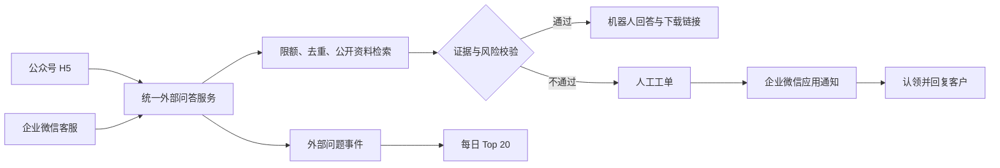

# 外部客户智能客服 V1 实施方案

## 目标

外部客户通过公众号 H5 或企业微信客服提问时，系统只根据已审核、已启用且标记为 `external_public` 的资料回答；客户可下载相应公开文件；没有充分资料依据或触发风险规则时，系统转交管理员或工程师。每天按上海自然日输出公众号、企业微信客服和全渠道合并的客户问题 Top 20。

## V1 范围

- 公众号 H5：沿用 OAuth、问答配额和公开资料下载；记录可审计的外部问题事件。
- 企业微信：使用“微信客服”承接外部客户消息；内部自建应用只用于通知和处理人员，不直接承接客户会话。
- 问答：仅文本；回答必须有公开资料依据；可返回短期签名下载链接。
- 转人工：无资料、低证据、敏感主题、客户主动要求人工或连续未解决时创建工单并通知负责人。
- 统计：每天 06:00（Asia/Shanghai）对前一自然日问题做相似问法聚类，分别生成三个 Top 20 榜单。

不包括语音/图片问答、CRM 同步、营销自动化、排班系统和企业微信文件素材直传。

## 架构

## 数据与安全

新增 `ai_external_question_events` 记录外部问题。客户身份只保存哈希；原始问题使用现有内容加密密钥加密保存；渠道消息 ID 用于幂等。新增 `ai_external_hot_question_report_items` 保存按渠道的聚类报告，支持 `wechat_official`、`wecom_kf` 和 `all`。

下载链接必须绑定客户会话、公开文件和短有效期；文件被取消公开后，已签发链接必须失效。Token、CorpSecret、EncodingAESKey 仅通过环境变量注入，不写入数据库或日志。

微信客服启用时需配置 `WECOM_KF_CORP_ID`、`WECOM_KF_SECRET`、`WECOM_KF_TOKEN`、`WECOM_KF_ENCODING_AES_KEY` 和至少 32 字符的 `WECOM_KF_IDENTITY_HASH_SALT`；并启用 Redis 限额与 `channels.wecom_kf` 特性开关。

## 转人工规则

| 条件 | 处理 |
|---|---|
| 公开资料有充分证据且非高风险 | 机器人回复并列出资料 |
| 无检索结果、证据不足或连续两次未解决 | 创建技术/客服工单 |
| 报价、合同、支付、投诉、隐私、安全 | 直接转管理员 |
| 客户明确要求人工 | 直接转人工 |

工单状态为 `PENDING → ASSIGNED → REPLIED → RESOLVED/CLOSED`。认领操作必须原子化；人工回复必须通过原客户渠道返回。

## 实施顺序

1. 统一外部问题事件、公众号事件接入和外部 Top 20（本次先行实施）。
2. 企业微信客服回调、消息同步、回复和会话级下载链接。
3. 工单、路由、企业微信应用通知和人工回复闭环。
4. 后台报表与工单页面、端到端测试和上线配置。

## 当前代码落地状态（2026-07-13）

- 已完成：统一密文问题事件、公众号 H5 问题写入、按公众号/微信客服/全渠道聚类的每日 Top 20，以及管理员只读查询接口。
- 已完成：微信客服 API 客户端，使用 `kf/sync_msg` 拉取客户文本并使用 `kf/send_msg` 回复；重复同步消息以“渠道 + 消息 ID”判重，不重复扣配额。
- 已完成：微信客服消息只检索 `external_public=true` 的已审核资料；回答末尾提供 H5 资料库入口，文件下载仍由既有短期下载令牌控制。
- 已完成：人工接管后端闭环——无公开资料依据即创建幂等工单，按 `EXTERNAL_SUPPORT_NOTIFY_USER_IDS` 通知指定企业微信成员，后台支持认领与人工回复。企业微信客服回复沿原客户会话发送；公众号 H5 回复在同一 OAuth 会话中查询。
- 待完成：正式环境的微信客服回调加密验签联调，以及桌面端/管理后台的工单可视化页面。

## 验收标准

- 两个渠道只检索公开资料，且不会泄露内部资料。
- 同一渠道消息不会被重复回答或重复计数。
- 无依据问题必定转人工，不由模型编造答案。
- 每日可查看公众号、企业微信客服和合并后的 Top 20。
- Top 20 聚合相似问法，包含提问次数、直接回答数、转人工数和引用资料。
- 同一外部问题最多创建一张工单；工单只能被一人原子认领，人工回复保留加密审计记录与渠道投递状态。
