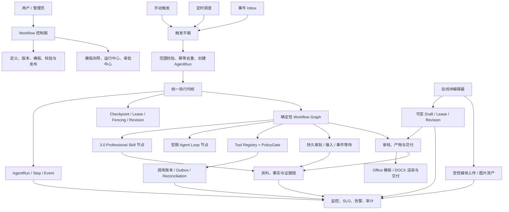

# 聚信 AI 助手 4.0——可靠自动流程版完整方案

> 状态：本地 4.0 候选实现已完成并通过离线门禁；生产版 4.0 尚未完成。剩余发布阻断项是 DOCX 复杂排版无损往返（结构化复杂特性报告 golden 已覆盖）、共享数据库迁移、staging/真实授权与 provider/灰度/回滚证据，以及三条首批业务模板接入真实业务数据/provider 的验收
> 基线：`codex/3.0-merged` / `ai-assistant-v3.0.0` / `150da87e347a6a56f97ba48442bbe3b7e51ba3de`
> 开发分支：`codex/ai-assistant-4.0`
> 目标版本：`4.0.0`（仅在发布门禁通过后升级）
> 输入方案：附件《聚信 AI 助手 4.0——自动流程版总体方案》
> 本文定位：适配性结论、改进计划、实施设计、检测标准和稳定性发布门禁

## 1. 决策摘要

原方案的产品方向适合聚信 AI 助手，但不适合按原文直接开发。

最终决策如下：

1. 保留“把 3.0 专业交付能力编排为可重复自动流程”的产品目标。
2. 不新建一套平行的运行状态、工具执行、审批、审计和恢复体系。
3. 4.0 定位为现有统一执行内核之上的“自动化控制面”，而不是第二个 Agent Runtime。
4. 先交付模板化、可恢复、可审计的手动流程，再增加定时和事件触发。
5. 可视化自由画布和自然语言生成流程后置，避免在执行语义未稳定前放大复杂度。
6. 不做底层推倒重构；必须先完成状态、工具、恢复、审批和迁移语义的定向收敛。
7. 用户已决定把 staging 和授权放到最后考虑；可以先做本地开发，但没有 staging、真实授权和双 Worker 故障证据时，不得宣布“生产稳定”。
8. 4.0.0 增加在线结构化文档编辑，支持段落、表格和图片等块的插入、编辑、拖拽、撤销、自动保存和恢复。
9. 复用现有 Office 模板、DOCX 导出、文件与交付链，但不把 Office 当成浏览器块编辑器内核；编辑器继续以现有 `DeliverableContent.blocks` 为服务端事实源。
10. 4.0.0 采用单活编辑租约和乐观并发，不承诺多人实时共同编辑；CRDT/OT 实时协同在稳定版本之后单独建设。

一句话架构：

> Workflow 负责“何时、按什么确定性图执行”，Agent Loop 只负责某个 AI 节点内部“如何完成任务”，所有状态和副作用仍由统一执行内核管理。

## 1.1 本轮正式实现状态（2026-07-16）

本轮没有继续扩展独立原型，而是把已确认的编辑交互接入现有 AI 助手的真实成果链路，形成 P1A 的最小可用闭环：

- 入口：现有桌面端的“成果中心”→ 选择一个专业成果 → 打开 `ProfessionalDeliverablesPage` 的结构化编辑区；`http://localhost:18140/` 仍是完全独立、无后端副作用的产品评审原型，不是生产入口。
- 编辑：`DeliverableContent.blocks` 通过 `documentBlockAdapter` 归一为 V2，稳定补齐旧 V1、缺失或重复 `block_id`；`DocumentBlockEditor` 支持标题、段落、表格、图片等顶层块的排序和新增段落，原正文 textarea 仅作为隐藏兼容镜像，不再是用户可见的第二个编辑器。
- 保存：编辑写入可变 `DeliverableDraft`，自动保存使用 revision、base version、fencing token 和 `Idempotency-Key`；同 key 同请求重试不增加 revision，同 key 不同请求稳定返回 409；显式“保存为版本”才创建不可变成果版本。
- 并发：编辑前获取单活 `EditLease`，前端每 60 秒续租；租约失效、revision 过期或 fencing token 过期时后端拒绝写入，避免旧页面覆盖新内容。
- 兼容：旧 V1 成果仍可读取；编辑器只通过适配层读写领域正文，未引入第二套生产文档事实源，也未改变历史不可变版本。
- 验证：截至 2026-07-17，桌面端全量测试 41 个文件、305 个测试通过，类型检查通过；服务端编辑租约定向测试 2 passed、32 deselected，`git diff --check` 通过。全量回归中的既有 MSW 未处理请求仅产生警告，退出码为 0；共享数据库迁移、真实授权/Provider、预发布和生产验证仍未执行。
- P1B 运行：审计路径已接入 `WorkflowRunService`，发布的数据库工作流会固定到 owner 可见的具体版本和定义哈希；每个节点写入 `AgentRun`/`AgentRunStep`/`AgentRunEvent`，在安全边界写入恢复 checkpoint；执行期间领取并校验 Worker lease/fencing token；Tool、Professional Skill、Artifact、Approval 四类类型化节点已接入现有注册表/服务，人工审核进入 `waiting_confirmation`，确认后才继续；任务中心重试、运维暂停/恢复和取消沿用统一 `AgentRun` 生命周期。`create_run_audit=false` 仍保留旧轻量引擎作为显式兼容开关。
- P1B 验证：工作流路由与持久化测试 15 个通过；类型化节点、租约领取/释放、恢复/运维路径均有回归覆盖。

本轮在线编辑补齐目标（本地实现，不扩大到 staging/真实 Office）：在现有领域正文契约上补齐表格行列增删、横向合并/拆分、列宽调整和无障碍首/末块移动；表格按数组行和 DOCX 导入的 `cells` 行统一读写，避免把对象渲染成 `[object Object]`。导入、导出报告必须在成果页可见，并保留支持/降级/拒绝明细；验证命令为 `npm test -- --run tests/document-block-adapter.test.ts tests/document-block-editor.test.tsx tests/professional-deliverable-workbench.test.tsx`。

本轮边界：图片上传、完整性扫描、引用计数和孤儿软删除、键盘块移动、持久化调度/事件/Outbox/等待/子流程、纯分支并行、Tool 对账和 Worker lease/fencing、DOCX 内嵌图片资产导入及机器可读降级报告本地实现已完成；复杂 Word 浮动排版、批注、域、宏等仍按支持/降级/拒绝矩阵处理，不承诺无损往返，但复杂特性报告已有 deterministic golden fixture。受控外部事件已增加默认关闭的 HMAC-SHA256、时间窗和 Inbox 幂等重放校验。三条首批业务模板已完成确定性本地端到端回归，但尚未接入真实业务数据、真实 provider 并完成生产验收。共享数据库迁移、staging/真实授权/真实 provider、灰度回滚、生产连续观测和 4.0.0 版本发布仍未宣称完成。

## 2. 适配性评估

### 2.1 适合保留的部分

| 原方案能力 | 适配结论 | 采用方式 |
|---|---|---|
| 手动、定时、事件、审批触发 | 适合 | 分阶段交付，手动优先，定时其次，事件最后 |
| Skill、资料、模板编排 | 非常适合 | 直接复用 3.0 Professional Delivery，不重新实现 |
| 节点化流程 | 适合 | 使用有类型、可验证的确定性流程图 |
| 审批、人机协同 | 适合 | 后端强制审批，参数变化后原审批失效 |
| 版本化与发布 | 适合 | 草稿可变、发布版本不可变，运行固定到具体版本 |
| 重试、断点和恢复 | 必须具备 | 复用 AgentRun checkpoint、lease、fencing 和 reconciliation |
| 审计与可追溯 | 必须具备 | 复用运行事件、步骤、工具调用账本和交付证据链 |
| 模板市场 | 适合 | 先做内置模板库，不做开放市场 |
| 自然语言生成流程 | 有价值但过早 | 4.0 后期只生成草稿，必须验证并人工发布 |
| 可视化自由编排 | 有价值但过早 | 先做模板向导和结构化编辑器，稳定后再做画布 |
| 在线文档编辑 | 必须增加 | 在现有专业成果页内以结构化块编辑器作为唯一可见编辑区，隐藏 textarea 仅用于兼容，复用成果版本、证据、评论、审核与审批链 |
| WordPress 式块拖拽 | 适合 | 首版支持顶层段落、表格、图片按块移动，带插入指示、撤销和键盘替代操作 |
| Office 能力 | 适合复用一部分 | 复用模板、样式、导入导出和交付；选区、拖拽、撤销和表格交互由新块编辑器负责 |

### 2.2 不适合直接照搬的部分

#### 2.2.1 会形成第二套执行内核

原方案分别设计 Workflow Runtime、State Store、Tool Executor、Approval、Audit 和 Recovery。仓库当前已经具备或正在收敛：

- `AgentRun`、`AgentRunStep`、`AgentRunEvent`；
- 统一运行状态契约和状态机；
- checkpoint、revision、lease、fencing；
- Tool Registry、策略检查、调用账本和结果对账；
- 专业交付的资料、模板、Skill、审核、审批和交付链路。

若按原方案再实现一次，会出现两个系统都声称自己是事实源的问题：暂停和恢复的状态可能不一致，工具失败可能被重复重试，审批可能被绕过，审计也无法证明哪条记录是真实执行轨迹。

#### 2.2.2 恢复语义停留在功能名，没有达到可执行契约

“支持重试、断点续跑”不足以保证稳定。必须明确：

- 哪些位置是安全点；
- 外部调用超时但结果未知时能否重试；
- Worker 失联后由谁接管；
- 旧 Worker 如何被 fencing token 拒绝；
- 已成功节点是否会再次执行；
- 审批后恢复是否仍固定到同一个定义版本和参数哈希。

原方案没有把这些要求落到状态转换、唯一键、并发控制和检测用例中。

#### 2.2.3 第一阶段范围过大

原方案首期同时包含引擎、定时、Skill、任务、产物、审批、重试、checkpoint、审计和多种业务场景。任何一项出现不稳定，都会让整体无法验收，也难以定位失败原因。

4.0 应按“执行语义 → 手动闭环 → 定时触发 → 事件连接 → 设计体验”的顺序交付。

#### 2.2.4 数据模型偏 CRUD，缺少分布式执行约束

原表结构没有完整覆盖：

- 乐观并发版本 `state_revision`；
- Worker 租约和 fencing token；
- 触发事件去重；
- 工具调用幂等键与请求哈希；
- 结果未知后的 reconciliation；
- 审批参数哈希与一次性决策；
- 定时任务的时区、DST、misfire 和 catch-up 策略；
- 契约版本与恢复兼容性。

只增加 workflow、node、run 三类表无法支撑稳定自动化。

#### 2.2.5 `tenant_id` 与当前权限模型不匹配

当前仓库的可验证权限边界是用户、项目及项目成员关系，并没有一套已落地的企业租户隔离基础。现在直接给工作流表加 `tenant_id`，会制造“字段存在即完成租户隔离”的假象。

4.0 首版采用 `owner_user_id + project_id + ProjectMember` 的服务端强制范围；如果后续确实需要企业多租户，必须先单独建设租户根实体、成员、角色、密钥域、迁移和隔离测试。

#### 2.2.6 当前工作流原型不能直接成为生产基础

当前工作树中的工作流代码可以作为交互和节点模型原型，但存在以下结构性限制：

- 同时存在文件存储和数据库定义；
- Run 和 Node 状态主要保存在内存中；
- `parallel` 当前实际按顺序执行；
- `human_review` 仅返回等待状态，没有持久化审批和恢复令牌；
- 失败后缺少持久重试、租约接管和结果对账；
- 流程完成后才写 AgentRun 审计快照，AgentRun 不是实时事实源；
- 节点直接调用 AgentHub，没有统一经过 Tool Registry 调用账本。

这些代码应保留为原型和测试素材，通过适配器逐步替换，不能直接扩展成生产引擎。

#### 2.2.7 验收标准不够证明“稳定”

功能演示通过，只能证明正常路径可用。生产稳定还需要迁移、并发、宕机、重复事件、未知副作用、权限隔离、真实凭证、灰度和持续观察证据。

#### 2.2.8 “复用 Office”不能等同于“Office 就是在线编辑器”

仓库现有 Office 能力集中在模板、上传解析、DOCX/XLSX/PPTX 产物和交付文件管理；专业成果正文已接入结构化块编辑器（仅保留隐藏 textarea 兼容镜像）。Office 链路没有提供浏览器内的节点选择、块拖拽事务、撤销栈、表格单元格模型、图片上传状态和评论锚点。

如果直接嵌入 Microsoft 365/Office Online：

- 需要 WOPI/Graph/SharePoint 等额外授权、存储回调、域名和凭证；
- Word 自身的文档模型与 WordPress 式块模型不同，无法自然复用现有块拖拽交互；
- 选区、评论、版本和审批会出现 Office 与聚信两个事实源；
- 当前“授权最后处理”的边界下，无法完成真实环境验收。

因此 4.0.0 采用聚信内置块编辑器，Office 作为导入、渲染、导出和交付适配层。未来如确需“直接在 Microsoft Word Online 中编辑”，应作为独立连接器项目评审，不能替代本方案的块编辑器。

## 3. 是否需要重构底层

结论：不需要推倒重构，需要一次受控的底层收敛。

### 3.1 保留

- 3.0 Professional Delivery 的 Skill、资料、模板、事实证据、审核、审批和交付能力；
- AgentRun 系列运行记录；
- 统一状态契约、checkpoint、lease、fencing 和 revision；
- Tool Registry、策略门、工具调用账本、直接动作账本和 reconciliation；
- Professional Delivery 已有的结构化 `blocks`、稳定 `block_id`、不可变版本、块级差异、事实证据、评论和审核定位；
- Office 模板、Word 渲染、DOCX/XLSX/PPTX 产物和下载交付链；
- 当前桌面端的总体应用框架。

### 3.2 改造

- 将 Workflow Run 映射为 AgentRun，而不是另建运行事实源；
- 将 Workflow Node 映射为 AgentRunStep，并增加稳定的节点绑定信息；
- 将 AI 节点、Skill 节点、工具节点全部接入统一执行入口；
- 将人审等待变成持久化等待对象和后端状态转换；
- 将定时和事件触发变成幂等的 Run 创建器；
- 将现有工作流文件存储和同步内存执行路径逐步退役；
- 用块编辑器作为专业成果唯一可见编辑区，隐藏 textarea 仅作兼容镜像，并通过适配层读写既有成果块契约；
- 增加可自动保存的可变编辑草稿，只有用户明确“保存为版本/提交审阅”时才创建不可变成果版本；
- 增加媒体上传、内容安全检查、图片引用和 Office 导出转换；
- 先解决 Alembic 多 head 与共享数据库历史，再增加正式 4.0 migration。

### 3.3 禁止

- 不允许 Workflow Runtime 绕过 AgentRun 状态机直接修改最终状态；
- 不允许工具节点绕过 PolicyGate 和 Tool Registry；
- 不允许外部副作用在结果未知时盲目重试；
- 不允许仅由前端隐藏按钮来实现权限或审批；
- 不允许运行中的流程自动漂移到新发布版本；
- 不允许同时保留文件和数据库两个生产事实源；
- 不允许把 Tiptap/ProseMirror 或 Office 的私有 JSON 直接变成第二套服务端文档事实源；
- 不允许自动保存每次都创建不可变成果版本；
- 不允许把图片以 base64/data URL 长期写入正文 JSON，或未经类型、大小、权限和安全校验直接引用外部 URL；
- 不允许在迁移图未收敛时直接沿用当前未提交的 `0034` 编号继续开发。

## 4. 4.0 产品范围

### 4.1 目标

1. 把 3.0 的专业单次交付变成可复用、可触发的业务流程。
2. 每次运行可暂停、审批、恢复、取消、追溯和安全重试。
3. 自动执行不降低现有项目权限、证据链和交付质量。
4. 异常不会静默卡死，外部副作用不会因恢复而重复发生。
5. 产品人员可使用模板完成配置，不依赖编写代码。
6. 用户可以在浏览器内像编辑 WordPress 文章一样编辑专业成果，并把段落、表格、图片作为结构化块移动和交付。

### 4.2 4.0.0 必须交付

- 流程定义、不可变发布版本和发布前校验；
- 手动、定时触发；
- 3 个经过验证的内置流程模板；
- Skill、条件、资料读取、产物、审批、通知等受控节点；
- 运行中心、审批中心、异常/对账中心；
- 暂停、恢复、取消和安全节点重试；
- 幂等、租约、fencing、checkpoint、reconciliation；
- 项目级权限隔离、敏感数据引用和完整审计；
- 在线块编辑器：段落、标题、列表、引用、表格、图片、分隔线和提示块；
- WordPress 式块插入、块工具栏、拖拽排序、明确落点、撤销/重做和键盘移动；
- 服务端自动保存草稿、崩溃恢复、编辑租约、乐观并发冲突处理；
- 结构化正文与 DOCX 模板/导出的确定性转换，以及旧 `schema_version: "1"` 内容兼容；
- 本地门禁，以及发布前的 staging、真实凭证和灰度门禁。

### 4.3 后置能力

- 任意复杂度自由画布；
- 自然语言自动发布流程；
- 第三方开放模板市场；
- 任意脚本节点；
- 多人实时光标、CRDT/OT 实时协同编辑；
- DOCX 导入后保持所有 Word 高级排版的无损往返；
- 跨文档多块拖拽、任意嵌套块和第三方编辑器插件市场；
- 跨企业租户共享；
- 无边界循环、多 Agent 自主改写流程；
- 防火墙、服务器管理等高风险写操作。

## 5. 目标架构



### 5.1 控制面与执行面分离

控制面管理草稿、版本、模板、触发器和展示；执行面只接受已发布、已校验、已固定版本的定义。控制面不可直接伪造执行结果，执行面也不可自行修改定义。

### 5.2 Workflow 与 Agent Loop 的边界

- Workflow 图负责顺序、分支、等待、风险、预算和失败策略；
- Agent Loop 只能运行在允许 AI 推理的节点中；
- Agent Loop 的工具调用仍必须通过统一工具契约；
- LLM 不得自由改写外层流程图，也不得跳过审批节点；
- 确定性节点不调用 LLM，减少成本和不可预测性。

## 6. 统一契约

所有契约都带 `schema_version`，发布版本固定契约版本和内容哈希。旧运行恢复时使用原契约；不兼容升级必须迁移或 fail closed。

### 6.1 `ExecutionScopeV1`

至少包含：

- `actor_user_id`、`owner_user_id`；
- `project_id` 和项目成员权限快照；
- `workflow_definition_id`、`workflow_version_id`、定义内容哈希；
- Skill、模板、资料范围和版本哈希；
- 可用工具、凭证范围、风险上限；
- 时间、Token、步骤和费用预算；
- 服务契约和执行规则版本。

范围在服务端构建，客户端不能提交任意项目 ID 或扩大权限。

### 6.2 `WorkflowDefinitionV1`

发布前必须验证：

- 节点类型和输入输出 schema；
- 图可达性、孤立节点和非法环；
- 循环上限、最大节点数和最大并行度；
- 每个节点的权限、风险、超时、重试和失败策略；
- Skill、模板、工具和资料引用是否存在且可访问；
- 审批是否覆盖所有高风险出口；
- 预算和流程级超时；
- 项目范围与目标输出位置；
- 敏感信息是否只保存引用或密文。

草稿可修改；发布版本不可修改，只能创建新版本。每次运行固定一个版本。

### 6.3 运行状态

Workflow 不再维护独立最终状态机，使用统一 AgentRun 状态并补齐以下可表达语义：

```text
queued
  -> running
  -> waiting_input | waiting_approval | waiting_event
  -> retrying | reconciliation_required | paused
  -> running
  -> succeeded | partial | failed | cancelled | timed_out
```

约束：

- 只有状态机服务可以执行转换；
- 每次写入携带 `state_revision`；
- Worker 写入必须携带有效 lease 和 fencing token；
- 终态不可被普通重试重新打开；
- `reconciliation_required` 完成对账前不得自动重试副作用。

节点生命周期：

```text
queued -> running
running -> succeeded | failed | skipped | waiting
running -> reconciliation_required | cancelled | timed_out
waiting -> running | cancelled | timed_out
failed -> retrying -> running
```

`skip` 只允许定义中标记为可选的节点，并记录操作者、理由和权限；关键控制节点永远不可跳过。

### 6.4 `TriggerEnvelopeV1`

包含：`source`、`event_id`、`event_type`、`occurred_at`、`received_at`、`scope`、`payload_ref`、`payload_hash`、`schema_version` 和 `dedupe_key`。

`source + event_id + workflow_version_id` 必须唯一。重复投递返回同一个 Run，不重复执行。

### 6.5 `ToolInvocationV1`

包含：调用 ID、幂等键、Run/Step/Node、请求哈希、输入摘要、工具版本、风险等级、审批引用、状态、结果摘要、provider receipt 和对账状态。

规则：

- Agent 发起的工具调用统一经过 Tool Registry 和 PolicyGate；
- 用户直接通过 HTTP 发起的写动作进入 Direct Action Ledger；
- 已确认失败且满足策略时才能重试；
- 超时或连接断开导致结果未知时进入 reconciliation；
- provider 支持幂等键时必须透传；不支持时用业务唯一键和结果查询补偿。

### 6.6 `ApprovalDecisionV1`

包含：approval ID、Run/Node、请求参数哈希、风险和范围、决策人、决策、理由、过期时间和一次性决策键。

以下情况原审批自动失效：

- 参数、接收人、项目、工具或风险等级变化；
- 流程版本变化；
- 审批超时；
- 决策已被消费；
- 操作者权限已失效。

### 6.7 恢复语义

安全点位于：节点开始前、确定性节点完成后、外部调用账本落库后、provider receipt 落库后、审批/等待状态落库后、节点完成提交后。

恢复必须满足：

1. 新 Worker 获取新 lease 和更高 fencing token；
2. 读取原 workflow version、scope 和最近 checkpoint；
3. 已提交成功的节点不再执行；
4. 运行中的纯计算节点可从安全点重做；
5. 外部副作用先查账本和 provider 状态；
6. 无法确定结果时停在 reconciliation，而不是猜测成功或失败；
7. 恢复动作写入事件和审计；
8. 状态或 checkpoint schema 不兼容时 fail closed，并进入人工处理。

## 7. 节点模型

### 7.1 4.0.0 允许的节点

| 节点 | 行为 | 默认风险 | 恢复策略 |
|---|---|---:|---|
| Start / End | 流程边界 | 低 | 幂等 |
| Project Read | 读取项目资料 | 低 | 可安全重试 |
| Condition | 确定性条件判断 | 低 | 可安全重算 |
| Transform | 受限数据转换 | 低 | 可安全重算 |
| Professional Skill | 调用 3.0 专业交付 | 中 | 固定 Skill/模板/资料版本恢复 |
| Agent Task | 在明确目标和预算内运行 Agent Loop | 中 | 从 checkpoint 恢复 |
| Artifact | 创建草稿或交付物 | 中 | 业务键幂等 |
| Human Approval | 持久化审批等待 | 中/高 | 使用一次性审批令牌恢复 |
| Notification | 发送通知 | 中 | Outbox + provider 对账 |
| Wait | 等待时间或事件 | 低 | 持久化唤醒条件 |
| Subflow | 调用固定版本子流程 | 中 | 父子 Run 绑定与深度限制 |

### 7.2 暂不允许

- 任意 Shell、任意 SQL、任意 Python；
- 动态下载并执行未知 Skill；
- 让 LLM 自行生成并直接执行新节点；
- 没有幂等或对账能力的高风险写工具；
- 不受深度和预算限制的递归子流程。

## 8. 数据模型

### 8.1 复用现有事实表

- AgentRun：一次流程运行的唯一事实源；
- AgentRunStep：节点尝试和状态；
- AgentRunEvent：状态、审批、恢复和运维事件；
- checkpoint 表：恢复快照；
- 工具调用和直接动作账本：副作用状态；
- Professional Delivery 的项目、资料、Skill、模板、审核、审批、产物表；
- `WorkArtifactVersion` 的不可变正文、内容哈希、父版本关系和块级 diff；
- 事实、证据、评论和审核使用的稳定 `block_id` 锚点；
- Office 模板定义、渲染配置、导出记录和交付记录。

### 8.2 4.0 最小新增模型

| 模型 | 用途 | 关键约束 |
|---|---|---|
| WorkflowDefinition | 稳定身份和范围 | owner/project/status/current version |
| WorkflowVersion | 不可变发布定义 | content hash 唯一、schema version、发布后不可改 |
| WorkflowRunBinding | AgentRun 与流程版本绑定 | AgentRun 唯一、定义/范围快照不可漂移 |
| WorkflowNodeBinding | Step 与稳定 node key 绑定 | Run + node key + attempt 唯一 |
| WorkflowSchedule | 定时配置 | timezone、misfire、next fire、lease、dedupe |
| WorkflowTriggerEvent | 事件 Inbox | source + event ID 唯一、payload hash/ref |
| WorkflowWait | 审批/输入/时间/事件等待 | token 唯一、过期、消费一次 |
| GenericApprovalRequest | 非专业交付类通用审批 | 参数哈希、决策版本、一次性消费 |
| DeliverableDraft | 在线编辑中的可变草稿 | deliverable 唯一、base version、draft revision、内容密文、编辑状态 |
| DeliverableEditLease | 单活编辑租约 | deliverable 唯一有效租约、owner、expires at、fencing token |
| DeliverableMedia | 图片等文档资产 | project/owner scope、SHA-256、MIME、尺寸、扫描状态、存储引用 |

不再新建独立的 workflow audit log；通过 AgentRunEvent、工具账本和投影视图形成统一审计，避免双写漂移。

大输入、输出和敏感数据不直接完整写进 JSON；保存对象引用、摘要、哈希和必要密文。

草稿与版本严格分离：

- 自动保存只更新 `DeliverableDraft`，不会制造大量不可变版本；
- 用户点击“保存为版本”或“提交审阅”时，服务端以 `base_version_uuid + draft_revision + content_hash` 原子创建 `WorkArtifactVersion`；
- 创建版本后草稿更新基线或关闭，旧版本永不原地修改；
- 工作流 `Artifact` 节点只消费明确版本，不能读取正在变化的草稿；
- 租约只决定谁可以编辑，不代替项目权限；所有写操作仍重新校验成员关系和成果状态。

正文仍保持文档型 JSON，不拆成每块一张表。4.0 使用 `DeliverableContentV2` 作为领域契约，编辑器状态通过适配器转换：

```json
{
  "schema_version": "2",
  "blocks": [
    {
      "block_id": "b-paragraph-01",
      "type": "paragraph",
      "content": [{"type": "text", "text": "正文", "marks": []}]
    },
    {
      "block_id": "b-table-01",
      "type": "table",
      "attrs": {"header": true},
      "rows": [
        {"row_id": "r-01", "cells": [{"cell_id": "c-01", "content": []}]}
      ]
    },
    {
      "block_id": "b-image-01",
      "type": "image",
      "asset_uuid": "media-uuid",
      "attrs": {"alt": "图片说明", "width": 720, "alignment": "center"}
    }
  ]
}
```

稳定标识规则：移动保留 `block_id`；复制生成新 ID；拆分时原块保留 ID、新块生成 ID；合并保留目标块 ID 并记录来源；表格行、单元格使用稳定子 ID。事实、评论和审核继续以 `block_id` 为主锚点，表格精确定位增加可选 `anchor_path/cell_id`，旧记录仍可只指向整个块。

### 8.3 迁移要求

当前已知 Alembic 存在两个 head，且共享数据库真实历史尚未确认。顺序必须是：

1. 获取目标数据库只读迁移证据；
2. 清点两个分支对象和潜在冲突；
3. 评审并执行 merge migration；
4. 让 4.0 migration 从授权后的唯一 head 继续；
5. 运行全新数据库、从共享历史升级、失败回滚和重复升级测试；
6. 禁止通过重命名 migration 文件或手工改 `alembic_version` 伪造收敛。

正文迁移采用读旧写新：`schema_version: "1"` 始终可读；首次编辑时在内存中转换为 V2，用户明确保存后才创建新的 V2 版本，不批量改写历史版本。V2 回滚期间仍保留 V1 只读渲染器和导出兼容测试。

在用户授权 staging/数据库前，只能准备 migration 候选和本地全新数据库证据，不能宣称共享数据库可安全升级。

## 9. API 设计

建议使用 `/api/ai/automation` 作为正式命名空间，避免与现有原型接口混淆。

### 9.1 定义与版本

- `POST /definitions`
- `GET /definitions`
- `GET /definitions/{id}`
- `PATCH /definitions/{id}`
- `POST /definitions/{id}/versions`
- `POST /definitions/{id}/validate`
- `POST /definitions/{id}/publish`
- `POST /definitions/{id}/enable`
- `POST /definitions/{id}/disable`

### 9.2 运行

- `POST /runs`
- `GET /runs`
- `GET /runs/{id}`
- `GET /runs/{id}/events`
- `POST /runs/{id}/pause`
- `POST /runs/{id}/resume`
- `POST /runs/{id}/cancel`
- `POST /runs/{id}/nodes/{node_key}/retry`

### 9.3 触发与审批

- `POST /schedules`
- `PATCH /schedules/{id}`
- `POST /events`
- `GET /approvals`
- `POST /approvals/{id}/decision`
- `GET /reconciliations`
- `POST /reconciliations/{id}/resolve`

### 9.4 在线文档编辑

沿用现有 `/api/ai/deliverables` 命名空间，避免另建“Office 文档”资源：

- `GET /{deliverable_uuid}/draft`：读取或从当前版本初始化草稿；
- `PUT /{deliverable_uuid}/draft`：按 `draft_revision` 自动保存结构化正文；
- `POST /{deliverable_uuid}/draft/lease`：获取或在规则允许时接管编辑租约；
- `POST /{deliverable_uuid}/draft/lease/heartbeat`：续租并校验 fencing token；
- `DELETE /{deliverable_uuid}/draft/lease`：主动释放租约；
- `POST /{deliverable_uuid}/draft/commit`：原子校验并创建不可变成果版本；
- `POST /{deliverable_uuid}/media`：初始化受控上传并返回资产 ID；
- `POST /{deliverable_uuid}/media/{media_uuid}/complete`：校验哈希、类型、尺寸和扫描状态后变为可引用；
- `DELETE /{deliverable_uuid}/media/{media_uuid}`：仅删除未被版本引用的资产；
- `POST /{deliverable_uuid}/preview`：使用同一转换器生成只读预览，不创建交付版本。

自动保存请求携带 `base_version_uuid`、`draft_revision`、`content_hash` 和 fencing token。版本或草稿冲突返回 `409 DELIVERABLE_DRAFT_CONFLICT` 及服务端当前 revision；前端不得静默覆盖，可选择刷新、保存副本或进入差异合并。租约过期返回稳定错误码并立刻切换只读。

所有写接口要求：

- 身份与项目成员权限；
- `Idempotency-Key`；
- 对可并发修改的资源使用 revision/`If-Match`；
- 服务端重新计算 ExecutionScope；
- 审计 actor、理由、请求哈希和结果；
- 错误使用稳定错误码，不暴露密钥和敏感 payload；
- 媒体下载和预览使用项目授权的短期 URL 或受控流式接口，正文只保存 `asset_uuid`，不保存物理路径。

## 10. 前端方案

### 10.1 4.0.0 页面

1. 专业成果在线编辑器：块编辑、目录、事实、审核、评论、版本、预览和 Office 导出。
2. 自动流程列表：状态、版本、触发器、最近运行、负责人。
3. 模板向导：选择模板 → 绑定项目/Skill/资料 → 设置触发 → 风险检查 → 发布。
4. 结构化流程编辑器：节点表单和受控连线，不支持任意代码。
5. 运行中心：节点时间线、当前等待、重试、checkpoint 和证据。
6. 审批中心：风险、参数差异、影响范围和一次性决策。
7. 异常与对账中心：未知副作用、卡住运行、人工裁决和恢复记录。
8. 调度日历：时区、下次执行、misfire 和最近触发结果。

### 10.2 交互原则

- 默认先预览再启用；
- 写操作清晰标记目标、范围、风险和是否需要审批；
- 失败展示“发生了什么、系统已经做了什么、用户可以做什么”；
- `reconciliation_required` 不展示成普通失败重试；
- 新版本发布不影响正在运行的旧版本；
- 所有权限校验仍在后端执行。

### 10.3 在线文档编辑器布局

在现有专业成果页内使用结构化块编辑器作为唯一可见编辑区，保留左侧成果/目录和右侧事实、审核、评论、版本、动态面板；隐藏 textarea 只服务旧自动化定位，不承担编辑事实：

```text
┌──────────────┬──────────────────────────────────────┬──────────────────┐
│ 成果/章节目录 │  + 插入块  撤销/重做  保存状态  预览 │ 事实/审核/评论/版本 │
│              │                                      │                  │
│              │  ⋮⋮ 标题                             │ 选择块后显示对应   │
│              │  ⋮⋮ 段落正文……                       │ 证据、问题和属性   │
│              │  ⋮⋮ ┌──────── 表格 ────────┐         │                  │
│              │  ⋮⋮ │ 单元格可编辑/增删行列 │         │                  │
│              │  ⋮⋮ └──────────────────────┘         │                  │
│              │  ⋮⋮ [图片 / 说明 / 尺寸]             │                  │
└──────────────┴──────────────────────────────────────┴──────────────────┘
```

核心交互：

- `/` 命令和“+”菜单插入段落、标题、列表、引用、表格、图片、分隔线和提示块；
- 鼠标悬停显示块拖拽柄，拖动时显示唯一插入线，整块移动后保持选区并可一次撤销；
- 段落、表格和图片首版按顶层块移动；表格内部支持单元格编辑、增删行列、合并/拆分和列宽调整，整张表作为一个文档块拖动；
- 图片支持文件选择和拖入上传，上传中显示进度，失败可重试；支持替代文本、宽度和对齐，不接受正文内 base64；
- 键盘和无障碍菜单提供“上移/下移/移到开头/移到末尾”，不把鼠标拖拽作为唯一操作方式；
- 删除有事实、证据、评论或审核锚点的块前给出影响提示，确认后保留可审计的锚点失效记录；
- 拖拽、粘贴和导入统一经过 schema 白名单，清除脚本、事件属性和危险 URL。

### 10.4 编辑器内核选型

推荐使用 **Tiptap/ProseMirror + React NodeView + 领域适配器**，不直接使用 Office iframe，也不把编辑器原生 JSON 存为服务端事实源。

选择依据：

- Tiptap 官方 React 集成、JSON 持久化、自定义 NodeView、节点拖拽、表格、图片和文件拖放事件覆盖了本功能的底层能力；
- 当前系统已有稳定 `block_id`、块级 diff、事实/评论锚点和服务端 schema，Tiptap 的自定义节点属性更适合保留这些领域约束；
- BlockNote 的开箱块体验更快，但它自带 `id/type/props/content/children` 文档模型；直接采用会增加一次长期双向映射和第二套块语义，因此只作为 P0 技术验证的对照方案；
- Tiptap 的 Image/FileHandler 不负责后端上传，本方案明确由聚信媒体 API 实现权限、扫描、哈希、存储和失败恢复。

实现边界：

```text
DeliverableContentV1/V2（服务端唯一正文契约）
                  ↕ BlockEditorAdapter（双向、可测试、确定性）
Tiptap/ProseMirror EditorState（仅前端运行态）
                  ↕ OfficeRendererAdapter
             DOCX / 预览 / 交付文件
```

P0 技术验证必须确认许可证、包体积、React 19 兼容、IME 中文输入、复制粘贴、500 块性能和桌面端打包；任一门槛不通过再选择 BlockNote 或直接使用 ProseMirror，不在业务开发中途更换内核。

官方选型资料：

- [Tiptap React 集成](https://tiptap.dev/docs/editor/getting-started/install/react)
- [Tiptap JSON 持久化](https://tiptap.dev/docs/editor/core-concepts/persistence)
- [Tiptap Drag Handle](https://tiptap.dev/docs/editor/extensions/functionality/drag-handle)
- [Tiptap React NodeView](https://tiptap.dev/docs/editor/extensions/custom-extensions/node-views/react)
- [Tiptap Table](https://tiptap.dev/docs/editor/extensions/nodes/table)
- [Tiptap Image](https://tiptap.dev/docs/editor/extensions/nodes/image)
- [Tiptap FileHandler](https://tiptap.dev/docs/editor/extensions/functionality/filehandler)
- [BlockNote 文档结构](https://www.blocknotejs.org/docs/foundations/document-structure)

### 10.5 保存、恢复和冲突语义

1. 打开可编辑成果时获取短租约，其他用户看到只读状态、编辑者和租约到期提示。
2. 编辑操作先进入本地撤销栈，停止输入约 2 秒触发自动保存，持续编辑最长约 10 秒至少保存一次。
3. 自动保存成功展示“已保存到服务器”及时间；失败保留编辑内容、退避重试并显示明确状态。
4. 关闭或崩溃后重新打开，从服务端草稿恢复；不在 `localStorage` 长期保存明文敏感正文。
5. 用户点击“保存为版本”时填写变更摘要，服务端原子创建不可变版本；提交审阅前必须先完成该动作。
6. 另一操作改变基线或 draft revision 时，返回冲突，不做 last-write-wins；用户可刷新、另存副本或查看差异后合并。
7. 租约超时、网络分区或旧页面恢复时，fencing token 阻止旧编辑者继续写入。

4.0.0 不做多人实时光标。单活租约能复用现有 revision/fencing 可靠性语义，也能避免为首版引入 CRDT、评论锚点重映射和审批版本漂移。实时协同必须在后续版本用独立 RFC 处理。

### 10.6 Office 复用和转换边界

| 能力 | 4.0 做法 | 是否复用现有能力 |
|---|---|---|
| Word 模板和样式 | V2 块映射到模板段落、标题、表格、图片 | 复用并扩展 |
| DOCX 导出与交付 | 沿用现有 export、文件哈希、权限和交付记录 | 直接复用 |
| Office 文件上传 | 沿用上传/解析入口，转换成受支持块并生成导入报告 | 复用入口，新增转换器 |
| 在线编辑 | Tiptap 块编辑器 | 新增，Office 不提供 |
| 块拖拽/撤销 | 编辑器事务 | 新增 |
| 表格交互 | 编辑器表格节点，导出时转换为 Word 表格 | 新增交互，复用导出层 |
| 图片管理 | 受控媒体资产，导出时嵌入 | 新增资产层，复用文件层 |
| 无损往返 | 4.0.0 不承诺复杂 Word 域、宏、批注和浮动排版无损往返 | 后置 |

所有转换器必须输出“支持、降级、拒绝”报告。不能识别的 Office 内容不可静默丢失；可安全降级的内容转为只读提示块，不安全或会误导交付的内容拒绝导入。

## 11. 首批业务模板

### 11.1 月度经营报告

流程：手动/定时触发 → 固定项目范围取数 → 调用报告 Skill → 事实与引用检查 → 生成草稿 → 人工审核 → 归档。

首版不自动向外部联系人发送报告。验收重点是资料版本固定、引用可追溯、重复触发不重复归档。

### 11.2 逾期事项提醒

流程：定时触发 → 查询逾期事项 → 确定性分组 → 生成提醒草稿 → 规则/人工审批 → Outbox 通知 → provider 对账。

首版可先只创建内部提醒任务，外部通知在真实凭证和对账能力通过后启用。

### 11.3 已审批交付物归档

流程：审批事件 → 验证审批与参数哈希 → 生成归档业务键 → 保存交付物 → 写入证据链 → 通知负责人。

同一交付物和版本的归档必须幂等。

## 12. 调度与事件

### 12.1 定时调度

每个 Schedule 明确：

- IANA timezone；
- DST 策略；
- misfire 策略：跳过、仅补一次或按上限补跑；
- 最大延迟和 catch-up 上限；
- 同一窗口并发策略；
- 下次触发时间；
- 调度 Worker lease 与 fencing；
- 窗口级 dedupe key。

调度器只负责创建幂等 Run，不直接执行节点。

### 12.2 事件触发

外部事件先写 Inbox，再验证 schema、签名、时间窗、范围和去重，最后创建 Run。消费失败可重放，但不得绕过唯一键。

4.0.0 不要求开放任意 Webhook；先为内部审批和项目事件建立受控适配器。

#### 12.2.1 受控签名事件的租户契约

`POST /api/ai/workflows/events/signed` 默认关闭，仅供受控适配器使用。生产开启时必须配置
`WORKFLOW_EVENT_SIGNATURE_CREDENTIALS`（JSON 对象），每个凭据同时声明密钥和允许范围：

```json
{
  "reporting-adapter": {
    "secret": "at-least-32-byte-secret",
    "owner_user_ids": ["owner-a"],
    "project_ids": ["project-a"]
  }
}
```

请求必须携带 `X-Workflow-Event-Credential`、`X-Workflow-Owner-Id`、`X-Workflow-Event-Timestamp` 和
`X-Workflow-Event-Signature`。签名覆盖规范化请求体、owner 和 timestamp；凭据 ID、owner 与 project
均为精确匹配，禁止通配符。请求体的 `project_id`（顶层或 `payload.project_id`）必须落在凭据的项目
allowlist；带项目的事件不能使用未声明项目范围的 owner-only 凭据。缺少凭据、范围不匹配、签名无效、
时间窗过期或 Inbox 重放均 fail closed。旧的 `WORKFLOW_EVENT_SIGNATURE_SECRET` 仅在
`AUTH_DEV_BYPASS=true` 的本地开发回退中兼容，生产配置校验会拒绝该回退。

该接口与已有的 `/api/ai/workflows/events` SSO 路由并存：内部用户继续使用 SSO、会话和项目权限；
外部适配器只能使用签名凭据声明的 owner/project 范围，不能借此扩大访问权限。

## 13. 安全、凭证与审计

1. 凭证只保存安全存储引用，不进入流程 JSON、日志、checkpoint 或前端响应。
2. 凭证按 provider、项目、用途和读写权限分域，默认最小权限。
3. 高风险工具必须同时满足工具策略、项目权限和有效审批。
4. 发布时校验凭证引用存在；运行时校验未过期且 scope 匹配。
5. 支持轮换、吊销和使用审计；恢复时不得自动替换为权限更高的凭证。
6. 日志对个人信息、Token、密钥和正文做脱敏，只保留必要摘要和哈希。
7. 下载、查看产物继续执行项目权限，不因获得 Run ID 而扩大访问。
8. 跨项目对象引用一律 fail closed。
9. 图片上传校验扩展名、文件签名、MIME、大小、像素和解码结果；隔离扫描未完成资产，拒绝 SVG 脚本和危险元数据。
10. 外部图片 URL 默认不由服务端抓取；未来开放时必须有 SSRF 防护、域名策略、大小上限和内容重新编码。
11. 编辑草稿正文按现有内容密文策略保存，日志、错误和性能埋点不得包含原文。

## 14. 分阶段改进计划

阶段按退出条件推进，不以日期代替质量判断。工作量是相对估算，需在迁移基线确认后再排具体日历。

### P0：基础收敛与编辑器技术验证（2–3 个迭代）

工作：

- 冻结 ExecutionScope、WorkflowDefinition、Trigger、ToolInvocation、Approval 和恢复契约；
- 确认 AgentRun 是唯一运行事实源；
- 设计现有工作流原型到统一内核的适配层；
- 移除生产方案中的文件存储和执行后补审计路径；
- 冻结 `DeliverableContentV2`、Draft、Media、EditLease、块 ID 和评论锚点契约；
- 实现 V1↔领域 V2↔编辑器 JSON 的纯适配器原型和固定样例；
- 对 Tiptap 与 BlockNote 完成许可证、React 19、中文输入、拖拽、表格、图片、粘贴、包体和 500 块性能验证，锁定内核；
- 定义 Office 导入/导出的支持、降级、拒绝矩阵和 golden fixtures；
- 完成 migration 对象清点、merge 候选和测试方案；
- 建立自动流程和在线编辑独立 feature flag，默认关闭。

退出条件：

- 状态和工具调用不存在绕过入口；
- 契约测试覆盖全部允许/禁止转换；
- migration 图有一个经过评审的收敛方案；
- V1 历史版本无改写，V1→V2 转换相同输入得到相同结果和哈希；
- 编辑器技术验证覆盖中文 IME、复制粘贴、拖拽撤销、表格和图片占位，选型记录获评审；
- 编辑器 JSON 无法绕过领域 schema，非法节点和危险 URL 100% 被拒绝；
- 原型保留不影响现有 3.0 行为；
- `git diff --check`、现有后端和桌面端快速门禁通过。

### P1A：在线文档编辑垂直切片（2–3 个迭代）

当前状态：本地 P1A 已完成真实成果读取、V1/V2 适配、顶层块拖拽、键盘移动、草稿自动保存、编辑租约、幂等重试、按钮撤销/重做、媒体上传/扫描/引用计数/孤儿软删除、结构化内容到 DOCX 的文本/表格保真门禁、内嵌图片导入及机器可读导入报告和显式提交版本闭环；复杂 Word 仍不承诺无损导入，但已用 deterministic golden 覆盖支持/降级/拒绝报告。

工作：

- DeliverableDraft、EditLease、Media 的本地 migration 候选、服务和 API；
- 用 `DocumentBlockEditor` 替换成果页正文 `textarea`，保留现有检查器和版本页；
- 段落、标题、列表、引用、表格、图片、分隔线、提示块；
- 块插入、顶层拖拽、明确落点、撤销/重做和键盘移动；
- 自动保存、恢复、租约续期、冲突提示、另存副本和显式保存版本；
- 图片上传、权限、扫描、失败重试、引用计数和孤儿资产清理任务；（正文 URL/协议/MIME/大小校验已先行落地）
- V2 块到 DOCX 的转换，版本 diff、事实、评论、审核和审批兼容。

退出条件：

- 连续编辑只更新一个草稿，不产生版本风暴；显式提交只创建一个不可变版本；
- 两个浏览器同时编辑时只有有效租约和 revision 能写，旧 token 100% 被拒绝；
- 在自动保存前、中、后断网或关闭页面，已确认保存内容可恢复且不静默覆盖；
- 段落、表格、图片拖动后 ID 不变、顺序正确、一次撤销可还原；
- DOCX 导出中的段落、表格、图片顺序和基本样式与只读预览一致；
- 旧 V1 成果可查看、导出和编辑后另存为 V2，历史内容哈希不变；
- 专业成果事实、证据、评论、审核、审批和交付回归通过。

### P1B：持久化手动流程 MVP（2–3 个迭代）

当前状态：本地 P1B 已完成统一 AgentRun 适配、版本固定、节点/事件/checkpoint 持久化、Worker lease/fencing、人工审核等待/确认、Tool/Professional Skill/Artifact/Approval 类型化节点、任务中心重试、运维暂停/恢复/取消、纯分支并行、Tool 对账和租约接管回归。真实 provider 副作用和多进程生产故障矩阵仍需 staging 证据。

工作：

- 定义、版本、校验、发布；
- AgentRun/Step 绑定和持久化节点执行；
- Project Read、Condition、Professional Skill、Artifact、Approval 节点；
- 手动运行、暂停、恢复、取消和安全重试；
- 运行中心、审批中心；
- 月度经营报告模板。

退出条件：

- 单 Worker 和故障注入恢复矩阵全部通过；
- 运行中发布新版本不改变旧 Run；
- 所有 Skill、模板、资料和项目范围固定且可追溯；
- 后端无法绕过审批；
- 3.0 回归全部通过。

### P2：定时流程与副作用安全（约 2 个迭代）

工作：

- Schedule、时区、misfire、catch-up；
- Notification/Outbox/对账；
- 逾期事项提醒、审批后归档模板；
- 异常与对账中心；
- 卡住运行、调度延迟和对账积压告警。

退出条件：

- 重复触发和双调度 Worker 不创建重复 Run；
- 通知结果未知时不会重复发送；
- DST、停机补跑和并发窗口测试通过；
- 3 个模板通过端到端验收。

### P3：事件触发和受控连接器（2–3 个迭代）

工作：

- 事件 Inbox、签名、schema、去重和重放；
- 内部项目事件和审批事件适配器；
- 先读后写的连接器授权模型；
- provider reconciliation 适配器。

退出条件：

- 乱序、重复、延迟和恶意事件测试通过；
- 连接器最小权限和吊销测试通过；
- 真实 provider 的成功、失败、超时和结果未知证据齐全。

### P4：设计体验增强（约 2 个迭代）

工作：

- 结构化画布、节点 schema 表单、版本 diff；
- 自然语言生成“流程草稿”；
- 静态分析、风险解释和发布前模拟；
- 模板复制和参数化；
- 编辑器跨块选择、批量移动、导入报告、快捷键帮助和大文档体验优化。

退出条件：

- AI 生成结果永远不能自动发布；
- 非法图、越权引用和无界循环无法发布；
- 预览与实际执行使用同一份已发布定义；
- 可用性测试可让非开发人员完成 3 个模板配置；
- 可用性测试中用户可在无培训情况下插入并拖动段落、表格和图片，完成保存与版本提交。

### P5：staging、灰度与生产稳定（最后执行，但不可省略）

工作：

- 经授权的共享数据库迁移演练；
- staging 双 Worker kill/recovery 演练；
- 真实凭证、审批、Outbox 和 provider 对账；
- 只读流程 → 内部写流程 → 小范围外部写流程分级灰度；
- 连续观察 SLO、积压、重复副作用和权限告警；
- 回滚流程、开关和责任人演练。

退出条件：

- 发布门禁第 16 节全部通过；
- 灰度期间无未解释的重复副作用和跨项目访问；
- 回滚可在目标时间内停止新触发并安全处理在途 Run；
- 证据包由产品、研发、运维和安全责任人确认。

## 15. 可检测验收标准

### 15.1 正确性

| 检测项 | 通过标准 |
|---|---|
| 状态转换 | 所有允许和禁止转换均有契约测试，非法转换 100% 被拒绝 |
| 重复手动请求 | 同一 Idempotency-Key 返回同一 Run |
| 重复事件 | 同一事件重复投递 1000 次，只创建一个 Run |
| 版本固定 | 运行中发布新版本，旧 Run 的定义哈希不变 |
| 节点恢复 | 已提交成功的节点在恢复后执行次数不增加 |
| 审批 | 未审批、过期、参数变化、重复消费均被后端拒绝 |
| 项目隔离 | A 项目成员无法读取、触发、审批或下载 B 项目对象 |
| 专业交付 | Skill、模板、资料、规则版本和引用证据可追溯 |
| V1 兼容 | 所有 V1 固定样例可查看和导出；首次保存 V2 不改变任何历史版本哈希 |
| 适配器往返 | 领域 V2 → 编辑器 → 领域 V2 在规范化后深度相等，未知节点 fail closed |
| 块拖拽 | 段落、表格、图片在每个合法落点移动后顺序正确、ID 不变，一次 undo 完整还原 |
| 草稿提交 | 自动保存不创建版本；同一 draft revision 重复提交只产生一个版本 |
| Office 输出 | golden fixtures 的段落、标题、表格、图片顺序、内容和基础样式通过结构与渲染比对 |
| 锚点 | 移动块不丢事实/评论/审核锚点；删除、拆分、合并均产生可检测的重映射或失效记录 |

### 15.2 并发和故障

| 检测项 | 通过标准 |
|---|---|
| 双 Worker 抢占 | 只有有效 lease Worker 可写，旧 fencing token 100% 被拒绝 |
| 安全点 kill | 在每个安全点前后终止 Worker，Run 可恢复且无状态倒退 |
| 外部调用超时 | 结果未知必进入 reconciliation，不自动盲重试 |
| 调度重复 | 双调度 Worker、时钟漂移、重启均不产生重复窗口 Run |
| 卡住检测 | 超过阈值的运行可观测、有告警、有处置入口 |
| schema 不兼容 | 恢复 fail closed，不使用猜测性默认值继续执行 |
| 双编辑者 | 同一成果只有有效租约持有者可写，过期 fencing token 100% 被拒绝 |
| 草稿冲突 | 两个客户端基于同一 revision 写入时一个成功、一个明确 409，不发生 last-write-wins |
| 自动保存故障 | 请求前/提交中/响应丢失/重放均可恢复，内容不静默丢失且不重复创建版本 |
| 媒体故障 | 上传中断、完成回调重放、扫描失败和资产删除竞争均不产生越权或悬空可见引用 |

### 15.3 调度

- 覆盖上海、UTC、包含 DST 的时区；
- 覆盖春季跳时和秋季重复小时；
- 覆盖停机后的 skip、补一次和有上限补跑；
- 覆盖同一流程禁止并发和允许受限并发；
- 计划触发到 Run 入队的 p95 目标不超过 60 秒。

### 15.4 性能和 SLO

- 控制面 API p95 小于 500ms，不包含实际 AI/工具执行；
- 500 个普通块、5 万字的基准文档首次可交互 p95 小于 2 秒，拖拽反馈 p95 小于 100ms；
- 草稿自动保存 API 在 1MB 正文基准下 p95 小于 800ms，且前端保存请求合并不堆积；
- 图片使用缩略图和按需加载，不因原图尺寸阻塞正文首次可交互；
- Run/Step/Event 列表采用分页，禁止无界加载；
- 运行创建成功率不低于 99.9%；
- 可安全恢复场景恢复成功率不低于 99%；
- 未解释的跨项目访问、审批绕过、重复高风险副作用必须为 0；
- reconciliation backlog、卡住运行、调度延迟均有阈值和告警；
- SLO 数字在 staging 用真实负载校准后方可锁定为生产承诺。

### 15.5 建议新增的自动化测试文件

以下是实施阶段拟新增文件，不表示当前已经存在：

- `server/tests/test_workflow_contracts.py`
- `server/tests/test_workflow_execution_recovery.py`
- `server/tests/test_workflow_trigger_idempotency.py`
- `server/tests/test_workflow_schedule_semantics.py`
- `server/tests/test_workflow_approval_security.py`
- `server/tests/test_workflow_project_isolation.py`
- `server/tests/test_workflow_tool_reconciliation.py`
- `server/tests/test_workflow_professional_delivery_integration.py`
- `server/tests/test_workflow_migrations.py`
- `server/tests/test_deliverable_content_v2.py`
- `server/tests/test_deliverable_draft_concurrency.py`
- `server/tests/test_deliverable_edit_lease.py`
- `server/tests/test_deliverable_media_security.py`
- `server/tests/test_deliverable_office_roundtrip.py`
- `apps/desktop/src/pages/__tests__/WorkflowsPage.test.tsx`
- `apps/desktop/src/pages/__tests__/WorkflowRunPage.test.tsx`
- `apps/desktop/src/components/__tests__/DocumentBlockEditor.test.tsx`
- `apps/desktop/src/components/__tests__/DocumentBlockDragDrop.test.tsx`
- `apps/desktop/src/pages/__tests__/ProfessionalDeliverableDraft.test.tsx`
- `apps/desktop/e2e/professional-deliverable-editor.spec.ts`

## 16. 发布门禁

### 16.1 每个开发阶段

执行仓库已有的最快相关检查，然后执行：

```bash
cd /Users/zhanglei/Documents/codex-new/juxin-ai-assistant
git diff --check

cd /Users/zhanglei/Documents/codex-new/juxin-ai-assistant/server
python3 -m pytest -q tests --ignore=tests/test_migrations.py -ra
python3 scripts/run_harness_release_gate.py
python3 scripts/run_ga_gate_local.py --json
python3 scripts/run_staging_preflight.py --mode local --json

cd /Users/zhanglei/Documents/codex-new/juxin-ai-assistant/apps/desktop
npm run typecheck
npm test -- --reporter=dot
```

### 16.2 4.0.0 发布前必须全部满足

1. Alembic 单一 head，fresh/upgrade/rollback/retry 证据通过；
2. 3.0 专业交付全量回归通过；
3. 在线编辑的 V1/V2 兼容、草稿、租约、冲突、拖拽、锚点、媒体和 Office golden tests 通过；
4. 工作流契约、权限、调度、幂等、恢复和对账测试通过；
5. 双 Worker lease/fencing、双编辑者和 kill/recovery 演练通过；
6. production checkpointer 方案评审通过；
7. 真实 provider reconciliation 证据通过；
8. staging 和灰度观察达到约定窗口；
9. 回滚开关、停止新触发、禁用在线编辑和在途 Run 处置方案验证通过；
10. 安全评审确认凭证、脱敏、媒体、审批和项目隔离；
11. 发布证据包完整并有明确签字人。

任何一项缺失，都只能标记为开发完成或候选版本，不能标记为生产稳定。

## 17. 灰度、回滚和兼容

### 17.1 Feature Flag

- 4.0 自动化总开关；
- 按用户/项目开启；
- 定时触发单独开关；
- 事件触发单独开关；
- 外部写工具单独开关；
- 自然语言流程草稿单独开关；
- 在线块编辑器单独开关；
- V2 保存、媒体上传和 Office V2 渲染分别可关闭。

关闭总开关后停止创建新 Run，不粗暴终止已开始的外部副作用；在途 Run 进入安全暂停或按处置规则完成。

### 17.2 原型迁移

1. 保留现有默认流程定义作为测试 fixture 和 UI 参考；
2. 新执行器在 feature flag 后接入统一内核；
3. 只读场景可进行旧/新结果 shadow 比较；
4. 确认无调用方后再移除文件存储和同步内存执行；
5. 不让旧、新执行器同时消费同一个触发事件。

在线编辑器采用同样的渐进替换：先只读 shadow 渲染并对比现有正文，再对内部测试成果开放 V2 保存；当前正式成果页已切到块编辑器，旧 textarea 保留为隐藏兼容镜像。关闭编辑器开关后回到 V1/V2 只读展示和现有版本下载，不删除已保存 V2 数据。

### 17.3 数据兼容

- 旧发布版本不可原地修改；
- 删除定义只做归档，保留历史运行引用；
- 新 schema 不能恢复旧 checkpoint 时必须明确迁移或人工终止；
- 回滚应用版本前先验证新写入数据是否仍可读；
- V1 历史版本永不批量重写，V2 写入与旧版只读兼容窗口至少覆盖整个 4.0 灰度期；
- 媒体资产先增加引用再发布版本，删除采用延迟回收，回滚期间不清理仍可能被旧代码引用的文件；
- 数据 migration 与功能开关解耦，遵循 expand → migrate → switch → contract。

## 18. 版本和 Git 规则

- 当前只创建开发分支，不立即把 `VERSION` 从 `3.0.0` 改为 `4.0.0`；
- 4.0 属于大改版，发布门禁通过时按约定升级为 `4.0.0`；
- 版本文件、发布说明、Tag 和提交必须对应；
- 未获得明确授权前不提交、不推送、不触碰共享数据库；
- 实施时保持小而可审查的提交：基础契约、持久运行、调度、UI、门禁分别提交；
- 当前工作树已有大量用户改动，开发前必须先确认这些改动的归属和合并顺序，不能清理或覆盖。

## 19. 风险清单

| 风险 | 影响 | 控制 |
|---|---|---|
| 两套运行状态 | 恢复错误、审计冲突 | AgentRun 唯一事实源 |
| 工具绕过 | 重复写、越权 | Tool Registry/Direct Action Ledger 强制入口 |
| 多 migration head | 部署失败或数据损坏 | 先取证、merge migration、演练 |
| 定时重复 | 重复报告或通知 | 窗口去重、lease、fencing |
| provider 结果未知 | 重复外部动作 | receipt + reconciliation |
| 审批漂移 | 批准 A、执行 B | 参数哈希、一次性令牌、版本固定 |
| 项目越权 | 数据泄露 | 服务端 ExecutionScope 和隔离测试 |
| LLM 改写控制流 | 绕过规则 | 确定性外层图，AI 仅在节点内部 |
| 大 JSON/敏感日志 | 性能和泄密 | 引用、摘要、哈希、脱敏 |
| 编辑器与领域双模型 | diff、锚点和导出漂移 | 领域 V2 唯一事实源、纯适配器、golden tests |
| 自动保存制造版本风暴 | 数据膨胀、审批混乱 | 可变 Draft 与不可变 Version 分离 |
| 多人覆盖 | 内容丢失 | EditLease + revision + fencing + 明确冲突 UI |
| 块 ID 漂移 | 证据、评论和审核失效 | 稳定 ID 规则、锚点重映射测试 |
| 图片上传风险 | 恶意文件、越权、存储膨胀 | 文件签名/扫描/配额/项目权限/延迟回收 |
| Office 转换失真 | 错误交付 | 支持矩阵、导入报告、golden fixtures、拒绝静默丢失 |
| 编辑器依赖不兼容 | React/桌面打包或中文输入故障 | P0 技术验证锁版本和替代方案 |
| 过早做自由画布 | 延误稳定主链 | 模板向导优先，画布后置 |
| 无 staging 证据 | 误判生产稳定 | P5 强制发布门禁 |

## 20. “系统稳定”的完成定义

只有同时满足以下条件，4.0 才算完成：

1. 产品：3 个模板从触发到交付形成真实闭环，专业成果可在线编辑并拖动段落、表格和图片；
2. 架构：只有一套运行状态、工具契约、审批和恢复语义；
3. 数据：迁移单 head，定义/成果版本不可变，V1/V2 兼容，运行证据和块锚点可追溯；
4. 安全：项目隔离、后端审批、最小凭证、媒体检查和脱敏全部通过；
5. 可靠性：重复、并发、双编辑、自动保存、kill、超时和结果未知演练无内容丢失或重复副作用；
6. 运维：卡住、积压、失败、调度延迟和对账都有可观测与处置入口；
7. 发布：staging、真实 provider、灰度和回滚证据完整；
8. 兼容：3.0 专业交付能力无回归，旧成果仍可查看、导出和审阅。

## 21. 现在应该做什么

开发顺序不从画页面或继续扩展现有内存引擎开始，而是：

1. 评审并确认本文的架构边界和 4.0.0 范围；
2. 将当前工作树中的 Agent Runtime、工具账本、恢复能力和 3.0 专业交付变更整理成明确基线；
3. 在不操作共享数据库的前提下完成 P0 契约、编辑器技术验证和 migration 候选；
4. 先以一个现有专业成果完成 P1A：V1 读取 → 在线块编辑 → 拖拽段落/表格/图片 → 自动保存 → 保存 V2 版本 → DOCX 导出；
5. 再以“手动月度报告”作为自动流程纵向切片打通 P1B；当前已先完成通用 AgentRun 适配层，下一步让工作流只消费明确成果版本并接入 Professional Skill/Artifact/Approval 节点；
6. 每个切片通过故障与权限检测后再增加下一类触发器；
7. 最后申请 staging、共享数据库只读证据、真实凭证和灰度授权，完成 P5。

这条路径保留原方案的产品价值，同时把稳定性建立在仓库已有能力之上，避免为了“自动流程”再造一套难以恢复和审计的底层系统。

## 22. 4.0 在线编辑 Demo 原型

### 22.1 目标和边界（2026-07-16 根据评审意见修订）

- 建立完全脱离现有桌面端、统一门户、登录态和后端服务的独立原型，让产品方直接确认 4.0 的产品结构、块编辑和拖拽体验；
- 复用现有成果中心的领域概念和 `DeliverableContent.blocks` 标识规则，但只使用内置演示数据；
- 段落、表格、图片必须能够作为顶层块重新排序，同时提供键盘上移/下移；
- 展示草稿自动保存、单活编辑租约、保存不可变版本、事实/审阅/评论/版本边栏和 Office 导出边界；
- 直接进入 4.0 工作台，不加载现有 `App`、路由、导航、API Client 或服务可用性判断；
- 原型使用原生 HTML、CSS 和 JavaScript，零运行时依赖，不连接真实草稿、媒体或 Office API，不写业务数据库，也不替代现有成果页。

### 22.2 Demo 验收标准

1. 能通过独立端口直接进入，并持续显示“独立交互原型 / 本地演示数据”标识；
2. 段落正文和表格单元格可编辑，段落、表格、图片可拖拽换序；
3. 新增块、删除块、撤销、重做和键盘排序可以工作；
4. 修改后先显示未保存，再显示保存中和草稿已保存；显式保存后版本号增加；
5. 右侧能够切换事实、质量审阅、评论和版本信息；
6. 1024px 以下布局能够降级使用，键盘焦点和 reduced-motion 样式存在；
7. 关闭原系统后仍可独立运行，不发出真实 API 请求，Office 导出按钮明确说明只是复用边界演示；
8. 页面不能出现原系统统一门户、原导航、登录判断或“服务暂时不可用”兜底页面。

### 22.3 验证命令

```bash
cd prototypes/ai-assistant-4.0
npm test
node --check app.mjs
node --check model.mjs
npm run dev
```

最后使用浏览器直接打开独立端口，验证无需后端即可进入，并检查拖拽、编辑、自动保存、版本保存和窄屏布局，保留截图供产品评审。

### 22.4 已实现的评审原型（2026-07-16）

- 已在现有桌面端主导航接入“4.0 编辑 Demo”，未替换 3.0 成果中心；
- 已实现三栏工作台：左侧文档大纲、中间纸张式编辑画布、右侧事实/审阅/评论/版本；
- 已实现段落、表格、图片顶层块，稳定 `block_id`、真实鼠标拖拽、键盘上移/下移、插入、删除、撤销和重做；
- 已实现段落正文、表格单元格和图片图注的原地编辑，以及“未保存 → 正在保存草稿 → 草稿已保存”的演示状态；
- 已展示单活编辑权、不可变版本入口、质量阻断、评论锚点和 Office 导入/导出边界；
- 原型只使用前端内置演示数据，不调用真实草稿、媒体、Office 或成果写接口，不写数据库；
- 单元测试、TypeScript 类型检查和 Web 构建已通过；独立浏览器会话验证为 0 个控制台错误、0 个警告；
- 产品评审截图：`output/playwright/ai-assistant-4-editor-demo.png`。

此 Demo 用于冻结产品方向，不代表正式编辑器内核已经选型。方向确认后，P0 仍需用真实现有成果验证 `BlockEditorAdapter`、Tiptap/ProseMirror、中文 IME、Draft/EditLease 契约和 Office 往返转换，不能把 Demo 的本地状态直接扩展成生产数据模型。

### 22.5 独立原型纠偏决定（2026-07-16）

产品评审确认：嵌入现有桌面端的 Demo 会被统一门户和服务可用性状态遮挡，也容易让人误以为 4.0 只是 3.0 增加一个编辑页面。因此，22.4 的嵌入式 Demo 仅保留为实现记录，不再作为 4.0 产品方向评审入口。

新的评审入口放在 `prototypes/ai-assistant-4.0/`，必须满足：独立启动、独立 URL、无后端依赖、无原系统外壳、无真实数据副作用。它验证的是 4.0 信息架构和核心交互，不承担生产集成、数据库契约或正式编辑器选型。

### 22.6 独立原型完成与验收记录（2026-07-16）

- 最终产品评审入口为 `prototypes/ai-assistant-4.0/`，本机访问地址为 `http://localhost:18140/`；22.4 的嵌入式 Demo 仅作为历史实现记录；
- 原型只包含原生 HTML、CSS、JavaScript 和内置演示数据，零运行时依赖，不加载现有 `App`、路由、API Client、服务可用性检查或数据库；
- 已实现段落、表格、图片三类顶层块，包含原地编辑、鼠标拖拽、键盘换序、新增、删除、撤销、重做、自动保存和稳定块 ID；
- 已实现大纲同步、质量/证据/评论/版本边栏、编辑租约提示、版本快照、预览、提交审核和 Office 导入导出复用边界提示；
- 浏览器真实鼠标拖拽已将块顺序调整为 `risk-register → executive-summary → architecture-map → delivery-plan`；新增段落并修改标题后，大纲与草稿状态立即同步；
- 质量页能够显示“阻断 1 · 提醒 1”，提交审核会明确阻止带阻断项的正式交付；保存版本能够生成 `V4`；
- 980×900 窄屏验收无横向溢出，键盘焦点与 reduced-motion 降级样式保留；浏览器控制台为 0 error / 0 warning；
- 网络验收只出现 `/`、`styles.css`、`app.mjs`、`model.mjs` 四个本地静态请求，没有外部请求或真实 API；
- 模型测试 4/4 通过，JavaScript 语法检查通过，依赖/旧系统引用扫描通过；
- 原系统 `18093` 服务停止后，独立原型 `18140` 仍返回 HTTP 200，证明评审入口不依赖原系统运行；
- 产品评审截图：`output/playwright/ai-assistant-4-standalone-demo.png`。

该原型只用于冻结 4.0 的产品方向和主要交互。正式开发仍须按 P0/P1A 落地 `DeliverableContentV2`、`DeliverableDraft`、`EditLease`、`BlockEditorAdapter`、媒体安全、Office 往返转换、权限隔离、恢复语义和故障演练，不能把浏览器本地状态直接作为生产实现。

### 22.7 配色归一实施计划（2026-07-16）

#### 目标

- 将独立 4.0 原型的视觉配色统一到现有桌面系统的真实主题令牌，避免形成第二套品牌色。
- 保留当前原型的信息结构、拖拽交互和演示逻辑，仅做最小范围的主题与状态色调整。

#### 修改范围

- `prototypes/ai-assistant-4.0/styles.css`：用现有系统的背景、表面、正文、边框、蓝色强调及成功/警告/危险色归一原型样式。
- `prototypes/ai-assistant-4.0/index.html`：同步浏览器图标颜色。
- 不修改 `apps/desktop` 及其他既有系统代码，不引入新依赖，不改变数据和交互契约。

#### 验收方式

1. 执行 `npm test` 和 JavaScript 语法检查，确认关键交互结构仍完整。
2. 执行 `git diff --check -- prototypes/ai-assistant-4.0 docs/plans/2026-07-16-ai-assistant-4.0-automatic-workflow-plan.md`，确认补丁格式无误。
3. 在 `http://localhost:18140/` 分别检查桌面宽度和窄屏布局，确认文本、按钮、选中态和状态色清晰可辨。
4. 生成新的页面截图，作为本轮颜色验收基线。

### 22.8 配色归一验收记录（2026-07-16）

- 已将独立原型的暖米色、橙色和青绿色主题替换为现有桌面系统浅色令牌：`#f3f4f6` 背景、白色表面、`#17181a` 正文、`#007aff/#0066cc` 强调色，以及既有成功/警告/危险状态色；
- 主提交、保存版本、当前流程和块选中态统一使用系统蓝色，质量阻断使用系统红色，完成状态使用系统绿色；未改动信息架构、文档模型或交互逻辑；
- `npm test` 通过 4/4，`npm run check` 通过，独立服务返回 HTTP 200，浏览器控制台为 0 error / 0 warning；
- 桌面视口实测主题令牌与现系统一致；980×900 窄屏实测 `documentScrollWidth === 980`，无页面级横向溢出；
- 浏览器默认停留在“证据”页，便于继续产品评审；
- 桌面截图：`output/playwright/ai-assistant-4-standalone-system-palette.jpg`；
- 窄屏截图：`output/playwright/ai-assistant-4-standalone-system-palette-narrow.jpg`。

## 23. 正式实现收尾记录（2026-07-16）

### 23.1 P1A 在线成果编辑

- 已把结构化编辑器接入现有 `ProfessionalDeliverablesPage`：成果中心选择成果后进入在线编辑区，支持标题/段落/表格/图片块编辑、拖拽排序、撤销/重做、草稿自动保存、编辑租约和不可变版本保存。
- 已增加 DOCX 导入入口：导入内容先解析为统一块模型，再替换当前编辑结构；导出继续复用现有 Office 适配层，并以正文内容保留门禁阻止静默丢块。
- 已增加图片上传闭环：前端生成幂等键并插入媒体块，后端校验 MIME、文件签名、大小、数量和成果归属，内容以加密字节保存，重复请求可安全重放；保存草稿/版本时再次校验媒体引用不能跨成果。

### 23.2 P1B Agent Loop / Harness 适配

- 工作流运行固定到 owner 可见的已发布版本，保存定义快照和哈希；节点统一落 `AgentRun`、步骤、事件和 checkpoint。
- Tool、Professional Skill、Artifact、Approval 四类节点已经接入统一执行路径；人工审核、失败重试、暂停恢复和 Worker lease/fencing 走同一生命周期。
- 纯分支并行使用线程池执行并按输入顺序合并；会触碰共享数据库或人工等待的分支自动降级串行，避免把并行实现成非确定性写入。

### 23.3 迁移链稳定性

- 发现历史 `0045` LangGraph 检查点与 `0046→0053` 专业交付链形成双 head；`0054_merge_langgraph_and_professional_delivery` 已合并两条历史链，`0055_workflow_control_plane` 增加调度/事件/Outbox/等待/子流程表，`0056_workflow_fencing_and_wait_tokens` 增加事件租约/fencing 与等待令牌约束。
- 迁移测试现在锁定单一 head `0056_workflow_fencing_and_wait_tokens`，并通过候选迁移升级/回滚演练验证；未对共享数据库执行。

### 23.4 本轮验证

- 后端迁移/候选/发布门禁回归：`python3 -m pytest -q tests/test_migrations.py tests/test_migration_candidate_rehearsal.py tests/test_workflow_release_gate.py`，34 passed；`run_workflow_release_gate.py --json` 返回 `overall=pass`，且明确 `mode=local_temp_only`、`staging_or_network_used=false`。
- 后端全量：1147 passed、10 skipped；工作流静态校验、provider 对账、媒体/Office/DOCX 定向回归、Harness release gate、GA local gate、local staging preflight 全部通过。
- 前端全量：39 个文件、294 个测试通过；`npm run typecheck`、`npm run build`、`git diff --check` 通过。

### 23.5 当前边界

- 本轮仍未执行共享数据库迁移、staging/真实凭证、灰度、正式版本升级、Git 提交或推送；这些属于发布授权阶段。
- DOCX 复杂排版无损导入、真实 provider reconciliation、多 Worker 生产故障矩阵、staging/灰度/回滚和连续观测仍是发布前下一批工作；本地已完成复杂特性报告 golden、签名事件契约和三条模板确定性回归。

## 24. P2/P3 本地实现收尾记录（2026-07-16）

以下本地开发切片已经完成并有回归覆盖：

1. 持久化 WorkflowSchedule、TriggerInbox、NotificationOutbox、WorkflowWait 和子流程记录，均带 owner、幂等键、状态、时间戳和 fencing-safe claim 字段。
2. 定时 claim、事件去重、Outbox claim/ack/fail、等待恢复和 bounded subflow 均通过确定性服务层执行；同一触发键最多创建一个持久化 Run。
3. `project_read`、`transform`、`notification`、`wait`、`subflow` 类型化节点已加入契约，未知或畸形节点 fail-closed。
4. 调度、事件、Outbox/对账和等待恢复 API 已接入认证与 owner/project 隔离；通知副作用仍以本地 Outbox 为边界，未连接真实 provider。
5. 编辑器已补齐 Alt+Arrow 键盘换序、媒体预览、草稿内移除（不破坏历史版本）、撤销/重做、自动保存失败/409 冲突可见与重试入口，以及生命周期扫描；前端定向与全量测试通过。
6. 调度器已实现 `skip`、`fire_once` 和有上限的 `catch_up` misfire 语义；迟到宽限、逐次幂等键、最多 10 次追赶和游标续跑均有回归覆盖。schedule 稀疏更新/启停、通知对账列表/resolve 和 owner 隔离路由已补齐。
7. DOCX 导入和 Office 导出对复杂特性、空块/空表格、未嵌入媒体输出 supported/degraded/rejected 机器可读报告或占位，不再静默丢失；浮动图片、批注、域、宏仍按明确降级/拒绝处理，复杂特性报告已有 golden fixture，但尚非无损往返。

因此当前结论是“本地 4.0 候选实现完成”，不是“生产 4.0 已发布”。DOCX 复杂排版无损导入/完整 golden、共享数据库迁移、staging 真实授权/provider、真实业务模板验收、灰度回滚和生产连续观测必须在发布授权后完成。

## 25. P4 工作流发布前校验与 provider 对账（2026-07-16）

### 25.1 已完成的代码闭环

- 新增 `server/app/workflow_static.py`：闭集节点类型与业务动作、步骤引用、项目权限范围、审批前置、无界循环、深度/节点上限和确定性 `nodes/edges` 预览；未知节点、未知业务动作、越权项目、无界循环和缺少审批均 fail-closed。
- Workflow API 新增 `POST /api/ai/workflows/validate` 和 `POST /api/ai/workflows/custom/{workflow_id}/validate`；保存与发布共用同一静态校验契约，发布失败不会改变已发布版本。
- 桌面端流程页支持全部类型化节点、参数 JSON 编辑、检查结果面板、当前草稿检查、显式发布前阻断和“复制为新流程”；草稿保存与不可变发布版本保持分离。
- 新增 `server/app/provider_reconciliation.py` 与 Worker 注入边界：成功、明确失败、未知结果、超时、重复和幂等均可本地演练；未知结果进入 `reconciliation_required`，禁止盲目重试；对账只允许显式确认成功后转为 `sent`，不会再次发送。

### 25.2 本地检测证据

- 工作流静态校验/业务模板、路由/控制面/Worker/provider 对账定向回归：66 passed；补充 misfire 语义后 Worker/Control/Router 合计 48 passed，DOCX/Office/API 定向回归 47 passed。
- 后端全量回归：1147 passed、10 skipped；桌面端全量：39 个测试文件、294 个测试通过。
- 迁移与发布门禁：34 passed，临时 SQLite `overall=pass`；0056 expand→migrate→switch→contract、fresh head/base 往返、旧 V1 数据保留和 flag-off 不建 DB session 均通过。

### 25.3 仍未完成的发布条件

本节全部证据均为本地离线或临时数据库证据，不等同 staging/生产验收。真实 provider、脱敏业务数据模板验收、共享数据库迁移、真实授权、双 Worker/生产 checkpointer、灰度、回滚观察窗口和连续 SLO 仍需用户授权后执行；在这些证据完成前，不升级 4.0.0、不提交或推送。

本地已完成签名事件的 HMAC、时间窗、Inbox 幂等、credential/owner/project allowlist 和生产 fail-closed
配置校验；尚未在 staging 验证真实密钥轮换、吊销、外部适配器网络重试和多租户运行时告警。

## 26. 代理审计收尾（2026-07-16）

- DOCX：导入增加页眉页脚、列表、超链、域、修订、批注、嵌套表格、浮动图片、altChunk、OLE、宏等特性扫描；导入报告区分 `supported_features`、`degraded_features`、`rejected_features`，并新增复杂特性报告 golden fixture；导出报告对未知/空块/未嵌入媒体给出明确占位与原因。这样解决了“复杂元素静默丢失”，但不等于 Word 复杂排版无损支持。
- 在线编辑器：非 409 自动保存失败可见并可重试；409 冲突显示恢复入口并重新读取服务端草稿/申请租约；拖拽使用稳定 ref，键盘替代操作保留；媒体删除只从当前草稿移除，历史不可变版本不被立即软删。
- 工作流：schedule 支持 owner-scoped PATCH、enable、disable；通知 Outbox 支持 reconciliation list/resolve；misfire `skip`、`fire_once`、有上限 `catch_up` 已实现，保留 lease/fencing/逐次幂等约束。
- 统一验证：`git diff --check`、Python compileall、后端 1147/10、桌面端 294、迁移/发布候选 34、事件签名/模板/DOCX 复杂特性报告定向 28 均通过；本地 release gate 明确 `overall=pass`、`mode=local_temp_only`、`staging_or_network_used=false`、`repository_unchanged=true`。
- 生产结论不变：共享数据库/真实 staging、真实授权与 provider、三条真实业务模板、双 Worker/负载/SLO、灰度与回滚观察窗口仍是 4.0.0 发布阻断项；事件签名已在本地实现默认关闭的 HMAC/时间窗/Inbox 重放及 credential/owner/project allowlist 契约，真实密钥轮换、吊销和外部适配器验收仍需发布环境；未升级版本号、未提交、未推送。
