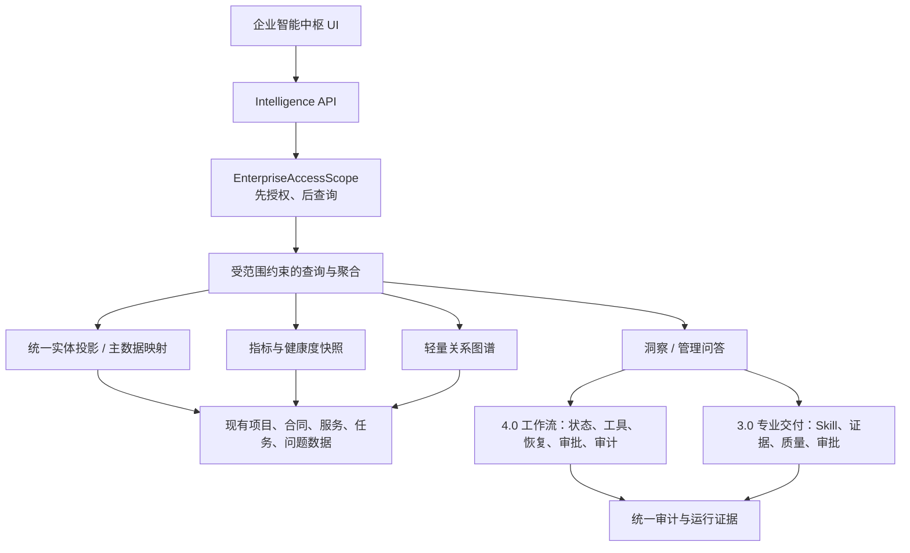

# 聚信 AI 助手 5.0——企业智能中枢版落地方案

> 方案状态：已确认，已完成首个 5.0 开发候选纵切；后续阶段按验收门推进
>
> 编制日期：2026-07-16（Asia/Shanghai）
>
> 代码分支：`codex/ai-assistant-5.0`
>
> 审计基线：`150da87e347a6a56f97ba48442bbe3b7e51ba3de`，标签 `ai-assistant-v3.0.0`
>
> 当前版本文件：`3.0.0`
> 原则：保留 1.0—4.0 全部能力；在本方案确认前不做大规模重构。

## 0. 结论与适配判断

### 0.1 总体结论

附件中的 5.0 产品方向适合聚信现有系统，建议继续做，但不能把附件中的表结构和实施顺序原样照搬。正确做法是：在现有项目域、3.0 专业交付域和 4.0 工作流底座之上，增加企业权限范围、统一实体投影、指标快照、知识关系、组织记忆、洞察和管理问答层，而不是重新建设一套任务、成果、Skill 或工作流系统。

建议批准的目标架构是“增量中枢层”：



### 0.2 不适合原样照搬的部分

| 原方案内容 | 不适合直接照搬的原因 | 适配方案 |
|---|---|---|
| 用 `enterprise_entities.metadata_json` 保存全部企业对象 | 会与现有项目、合同、任务、成果表形成第二套事实源，后续状态漂移 | 现有领域表继续做事实源；新增轻量 `enterprise_entity_refs` 只保存统一 ID、来源和版本 |
| 先做驾驶舱，再补权限 | 当前项目权限仍以成员关系为主，`read_only` 和 `external_customer` 的能力边界不完整；跨项目聚合会放大越权风险 | 第一项代码工作必须是统一 `EnterpriseAccessScope` 和权限回归测试 |
| 直接按任务推算合同服务完成率 | 当前任务没有稳定关联服务项，合同只有服务范围，没有周期性履约实例 | 新增服务履约实例，按“到期义务 / 完成证据”计算，不猜测 |
| 直接统计现有“交付物” | 当前有轻量 `ProjectDeliverable` 和正式 `WorkArtifact`/专业交付物两套模型 | 建立 canonical mapping；正式统计只认经过 3.0 版本、证据、质量和审批链的成果 |
| 直接做整改完成率 | 当前只有 `ProjectIssue`，没有独立整改、截止时间、复核证据模型 | 先补 `ProjectRemediation` 及问题、资产、复核关系 |
| 复用现有运营看板 | `OpsDashboardPage` 是 Agent/Provider/SLO 技术运维页，不是公司业务运营页 | 新建独立 `IntelligenceOverviewPage`，只复用交互组件和视觉 token |
| 直接开放自然语言企业查询 | 当前深度检索 lexical fallback 未在 SQL 层强制权限过滤，可能泄露文件名、摘要和 UUID | 先修检索权限旁路；管理问答只走白名单语义查询计划，不允许模型生成自由 SQL |
| 5.0 直接宣布稳定上线 | 4.0 代码仍混在约 360 项未提交改动中，真实共享库迁移、真实授权、多 Worker、灰度回滚和监控尚未验证 | 可以先本地开发 5.0；生产稳定声明必须等最终发布门禁通过 |

### 0.3 本方案不执行的事项

- 不替换个人助理、项目工作空间、专业交付中心或自动流程中心。
- 不新增对外销售、订阅、计费、开放平台或无人值守公司级决策。
- 不在本方案确认前创建 5.0 迁移、修改业务代码、升级版本、提交或推送 Git。
- 不把当前未提交工作树整体打包成 4.0/5.0 发布提交。
- 不把本地测试通过描述成生产环境验证通过。

## 1. 当前数据架构分析

### 1.1 当前事实源与可复用边界

| 领域 | 当前实现 | 5.0 复用方式 | 主要缺口 |
|---|---|---|---|
| 身份与全局授权 | `auth.py` 调统一登录 introspect/authorize；`SessionPayload` 包含用户、角色、部门、管理部门 | 保留统一登录和 `require_action()` | 无稳定组织 ID、部门 ID、内部/外部主体类型、企业数据范围契约 |
| 项目与成员 | `Project`、`ProjectMember`、`require_project_access()`；项目列表在 SQL 层按成员过滤 | 项目继续做业务主实体，保留无权限返回 404 的资源隐藏策略 | 项目无组织、归属部门、客户稳定 ID；角色未映射为细粒度 capability |
| 客户、合同、服务 | `ProjectContract`、`ProjectServiceScope`、版本与确认记录 | 合同、服务范围继续做事实源 | `customer_name` 是文本；无 Customer 主数据；无周期性服务履约实例 |
| 系统与资产 | `ProjectBusinessSystem`、`ProjectAsset`、目标与执行规则 | 保留项目归属和现有初始化流程 | 部门、负责人是自由文本；执行规则用 Skill/模板名称而非版本 ID |
| 任务、成果、问题 | `ProjectTask`、`ProjectDeliverable`、`ProjectIssue`、`ProjectActivity` | 任务和问题可增量补关系 | 任务未关联服务项/工作流；问题未关联资产/整改/复核；无整改实体 |
| 专业交付 3.0 | Skill/模板版本、运行绑定、事实证据、质量规则、评审、审批、导出、交付、经验候选 | 作为正式成果和质量唯一底座，禁止 5.0 旁路写状态 | 需把轻量项目交付物映射到正式成果 |
| 自动流程 4.0 | Workflow 定义/版本、AgentRun、状态机、工具契约、事件、调度、Outbox、Wait、lease/fencing、checkpoint/recovery | 作为建议执行和自动处理的唯一运行底座 | 文件式 legacy workflow 路径仍存在；兼容确认路径不能用于中高风险动作 |
| 记忆与知识 | `UserMemory`、`ProjectMemory`、知识库、LearningCandidate、交付经验候选 | 作为组织记忆候选来源 | 没有公司级版本化审核发布模型；个人记忆不能直接升级为组织规则 |
| 统计 | 部门/管理员统计和 Agent 运维数据 | 复用筛选、KPI、趋势等 UI 形式 | 不是合同履约、项目健康、整改等企业业务指标 |
| 审计 | `AuditLog`、请求审计、工具/动作 ledger | 扩展 scope、策略版本、数据版本、请求关联 ID | 当前全局审计查询缺少数据范围；现有审计不是不可篡改账本 |
| 迁移 | Alembic，已有分支 merge、单 head 检查、本地升降级演练 | 5.0 继续增量迁移 | 当前 0056 及大量代码未提交，不能假定为已冻结发布基线 |

### 1.2 当前关键风险证据

1. `external_customer`、`read_only` 目前主要是成员角色名，部分项目读取和写入接口没有完整能力矩阵；企业中枢上线前必须修正。
2. 外部身份没有与客户主体做已验证绑定，不能仅凭项目成员角色判断客户身份。
3. 项目知识文件可关联 company/department 范围内容，但需要补充当前部门一致性验证。
4. 全局审计查询当前按 action 权限开放，没有企业、部门、项目数据范围。
5. `deep_retrieve.py` 的 lexical fallback 曾只把 owner 当加分因素，没有作为 SQL 权限条件；该 P0 已补齐并由回归测试证明 fallback 与主检索路径都复用 SQL 可见性条件。
6. 两套成果模型若直接聚合会产生重复统计、审批旁路和状态不一致。

### 1.3 目标数据流

```text
统一登录身份
→ PrincipalContext
→ EnterpriseAccessScope（内部身份、capability、部门/项目/客户范围）
→ Scope-bound Repository（SQL 层限定范围）
→ 现有领域事实源 + 统一实体引用
→ 版本化指标/健康快照/关系/洞察
→ 带范围、周期、截止时间、证据的 API
→ 企业智能中枢页面或管理问答
→ 人工确认
→ 4.0 WorkflowRunService 执行
→ 3.0 专业交付形成成果
→ 审核后沉淀项目或组织经验
```

## 2. 企业级权限范围设计

### 2.1 权限契约

所有企业查询必须显式接收不可为空的 `EnterpriseAccessScope`。Repository 不提供“无 scope 查询全部”的重载。

```python
class PrincipalContext:
    user_id: str
    principal_type: Literal["internal", "external_customer", "service"]
    organization_id: str
    home_department_id: str | None
    managed_department_ids: tuple[str, ...]
    auth_role: str
    authz_version: str

class EnterpriseAccessScope:
    organization_id: str
    principal_type: str
    department_ids: tuple[str, ...]
    project_ids: tuple[str, ...]
    customer_ids: tuple[str, ...]
    company_access: Literal["none", "aggregate", "detail"]
    capabilities: frozenset[str]
    allowed_resource_types: frozenset[str]
    masked_fields: frozenset[str]
    min_aggregate_group_size: int
    policy_version: str
    fingerprint: str
    expires_at: datetime
```

### 2.2 强制执行链

```text
get_session
→ 确认 principal_type；external 直接拒绝企业中枢
→ require_action(企业能力)
→ EnterpriseAccessScopeService.resolve()
→ 校验请求 scope 是授权 scope 的子集
→ Repository.compile_scope_predicate()
→ SQL WHERE 先过滤再 join/aggregate
→ FieldMasker 脱敏
→ AggregateGuard 小样本抑制
→ 结果附 scope fingerprint / policy version
→ AuditLog 记录用途、范围、命中数和结果
```

禁止以下写法：先查公司全量数据再在 Python、AI 上下文或前端中过滤；把 scope 作为可选参数；只按前端菜单隐藏控制权限；让缓存跨 scope 复用。

### 2.3 Capability 建议

| Capability | 用途 |
|---|---|
| `intelligence:view` | 显示并进入企业智能中枢 |
| `intelligence:overview:read` | 查看授权范围的运营概览 |
| `intelligence:entity:detail` | 下钻实体明细 |
| `intelligence:metrics:read` | 查看指标和趋势 |
| `intelligence:graph:read` | 查看两端均有权访问的关系 |
| `intelligence:insight:read/manage` | 查看或处理洞察 |
| `intelligence:query:ask/export` | 管理问答与受控导出 |
| `intelligence:memory:propose/review/publish` | 组织记忆提议、审核、发布分离 |
| `intelligence:capability:read/propose/review` | 能力评估和优化建议治理 |
| `intelligence:recommendation:execute` | 经风险门禁调用 4.0 工作流 |

角色只负责映射 capability，API 不直接写死“admin 就能看全部”。质量负责人、审计员、部门负责人等都应由 capability + data scope 共同决定。

### 2.4 访问范围规则

| 主体 | 默认范围 | 明细权限 | 聚合权限 |
|---|---|---|---|
| 公司负责人 | 经授权的公司 | 取决于 `detail` capability | 公司级，可应用小样本抑制 |
| 部门负责人 | 管理部门 + 明确项目 | 本部门/项目 | 本部门，不得反推其他部门 |
| 项目负责人 | 负责项目 | 项目内 | 仅项目 |
| 普通内部成员 | 明确加入项目 | 按项目角色和字段白名单 | 默认无跨项目聚合 |
| 质量/审计角色 | 专门授权范围 | 只读且按资源类型限制 | 只读、保留审计用途 |
| 外部客户 | 企业中枢为 none | 企业中枢一律拒绝 | 一律拒绝 |

外部客户继续使用现有外部项目/问答入口，但必须增加“已验证客户账号绑定 ∩ 有效项目成员 ∩ 可共享资源类型”的三重限制。外部客户不可访问合同原文、资产网络位置、内部成员信息、项目记忆、内部活动、公司经验、Skill/工作流配置或内部洞察。

### 2.5 聚合防推断

- 默认 `min_aggregate_group_size=3`，涉及人员绩效、单一客户敏感指标时可提高到 5。
- 低于阈值返回 `suppressed=true`，不返回可通过总数相减推断的精确值。
- 图谱查询要求 source 和 target 两端均可见，关系本身也必须在允许类型中。
- 排行榜不展示无权对象名称，不通过排序位置泄露其存在。
- 快照、缓存、导出、引用回查都绑定 `scope_fingerprint + policy_version`。

## 3. 主数据统一方案

### 3.1 事实源原则

1. 项目、合同、服务项、资产、任务、问题、正式成果、Skill 和 Workflow 继续由现有领域表负责。
2. 统一实体层只解决稳定 ID、别名、来源、版本、组织/部门/客户归属和跨域引用，不复制完整业务 JSON。
3. 身份和组织目录以统一登录/组织系统为权威；本系统保存稳定外部引用和同步快照，不自行成为账号权威。
4. AI 抽取数据进入候选/待确认状态，不直接覆盖主数据。

### 3.2 需要补齐的主数据

| 对象 | 方案 |
|---|---|
| 组织 | `Organization` 保存公司稳定 ID；即使当前单公司也保留组织边界 |
| 部门 | `OrganizationUnit` 保存稳定 UUID、上级、外部目录 ID、目录版本和同步时间 |
| 客户 | `EnterpriseCustomer` 保存客户代码、标准名、别名、状态和敏感等级 |
| 外部身份 | `CustomerIdentityBinding` 绑定客户与已验证外部 subject，不允许项目管理员仅靠文本声明 |
| 项目归属 | 给 Project 增加 organization、owner_department、primary_customer 的稳定引用；多客户用关联表 |
| 合同客户 | `ProjectContract.customer_id` 指向客户主数据；原 `customer_name` 暂留作来源快照 |
| 统一实体 | `EnterpriseEntityRef` 保存 canonical UUID、entity_type、source_table、source_uuid、source_version |
| 实体别名 | `EnterpriseEntityAlias` 保存来源系统、别名、有效期和确认状态 |

### 3.3 业务链路补齐

- `ProjectTask` 增加可空的 `service_scope_id`、`execution_rule_id`、`workflow_run_id` 和来源类型。
- 新增 `ProjectServiceOccurrence`：把月度、季度、年度服务范围展开为具有周期、截止时间、任务/成果/流程引用和完成证据的履约实例。
- 新增 `ProjectRemediation`：关联问题、资产、责任人、截止时间、复核人、复核证据和状态。
- 新增 Issue—Asset、Issue—Source、Remediation—Evidence 关系表，避免把多值关系塞进 JSON。
- 轻量 `ProjectDeliverable` 通过现有 legacy mapping 或新增 canonical ref 映射正式 `WorkArtifact`；指标以正式成果状态为准。
- `ProjectExecutionRule` 从 Skill/模板名称逐步回填到已发布版本 ID，并增加可选 WorkflowVersion 引用。

### 3.4 数据回填与质量治理

回填采用 expand/backfill/validate/contract：先加可空字段和映射表；生成数据质量报告；人工处理歧义；达标后再增加非空/唯一约束。禁止按名称静默合并客户、部门或项目。

首批质量规则：

- 客户代码、项目 UUID、合同编号的唯一性和组织边界。
- 合同客户必须与项目客户关系一致。
- 项目部门必须是有效组织单元。
- 外部成员必须存在有效 CustomerIdentityBinding。
- 任务、问题、资产、成果的项目归属一致。
- 服务履约实例不能跨合同有效期。
- 正式成果不能同时映射到两个项目交付物。
- 无法匹配的数据进入 `unresolved` 队列，不进入公司指标分母，并在数据完整度中显式扣分。

## 4. 企业指标体系

### 4.1 指标快照统一契约

每次指标输出必须包含：

```json
{
  "metric_code": "service_completion_rate",
  "definition_version": "1.0.0",
  "scope": {"type": "department", "id": "..."},
  "scope_fingerprint": "...",
  "policy_version": "...",
  "period_start": "...",
  "period_end": "...",
  "data_cutoff_at": "...",
  "data_version": "...",
  "numerator": 0,
  "denominator": 0,
  "value": null,
  "freshness": "fresh|stale|failed",
  "data_completeness": 0.0,
  "suppressed": false,
  "exclusions": [],
  "evidence_refs": []
}
```

快照写入后不可原地改写；口径变化创建新 definition version，历史页面默认按原版本展示，也可选择重算为新版本但必须另存快照。

### 4.2 首期指标定义

| 指标 | 明确定义 | 当前可做性 |
|---|---|---|
| 活跃项目数 | 截止时间处于有效生命周期且在 scope 内的 distinct project | 需先补项目生命周期和归属 |
| 合同服务覆盖率 | 已生成履约实例的有效服务项数 / 应生成履约实例的有效服务项数 | 需新增 ServiceOccurrence |
| 服务按期完成率 | 截止期内已完成且有任务/成果证据的履约实例 / 截止期内到期履约实例；批准豁免单列 | 需新增 ServiceOccurrence |
| 成果交付率 | 周期内应交付且正式状态为 approved/delivered 的成果义务 / 周期内到期成果义务 | 只认 3.0 正式成果映射 |
| 首次质量通过率 | 第一次 ReviewRun 无阻断问题的成果数 / 有首次评审的成果数 | 可复用 3.0 数据 |
| 最终质量通过率 | 最终通过质量门的成果数 / 已结束评审成果数 | 可复用 3.0 数据 |
| 超期任务数/率 | `due_at < cutoff` 且未完成/取消的任务；率的分母为截止期内应完成任务 | 当前任务可算，需明确状态映射 |
| 整改按期闭环率 | 截止期内按期关闭且复核通过的整改 / 截止期内到期整改 | 需新增 Remediation |
| Workflow 成功率 | 周期内 terminal succeeded / terminal non-cancelled runs；wait/in_progress 不进入终态分母 | 可复用 4.0 AgentRun/WorkflowRun |
| Workflow 人工介入率 | 发生 confirm/reconciliation/manual retry 的 runs / terminal runs | 可复用 4.0 事件与 ledger |
| 数据完整度 | 已满足必填主数据和关系的对象数 / 应满足对象数 | 新增数据质量规则后计算 |
| AI 节省工时 | 暂不做正式经营指标；没有可靠人工基线时只展示实验估算并明显标注 | 延后 |

指标必须有 owner、业务解释、分子、分母、排除项、时间语义、时区、更新频率、来源表、数据责任人和变更记录。没有分母时返回 `null + reason`，不返回 0% 或 100%。

### 4.3 快照策略

- 实时页读取最近已完成快照，不在页面请求中对全库做大聚合。
- 事件驱动增量刷新 + 每日校准；第一阶段可先每日全量、项目变更后增量。
- 同一 `metric/version/scope/period/cutoff/data_version` 唯一，计算 job 使用幂等键。
- 计算失败保留上次快照并标记 stale，绝不把缺失数据显示为正常。
- 所有时间按 Asia/Shanghai 解释业务周期，数据库时间保存 UTC。

## 5. 项目健康度设计

### 5.1 维度和权重

| 维度 | 权重 | 主要信号 |
|---|---:|---|
| 合同与服务履约 | 25 | 遗漏服务实例、到期未完成、合同/服务资料缺失 |
| 计划与任务进度 | 20 | 超期任务、关键路径延迟、责任人缺失 |
| 成果交付 | 20 | 到期未交付、审批滞留、正式版本缺失 |
| 质量 | 15 | 阻断问题、首次通过率、反复退回 |
| 问题与整改 | 10 | 高危未处理、整改超期、复核失败 |
| 自动流程可靠性 | 10 | 失败、reconciliation_required、长时间等待、人工重试 |

每个维度返回 0—100 分、指标输入、扣分规则、扣分值、证据引用、规则版本和截止时间。总分只由后端计算，前端不复制公式。

### 5.2 计算与状态

```text
raw_score = Σ(适用维度分 × 权重) / Σ(适用维度权重)
data_confidence = 有效必需字段权重 / 应有必需字段权重
```

- 明确“不适用”的维度可从权重中移除；“数据缺失”不能标为不适用。
- `data_confidence < 0.80` 时状态为 `data_incomplete`，不得显示为健康，即使 raw_score 很高。
- `healthy`：score ≥ 80、confidence ≥ 0.80 且无 critical finding。
- `attention`：60 ≤ score < 80，或存在 high finding。
- `high_risk`：score < 60，或存在 critical finding。
- 硬规则可以覆盖分数，例如合同关键服务遗漏、高危整改超期、正式交付未审批。

### 5.3 可解释输出

```json
{
  "project_id": "...",
  "score": 68,
  "status": "attention",
  "confidence": 0.93,
  "rule_version": "project-health/1.0.0",
  "as_of": "...",
  "dimensions": [],
  "deductions": [
    {
      "code": "SERVICE_OCCURRENCE_MISSING",
      "points": 12,
      "reason": "季度漏洞扫描未生成本季度履约实例",
      "evidence_refs": ["contract:...", "service_scope:..."]
    }
  ]
}
```

### 5.4 健康度验收用例

1. 已确认季度服务范围但本季度无履约实例：服务维度扣分并给出合同、服务项证据。
2. 项目全部指标良好但主客户、部门和 40% 任务截止时间缺失：返回 `data_incomplete`，不能返回 healthy。
3. 高危整改超期：即使加权总分大于 80，也至少为 attention；critical 时为 high_risk。
4. 用户无权查看某成果：健康度仍在授权范围内计算，但扣分明细不能泄露该成果；必要时返回受抑制原因。
5. 规则版本升级：历史快照保持旧分，重算结果另存新版本。

## 6. 企业知识图谱方案

### 6.1 范围与技术选择

第一版使用关系型数据库中的实体引用表和邻接关系表，不引入 Neo4j。当前关系规模、查询深度和团队维护成本不支持立即增加第二种数据库；只有当真实数据证明多跳查询延迟或关系规模达到关系库瓶颈时再评估图数据库。

图谱不是新的事实库：节点引用现有 canonical entity，关系保存方向、类型、来源、有效期、可信度和确认状态。

### 6.2 节点与关系

首批节点：组织、部门、人员（默认脱敏引用）、客户、合同、项目、服务项、业务系统、资产、任务、正式成果、问题、整改、知识、SkillVersion、TemplateVersion、WorkflowVersion、AgentRun。

首批确定性关系：

```text
组织 HAS_DEPARTMENT 部门
部门 OWNS_PROJECT 项目
客户 HAS_CONTRACT 合同
合同 COVERS_PROJECT 项目
合同 DEFINES_SERVICE 服务项
项目 CONTAINS_ASSET 资产
服务项 GENERATES_OCCURRENCE 履约实例
履约实例 REALIZED_BY 任务/成果/WorkflowRun
问题 AFFECTS 资产
问题 REQUIRES_REMEDIATION 整改
成果 PRODUCED_BY SkillVersion/TemplateVersion
WorkflowVersion CREATED AgentRun
成果 SUPPORTED_BY Evidence
```

### 6.3 关系生成和确认

| 来源 | 默认状态 | 规则 |
|---|---|---|
| 数据库外键、已确认映射 | `verified` | 系统生成，记录 source row/version |
| 已审核合同结构化提取 | `verified` 或 `pending` | 仅已确认字段可自动 verified |
| AI 从文件/对话推断 | `pending` | 必须人工确认后才能作为正式事实或指标输入 |
| 人工录入 | `pending_review` | 重要关系执行四眼审核 |
| 来源失效/撤销 | `superseded`/`invalid` | 不删除历史，记录有效期和替代关系 |

关系唯一指纹建议为 `organization + source_entity + relation_type + target_entity + source_ref + valid_from`。AI 重复提取不能创建重复边。

### 6.4 权限和查询

- 每次图查询先解析 AccessScope，节点查询在 SQL 层过滤。
- 一条边仅在 source、target、relation_type 三项都允许时返回。
- 多跳查询每跳重新应用 scope；禁止先构建公司全图再裁剪。
- 图谱摘要的缓存键包含 scope fingerprint、policy version、relation version 和 cutoff。
- 人员节点默认返回角色/部门统计，不返回个人敏感信息；员工绩效图谱不在 5.0 范围内。
- 默认最大 2 跳、200 节点、500 边；超限要求缩小范围，防止超时和推断泄露。

### 6.5 关系审核体验

审核页必须显示来源文件/记录、抽取片段、实体消歧候选、可信度、影响指标和确认后的可见范围。审核人可以确认、纠正、拒绝或合并；所有操作带 expected row version 并写审计。

## 7. 组织记忆方案

### 7.1 与现有记忆的边界

- `UserMemory` 仍只服务个人，不直接进入公司规则。
- `ProjectMemory` 仍只服务项目确认，不自动扩大到公司范围。
- `LearningCandidate` 和 `DeliverableExperienceCandidate` 可作为组织记忆候选来源，但必须进入新的审核发布链。
- 公司知识库保存可检索资料；组织记忆保存经审核的做事规则、质量经验、风险模式和适用边界，两者不能混为一张表。

### 7.2 状态机

```text
candidate
→ under_review
→ approved
→ published
→ superseded / retired

candidate / under_review → rejected
published → rollback_to_previous_version（创建新事件，不覆盖历史）
```

AI 只能创建 candidate；review、approve、publish 必须由不同 capability 控制。公司级高影响规则建议四眼审核。发布时固定内容哈希、来源、适用范围、版本、审批人和生效时间。

### 7.3 记忆内容契约

每条组织记忆包含：稳定 item ID、版本、类型、标题、规范内容、适用成果/项目/客户类别、排除范围、来源实体和证据哈希、提出原因、可信度、敏感等级、创建人类型、审核/发布人、发布时间、有效期和替代版本。

涉及客户名称、合同内容、资产标识或人员信息的正文按敏感等级加密；检索索引只保存允许的脱敏表示。来源权限撤销后，记忆应重新评估，不得继续通过记忆泄露原文。

### 7.4 冲突和失效

- 新候选发布前查找同 scope、同类型的已发布记忆，展示差异和冲突。
- 法规、合同或质量规则版本变化触发重新审核，不自动改写。
- Skill/模板/工作流消费组织记忆时固定 memory version 和 hash，保证运行可追溯。
- 反馈只生成新候选，不直接修改正式记忆。

## 8. 主动洞察引擎方案

### 8.1 处理链

```text
领域事件 / 定时扫描
→ AccessScope 或系统级受控 scope
→ 规则候选筛选
→ 指标与事实证据绑定
→ 去重指纹
→ 风险/可信度计算
→ 洞察持久化
→ 人工确认、忽略或标记误报
→ 生成 Recommendation
→ 风险门禁
→ 4.0 WorkflowRunService
→ 运行结果回写洞察
```

第一版以确定性规则为主，模型只用于归类、摘要和建议文案；模型不能自行扩大数据范围或决定执行。

### 8.2 首批规则

| 规则 | 条件 | 证据 | 允许动作 |
|---|---|---|---|
| 合同服务遗漏 | 有效服务项在应有周期未生成履约实例/任务/流程 | 合同版本、服务项、频率、周期 | 创建任务草案或启动已发布服务流程；不改合同 |
| 项目延期风险 | 关键任务超期、后续依赖受阻或交付窗口不足 | 任务、依赖、截止时间、成果义务 | 建议调整计划/提醒；不改负责人 |
| 成果质量异常 | 阻断问题上升、反复退回、首次通过率显著下降 | ReviewRun、ReviewIssue、版本 | 建议专项复核或 Skill/模板评估 |
| 重复问题 | 规范化 fingerprint 在多个有权项目重复出现 | Issue、Asset、Evidence | 建议通用基线或培训候选；隐藏无权项目 |
| 整改超期 | due_at 已过且未复核关闭 | Remediation、Issue、Asset | 提醒/升级审批流程 |
| Workflow 异常 | 失败率、等待时长、人工介入率超过版本阈值 | WorkflowVersion、AgentRun、Event | 建议流程新版本草案；不改正式版本 |

### 8.3 洞察契约与生命周期

洞察至少保存：类型、规则/模型版本、scope snapshot/fingerprint、policy version、数据截止时间、数据版本、来源实体、证据、可信度、严重度、影响范围、去重 fingerprint、状态、负责人、误报反馈和关联 action/run。

状态建议：`open → acknowledged → action_proposed → action_started → resolved`；旁路状态为 `dismissed`、`false_positive`、`expired`。来源数据变化时重新评估，不能静默覆盖旧结论。

### 8.4 洞察到执行的风险门禁

- 只读查询、生成草稿、站内提醒为 low risk；首版仍要求用户显式发起，或由已发布预授权策略触发。
- 创建正式任务、通知外部、改变业务状态为 medium risk，必须显式确认和审批 token。
- 修改合同范围、正式负责人、权限、已发布 Skill/模板/Workflow 为 high risk，5.0 不自动执行，只能提出建议并进入现有治理流程。
- 执行只能调用 `WorkflowRunService` 和 `ToolRegistry.execute`；保存 workflow version、run ID、idempotency key、请求 hash 和审批证据。
- 外部结果不确定时状态为 `reconciliation_required`，不能猜测成功。

## 9. 管理问答方案

### 9.1 查询架构

```text
用户问题
→ 身份与 EnterpriseAccessScope
→ 意图识别（指标/项目/合同/质量/流程/风险）
→ 白名单 SemanticQueryPlan
→ 参数与 scope 子集校验
→ 受控 QueryService / MetricSnapshotService
→ 证据与数据质量检查
→ 回答生成
→ 引用回查再校验
→ 审计
```

模型不生成和执行自由 SQL。QueryPlan 只允许已注册的 metric_code、dimension、filter、sort、group_by 和时间范围；编译器拒绝未知字段、超大范围、个人绩效问题和无权限实体。

### 9.2 QueryPlan 示例

```json
{
  "intent": "compare_project_health",
  "scope": {"department_ids": ["authorized-id"]},
  "period": {"start": "2026-07-01", "end": "2026-07-16"},
  "metrics": ["project_health_score"],
  "filters": [{"field": "status", "op": "in", "value": ["attention", "high_risk"]}],
  "group_by": ["project"],
  "limit": 20
}
```

### 9.3 回答规范

每个管理回答必须包含：结论、统计范围、周期、数据截止时间、指标口径版本、关键证据、数据完整度/新鲜度、受抑制信息、限制条件和建议。没有足够证据时明确拒答或返回“数据不足”，不能用常识补齐公司事实。

管理问答缓存必须绑定 user/organization/scope fingerprint/policy version/data version/query hash。导出前重新授权，导出文件记录相同范围并设置有效期。

### 9.4 接入前 P0 修复

已修复 `deep_retrieve._lexical_search`：owner、company approval、department/project/customer scope 编译为 SQL predicate；fallback 与主检索路径复用同一 AccessScope。回归测试证明无模型密钥、向量服务故障和强制 fallback 时都不能返回无权文件名、摘要或 UUID。后续只需把该测试纳入目标环境回归，不再以自由 SQL 或模型生成查询替代此边界。

## 10. 能力评估方案

### 10.1 评估对象和数据源

| 对象 | 核心数据源 | 首批指标 |
|---|---|---|
| SkillVersion | ProfessionalRunBinding、SkillRunLog、ReviewRun、交付记录 | 成功率、质量通过率、人工修改率、成本、时长、样本量 |
| TemplateVersion | 成果版本、评审问题、人工 diff | 首次通过率、结构缺失率、修改热点 |
| WorkflowVersion | AgentRun、RunEvent、Wait、审批、reconciliation ledger | 成功率、等待时长、人工介入率、失败类型、恢复成功率 |
| Model/Profile | AgentCallLog、模型网关、ReviewRun | 任务成功、质量、成本、延迟、拒绝/回退率 |

评估按版本分组，禁止把不同 Skill/Workflow/模型版本混在同一结果。样本量低于业务阈值时只显示原始数据和低置信标记，不下“更好/更差”结论。

### 10.2 评估规范

- 保存 period、scope、data cutoff、evaluation definition version、sample size、confidence interval、排除项和来源 run IDs。
- 失败、取消、等待、reconciliation_required 分开统计，不能都归为失败。
- 人工修改率只有在草稿提交前后 diff 可靠时启用；纯文本长度差不能作为质量结论。
- 成本只按同任务类型、相似质量门比较，不能用更低成本掩盖质量下降。
- 个人维度默认不做排名；能力评估针对版本和流程，不用于自动绩效决策。

## 11. 优化建议和审核机制

### 11.1 提案状态机

```text
draft
→ test_pending
→ test_running
→ review_pending
→ approved
→ published_as_new_version
→ observed
→ accepted / rolled_back

任一审核阶段 → rejected
```

AI 只能创建 draft 和测试建议。测试在隔离数据集或 shadow run 中进行；审核人查看现状、提议 diff、评估样本、质量/成本影响、风险、回滚方案和影响范围。

### 11.2 发布边界

- Skill/模板优化通过 3.0 catalog/version 发布服务生成新版本，不修改已发布版本。
- Workflow 优化通过 4.0 workflow version/save/publish/rollback 服务，不走文件 legacy 路径。
- 模型配置通过现有 provider/profile 治理，不把密钥写入提案。
- 组织记忆优化创建新版本并重新审核。
- 发布者与提案创建者分权；高风险配置要求第二审核人。

### 11.3 观察与回滚

每个发布版本定义观察窗口、核心质量指标、失败阈值、成本阈值和回滚目标。观察失败只能触发“建议回滚”或既有预授权回滚流程，不允许模型直接修改正式版本。

## 12. 数据库模型与迁移方案

以下迁移按“开发候选”拆分，0057—0059 已在本轮以 expand 方式实现并通过临时 SQLite 升降级验证；0060 之后仍是待实施设计。前提是继续保持 4.0 的单一 Alembic head，保留 1.0—4.0 既有业务事实表，不用一张泛化 `enterprise_entities` 表复制项目、合同、任务、成果和流程事实。

### 12.1 建议迁移拆分

| 候选迁移 | 新增或扩展内容 | 目的 |
|---|---|---|
| `0057_enterprise_identity_scope` | `ai_organizations`、`ai_organization_units`、`ai_enterprise_customers`、`ai_customer_identity_bindings`、`ai_enterprise_entity_refs`、`ai_enterprise_entity_aliases`；给项目/合同补 organization、department、customer 引用 | 建立稳定组织、部门、客户主键和外部身份绑定 |
| `0058_enterprise_business_lineage` | `ai_project_customer_links`、`ai_project_service_occurrences`、`ai_project_issue_asset_links`、`ai_project_remediations`、`ai_remediation_evidence_links`；给任务补 service scope/workflow 引用；扩展既有成果映射 | 补足跨域业务血缘和整改闭环 |
| `0059_enterprise_metrics_health` | 指标定义/版本、不可变指标快照、项目健康快照、数据质量问题 | 固定指标口径并支持按截止时间复算；计算调度仍由后续服务补齐 |
| `0060_enterprise_graph_memory` | 关系、关系证据、组织记忆项/版本/审核事件/候选项 | 建立带证据的轻量关系图和受治理组织记忆 |
| `0061_enterprise_insights_recommendations` | 洞察规则/版本、洞察、洞察证据、建议、建议动作 | 支持主动发现、人工确认和安全执行 |
| `0062_enterprise_capability_evaluation` | 能力评估、优化提案、提案事件、发布观察记录 | 形成评估—建议—审核—新版本—观察—回滚闭环 |

如果现有 `LegacyDeliverableMapping` 能表达轻量 `ProjectDeliverable` 与权威 `WorkArtifact/Version` 的对应关系，应扩展它而不是再建第三套映射。指标只以 3.0 权威成果版本、审核和交付记录为事实源。

### 12.2 公共字段、约束与索引

新表统一包含 `uuid`、`organization_id`、数据范围/策略版本、`row_version`、`created_at`、`updated_at`；快照和证据表额外包含 `as_of`、`data_version`、`source_hash`、`definition_version`。敏感内容使用现有加密/密钥管理能力，表中不保存 Provider 密钥。

必须建立以下约束：

- canonical entity mapping 唯一，别名只能指向一个当前有效实体。
- 关系按 organization、source、predicate、target、有效期生成唯一 fingerprint。
- 指标快照按 organization、scope、period、metric、definition version、as_of 唯一且写入后不可覆盖。
- 洞察按 rule version、scope、evidence fingerprint 去重；动作有独立幂等键。
- 外键、软删除和有效期规则明确；禁止悬空的 customer/project/service/remediation 关系。
- 高频查询建立 organization + department/customer/project + status/time 组合索引，不能依靠应用层全表过滤。

### 12.3 迁移和回填方法

按 `expand → backfill → validate → switch-read → contract` 执行：先加可空引用和新表；从现有项目成员、合同 `customer_name`、服务范围、成果映射回填；生成歧义清单由人工确认；验证行数、唯一性、孤儿记录、抽样业务结果；双读对账通过后才切换读取。删除旧字段属于后续独立版本，不与 5.0 首发合并。

每个迁移都在临时 SQLite 和目标 MySQL 上验证 upgrade/downgrade/再 upgrade；新模型必须显式注册到 `server/migrations/env.py`。迁移号只在 4.0 图谱稳定后最终确定，禁止修改已经执行过的迁移历史。

## 13. API 设计

统一前缀为 `/api/ai/intelligence`，沿用现有认证服务，在 Session/PrincipalContext 中增加 capability 与 AccessScope 摘要。读取响应统一返回：

```json
{
  "request_id": "uuid",
  "scope": {"organization_id": "...", "department_ids": ["..."]},
  "period": {"start": "2026-07-01", "end": "2026-07-16"},
  "as_of": "2026-07-16T10:00:00Z",
  "definition_versions": {"project_health": "1.0"},
  "freshness": {"status": "fresh", "calculated_at": "..."},
  "data_quality": {"confidence": 0.92, "issues": []},
  "permissions": {"can_export": false, "can_view_evidence": true},
  "data": {}
}
```

### 13.1 首批只读接口

| 接口 | 用途 |
|---|---|
| `GET /scope` | 当前主体可用组织、部门、客户、项目范围和能力摘要 |
| `GET /overview` | 企业总览指标、健康分布、关注项和新鲜度 |
| `GET /attention-items` | 风险项目、超期任务/整改、合同覆盖缺口、流程异常 |
| `GET /projects/health` | 项目健康列表、原因码、置信度和范围内分页 |
| `GET /projects/{project_uuid}/health` | 单项目分项得分、证据和趋势 |
| `GET /contracts/service-status` | 合同服务项覆盖和履约状态 |
| `GET /deliverables/status` | 权威成果版本、审核、批准、交付状态 |
| `GET /tasks/overdue`、`GET /remediations/overdue` | 超期任务和整改清单 |
| `GET /workflows/summary` | 4.0 流程成功、等待、失败、恢复和人工介入情况 |
| `GET /metrics/{metric_code}` | 版本化指标及其口径、周期和证据 |

### 13.2 后续接口组

- 管理问答：`POST /management/query-plan`、`POST /management/query`、`POST /management/export`；只接受白名单语义 QueryPlan，不接受 SQL。
- 关系图：`GET /graph/neighbors`、`GET /graph/path`、`POST /graph/relations/{uuid}/confirm`、`POST /graph/relations/{uuid}/reject`。
- 组织记忆：`GET/POST /memories`、`GET /memories/{uuid}/versions`、`POST /memories/{uuid}/review`、`POST /memory-candidates/{uuid}/resolve`。
- 主动洞察：`GET /insights`、`GET /insights/{uuid}`、`POST /insights/{uuid}/acknowledge`、`POST /insights/{uuid}/dismiss`、`POST /recommendations/{uuid}/execute`。
- 能力优化：`GET /capability-evaluations`、`POST /optimization-proposals`、`POST /optimization-proposals/{uuid}/review`、`POST /optimization-proposals/{uuid}/publish`、`POST /optimization-proposals/{uuid}/rollback`。

### 13.3 API 强制规则

- 所有 repository 查询接收必填 `EnterpriseAccessScope`，控制器传裸 user id 不足以授权。
- 对无权的具体实体统一返回 404，避免存在性泄露；有权进入企业中枢但缺少某项 capability 时返回 403。
- 变更接口要求 `Idempotency-Key`、`If-Match` 或 expected row version、对应 capability，并写结构化审计事件。
- 用户接口不提供任意“重算全部”能力；计算任务只由受控调度或管理员作业触发。
- 导出、证据展开、图谱两端、缓存读取和 fallback 检索都必须再次执行同一范围授权。
- 错误响应包含 request_id 和稳定错误码，但不返回 SQL、提示词、密钥、内部路径或越权实体信息。

## 14. 前端方案

5.0 新入口命名为“企业智能中枢”，要求 `intelligence:view` capability；外部客户和无该能力用户即使直接输入 URL 也不能访问。首阶段保留现有 `App.tsx` 和 1.0—4.0 页面，不把技术运维 `OpsDashboard` 改名冒充业务总览。

### 14.1 页面与导航

首个可交付纵切只开放以下页面：

- `/intelligence/overview`：企业总览、数据新鲜度、健康分布、关注项。
- `/intelligence/projects`：项目健康列表与筛选。
- `/intelligence/projects/:projectUuid`：项目健康解释、证据、任务、成果、流程。
- `/intelligence/contracts`：合同服务覆盖与履约状态。
- `/intelligence/automation`：4.0 流程运行摘要和异常入口。
- `/intelligence/insights`：主动洞察列表；管理问答先做右侧抽屉，避免首版导航过重。

现有应用没有稳定 URL 路由。应先加入隔离的 intelligence route adapter；是否全面引入 `react-router` 作为独立决策评审，不能在 5.0 顺带重写全部导航。

### 14.2 组件和状态

新增 Scope/Period Selector、Freshness Badge、Attention List、Metric Card、Health Distribution、Health Explanation、Contract Service Matrix、Overdue Task/Remediation Table、Workflow Summary、Management Q&A Drawer。复用现有颜色 token、卡片/表格/抽屉模式、`ProjectWorkspace`、`CitationPreviewDrawer`、`OutputReader`、`TaskProgressTimeline` 和 `WorkflowsPage` 的成熟交互。

页面只消费真实 API，不在生产代码放静态假数据。每个模块必须有 loading、empty、stale、partial、permission denied、error 状态；部分数据失败时保留成功模块并展示范围、截止时间和数据质量。健康分数和业务口径由后端计算，前端只负责展示和解释。

### 14.3 预计代码边界

后续实现预计新增 `apps/desktop/src/api/intelligence.ts`、`apps/desktop/src/pages/intelligence/`、`apps/desktop/src/components/intelligence/` 及对应测试；后端新增独立 `enterprise_intelligence` domain/service/repository/router 模块。第一阶段不把图谱、组织记忆和能力评估全部塞入总览，它们在后续阶段独立交付。

## 15. 分阶段实施计划与验收门

工期按人日估算，不等于日历承诺；进入每阶段前根据团队人数和 4.0 基线重新排期。

### Phase 0：稳定基线和安全前置（2—4 人日）

- 锁定可复现的 4.0 commit/tag、单一迁移 head 和测试结果，清理“分支名 5.0、代码版本仍 3.0、工作树大量未提交”的不一致。
- 修复 lexical fallback 越权风险，建立 PrincipalContext/EnterpriseAccessScope 契约和跨角色安全回归矩阵。
- 解决现有 admin/department manager 导航和 E2E 期望冲突。
- 验收：4.0 回归门全绿；所有数据入口具备 scope predicate；无 P0/P1 越权缺陷。

用户此前决定 staging 和真实授权最后考虑，可以不阻塞本地首个纵切；但它们仍是“生产稳定”不可取消的发布门。

### Phase 1A：主数据、权限和业务血缘（5—8 人日）

- 完成 organization/department/customer 稳定主键、身份绑定、项目/合同/服务/任务/成果/整改关系。
- 实现 expand/backfill/validate，对歧义数据生成审核清单。
- 验收：主数据完整度达到约定阈值；越权矩阵、外部客户隔离和迁移双数据库测试通过。

### Phase 1B：指标、项目健康、总览和受限管理问答（8—12 人日）

- 发布版本化指标、健康分和数据质量；完成只读企业总览纵切。
- 管理问答仅支持白名单 QueryPlan、证据引用和受控导出。
- 验收：固定数据集结果可重复；每项数字可追到证据和口径版本；页面无假数据；直接 URL 和 API 权限一致。

第一里程碑总计约 15—24 人日（含 Phase 0），目标是“真实数据库上的只读智能总览”，不是一次性交付整套 5.0。

### Phase 2：关系图谱和组织记忆（10—15 人日）

- 建立 SQL 轻量关系图、证据确认、冲突处理和组织记忆版本审核。
- 验收：关系两端均授权；AI 关系默认待确认；记忆不能自动发布；冲突和版本历史可追溯。

### Phase 3：主动洞察和安全动作（10—15 人日）

- 实现规则检测、证据聚合、去重、生命周期、建议和 4.0 工作流动作接入。
- 验收：规则在金标数据集上达到约定 precision/recall；重复洞察不刷屏；中高风险动作必须审批；动作幂等并可恢复。

### Phase 4：能力评估和优化闭环（8—12 人日）

- 实现 Skill/模板/Workflow/模型配置的版本化评估、shadow test、提案审核、发布观察和回滚。
- 验收：不同版本不混算；低样本明确降置信；只能发布新版本；观察失败能定位并回滚。

### 15.1 每阶段固定报告

每阶段交付报告包含：本阶段范围、代码/迁移清单、数据口径变更、权限影响、测试结果、性能结果、已知风险、回滚方法、下一阶段输入。任何阶段未过门，不自动扩大到下一阶段。

### 15.2 “系统稳定”发布门

稳定不是“本机能打开”，至少要求：

- 功能门：关键业务纵切和恢复路径全部通过。
- 数据门：迁移/回填/对账/数据质量在真实数据库候选环境通过。
- 安全门：权限矩阵、外部用户、推断攻击、fallback、导出和动作审批测试通过。
- 运行门：多 Worker 的 lease/fencing、幂等、reconciliation、故障恢复和容量测试通过。
- 可观测门：指标、日志、trace、告警、审计查询和 runbook 可用。
- 发布门：staging 真实登录/密钥/Provider、灰度、备份恢复和回滚演练通过。

因此，在真实数据库迁移、真实授权、第三方 Provider、多 Worker、灰度/回滚和生产监控完成前，只能称“5.0 开发候选”，不能称“生产稳定版”。

## 16. 测试方案

### 16.1 后端与数据测试

建议新增：

- `server/tests/test_enterprise_access_scope.py`：角色、部门、客户、项目、外部身份和 deny 优先矩阵。
- `server/tests/test_enterprise_scope_repository.py`：证明 scope 在 SQL 层生效，含 lexical/vector fallback 和缓存隔离。
- `server/tests/test_external_intelligence_denied.py`：外部用户的直接 URL/API/导出/证据访问均被拒绝。
- `server/tests/test_enterprise_metrics.py`：指标公式、版本、周期、截止时间、去重和不可变快照。
- `server/tests/test_project_health.py`：权重、阈值、缺失数据、置信度、解释和固定金标。
- `server/tests/test_management_query.py`：QueryPlan 白名单、范围收窄、拒绝自由 SQL、聚合抑制和证据。
- `server/tests/test_graph_permissions.py`：关系两端授权、待确认关系、路径限制和批量查询。
- `server/tests/test_org_memory_governance.py`：候选、审核、版本、冲突、撤回和敏感等级。
- `server/tests/test_insight_workflow_actions.py`：规则去重、状态机、风险令牌、审批、幂等和 reconciliation。
- `server/tests/test_capability_evaluations.py`：版本隔离、样本量、质量/成本、shadow run、发布和回滚。
- 迁移测试：从当前 4.0 head 到 5.0、downgrade/upgrade、SQLite/MySQL、回填歧义和对账。

### 16.2 前端与端到端测试

- API 合约测试覆盖响应 envelope、scope/freshness/data_quality 和稳定错误码。
- 组件测试覆盖 loading/empty/stale/partial/403/404/error、长文本和窄屏。
- 路由与导航测试覆盖 capability 可见性、直接 URL、防回退泄露和范围切换。
- E2E 使用 admin、department manager、project member、external customer 四类主体，验证相同数字、证据和导出边界。
- 可访问性检查覆盖键盘导航、焦点、表格标题、颜色对比和屏幕阅读器标签。

### 16.3 非功能和故障测试

- 性能：总览 P95、健康列表 P95、并发范围查询、图谱扩展上限、管理问答超时和导出限额。
- 容量：按目标项目/任务/成果/关系/快照量构造数据，验证索引和计算窗口。
- 故障：数据库短断、向量服务失败、Provider 超时、Worker 崩溃、重复事件、过期 lease、发布中断。
- 恢复：4.0 checkpoint/replay/reconciliation 与 5.0 动作账本联合验证。
- 安全：IDOR、跨部门筛选、缓存投毒/串租、prompt injection、CSV 公式注入、敏感日志、速率限制。

### 16.4 每次实现的最小命令集

```bash
cd server && python3 -m pytest tests -q
python3 scripts/run_migration_candidate_rehearsal.py
python3 scripts/run_workflow_release_gate.py
cd ../apps/desktop && npm run test
npm run typecheck
npm run build
npm run test:e2e
```

先运行本次改动的目标测试，再运行完整门禁。上述命令在实现阶段应按仓库脚本实际参数复核；本轮已执行后端/桌面端目标测试、全量测试、类型检查、构建和差异检查，但尚未执行真实数据库迁移、staging 依赖、生产授权或多 Worker 发布门禁。

### 16.5 关键不可破坏性质

1. 无权数据在 repository 查询阶段就不存在于结果中，fallback 也不能泄露文件名、摘要、UUID 或计数。
2. 小样本聚合受抑制，不能通过连续筛选反推出个人或客户信息。
3. 图关系的两个端点都必须在范围内，范围缓存不能跨主体或策略版本复用。
4. 指标同版本、同截止时间、同输入得到相同结果；健康分可解释，缺失数据不伪装成健康。
5. AI 关系默认待确认，组织记忆不能自动发布，模型不能生成自由 SQL。
6. 中高风险动作必须审批，重复请求只执行一次，失败可进入 reconciliation 并由人工处置。

## 17. 安全风险与控制方案

| 风险 | 强制控制 | 检测与验收 |
|---|---|---|
| 横向越权/IDOR | PrincipalContext + SQL 级 AccessScope + deny 优先 + 实体 404 | 跨部门、跨客户、猜 UUID、批量/导出回归测试零泄露 |
| 外部客户看到内部资料 | 外部身份绑定 verified customer；默认拒绝 intelligence capability；内部成果/审计/记忆分级 | 外部角色直接 URL、API、fallback、缓存、导出专项测试 |
| 聚合推断个人或小客户 | 最小分组阈值、维度白名单、查询预算、相邻查询抑制 | 红队以连续筛选尝试反推；记录被抑制字段和原因 |
| 范围缓存串用 | cache key 含 principal、organization、scope fingerprint、policy/data version | 并发切换角色/范围测试，策略变更立即失效 |
| Prompt injection/自由 SQL | QueryPlan 白名单、结构化编译、工具输出视为不可信、证据引用 | 恶意合同/文档语料、未知字段、SQL 片段和越界时间范围均拒绝 |
| 图谱幻觉和关系扩散 | 每条关系有来源/evidence/confidence；AI 关系待确认；限制深度/节点数 | 无证据不发布；两端授权；路径和批量扩展限额测试 |
| 工作流副作用 | 复用 4.0 ToolSpec、risk、approval token、idempotency、lease/fencing、ledger | 重复事件、过期 token、Worker 崩溃和 reconciliation 演练 |
| Provider 数据外泄 | 数据分类、最小上下文、Provider allowlist、脱敏、区域/保留策略；密钥仅由现有 secrets 管理 | 出站审计、敏感样本测试、配置扫描；禁止密钥进入提案/日志 |
| 组织记忆泄密或污染 | 敏感级别、范围、来源、审核、版本、撤回、冲突和保留期 | 未审核不可检索；跨范围、撤回后缓存和冲突处理测试 |
| 审计被篡改 | 结构化 append-only 写入、事件 hash chain/外部不可变存储作为后续增强、严格审计读取权限 | 日志完整性对账、缺口告警、外部归档演练；当前不得宣称 WORM |
| 陈旧或错误数据误导 | as_of/freshness/confidence 强制展示；版本化快照；阈值下拒答 | 断同步、部分失败、回填歧义和过期数据 E2E |
| 迁移漂移/数据损坏 | 单一 head、expand-contract、备份、双库 rehearsal、回填对账、可回滚切读 | upgrade/downgrade/再 upgrade、行数/哈希/抽样业务核对 |
| 资源耗尽/拒绝服务 | 范围分页、图深度限制、QueryPlan 成本预算、速率限制、异步导出 | 大范围/高并发/恶意复杂查询压测和告警 |

安全上线硬门：P0/P1 越权缺陷为 0；所有企业中枢 API 有 SQL 级 scope；外部客户默认拒绝；检索 fallback、缓存、聚合、导出和图谱均通过专项测试；所有变更动作都有 capability、幂等、风险审批和审计。

当前残余风险必须如实保留：既有审计尚不能证明防篡改；staging、真实授权/密钥/Provider、多 Worker、灰度、监控和回滚尚未验证。它们可以按用户决定后置，但不能从生产发布条件中删除。

## 18. 最终建议、开工条件与完成定义

### 18.1 结论

原 5.0 方向适合聚信 AI 助手，但应批准本“适配版”，不应原样一次性开发。最重要的调整是：先建立统一权限范围契约，再补主数据血缘；复用 3.0 专业交付和 4.0 Agent Runtime；第一里程碑只做真实数据、只读、可解释的企业总览；图谱、记忆、洞察和自优化按阶段放行。

### 18.2 用户确认后的第一批动作

1. 已按开发候选方式锁定当前代码基线，保留 `VERSION=3.0.0`；4.0 的真实生产验证仍是后置发布门。
2. 已完成 AccessScope/lexical fallback 权限前置和回归测试，未先做大规模 UI 或数据模型重构。
3. 已完成基于现有事实表的只读 `/api/ai/intelligence/overview` 第一条真实纵切，并补充指标契约、项目健康度和证据状态展示。
4. 已完成 Phase 1A 身份主数据与项目/合同可空范围引用迁移（0057）及临时 SQLite 升降级演练；当前版本文件仍为 `3.0.0`，没有把本地候选代码伪装成 5.0 生产发布。
5. 已完成 Phase 1A 业务血缘迁移（0058）：客户—项目、服务履约实例、问题—资产、整改—证据关系，以及任务到服务范围/执行规则/4.0 AgentRun、交付物到正式 WorkArtifact/Version 的可空引用；已通过临时 SQLite 升降级和迁移单头回归。
6. 已完成范围内数据质量报告：按 `EnterpriseAccessScope` 只读扫描项目、合同、服务范围和成果映射缺口，输出稳定问题码、证据对象和人工复核标记，不自动合并或回写主数据。
7. 已完成 0059 指标/健康快照表和幂等持久化服务：固定截止时间重复执行不会重复插入，历史值不会因实时业务数据变化而被覆盖，并保留口径版本、范围指纹、数据版本和来源哈希。
8. 已完成数据质量问题的 append-only unresolved 队列写入：问题指纹包含权限范围、实体、问题码和规则版本；重复扫描幂等，人工已解决记录不会被重新打开，规则升级可用新版本产生新问题。

### 18.3 5.0 完成定义

只有在以下条件同时满足时，才可标记 5.0 完成：本方案各阶段范围已验收；指标和健康分可追溯；权限/推断/动作安全门通过；迁移和回填在目标数据库验证；3.0/4.0 回归无破坏；故障恢复与多 Worker 通过；staging 真实依赖、灰度、监控、备份恢复和回滚演练完成；发布说明、runbook、风险清单和审计证据齐全。

本方案已进入“开发候选”阶段，但完成本轮纵切不等于 5.0 生产完成。生产数据库迁移、真实授权/密钥/Provider、多 Worker、灰度、监控、备份恢复、回滚和 Git 发布仍按第 15.2 节作为后续硬门；本轮不修改版本号、不执行真实迁移、不提交或推送 Git。

## 19. 本轮实现范围（用户确认后）

用户已确认“按照方案开发”，并说明当前版本号仍为 3.0 是因为 4.0 尚未进入正式环境验证，而不是 4.0 代码不存在。本轮按候选开发方式推进，不修改 `VERSION`，不执行真实数据库迁移、生产授权接入、Git 提交或推送。

本轮已交付并验证的最小纵切：

1. 用现有 `SessionPayload` 生成统一的 `EnterpriseAccessScope`，集中表达主体、角色、部门和 capability。
2. 修复 4.0 深检索 lexical fallback 的 SQL 级权限过滤，确保无权文件的文件名、摘要、UUID 不进入结果。
3. 基于现有项目、项目成员、任务、成果和问题表提供只读 `/api/ai/intelligence/overview`；所有项目查询先按成员关系收窄，响应包含 `scope`、`freshness` 和 `data_quality`。
4. 增加版本化指标快照契约：指标编码、定义版本、范围指纹、周期、截止时间、数据版本、分子/分母、完整度、证据引用和缺失原因；当前实现了 `active_project_count`、`overdue_task_rate`、`approved_deliverable_rate` 三项只读指标。
5. 增加项目健康度计算：按任务、成果、问题三个维度生成分数、置信度、数据不完整状态、规则版本和可解释扣分项；超期任务、缺失截止时间、严重问题均有稳定原因码。
6. 添加后端回归测试，并接入桌面端只读总览入口、指标口径/截止时间/证据、健康度解释、加载/错误/刷新状态和员工导航回归测试。
7. 增加只读 `GET /api/ai/intelligence/data-quality`，报告范围内组织/部门/客户/合同确认/服务履约发生记录/成果映射缺口；报告与总览共用项目范围过滤，避免越权和静默修复。

### 19.1 本轮 Phase 1A：身份主数据与范围引用

目标：在不改变现有 3.0 事实源和不强制回填存量数据的前提下，落地企业组织、部门、客户和外部身份的稳定引用，为后续权限范围、业务血缘和持久化快照提供可验证的主键基础。

变更范围：

- 新增 `server/app/enterprise_intelligence_models.py`，注册组织、组织单元、企业客户、客户身份绑定、统一实体引用和实体别名六类表。
- 给 `ai_projects` 增加可空 `organization_id`、`owner_department_id`、`primary_customer_id`；给 `ai_project_contracts` 增加可空 `organization_id`、`customer_id`，保留 `customer_name` 作为来源快照。
- 新增单头迁移 `0057_enterprise_identity_scope`，使用 expand 方式只加表和可空列，支持从 0056 升级及回退，不执行真实数据库迁移。
- 约束先保证组织内稳定外部 ID、客户代码、身份 provider/subject 和来源实体版本不重复；歧义数据继续进入后续 unresolved 回填队列。

验证命令：

```bash
cd /Users/zhanglei/Documents/codex-new/juxin-ai-assistant/server
PYTHONPATH=. python3 -m pytest -q tests/test_enterprise_identity_migration.py tests/test_migrations.py -ra
git diff --check
```

验收边界：本轮只验证模型元数据、唯一性约束、0056→0057 升级/回退和现有迁移单头；不声明真实库迁移、真实目录同步或生产授权已完成。

验证结果（2026-07-16）：

- 本轮指标/健康度专项后端测试：4 passed；首个权限/总览纵切目标集此前 10 passed。
- 后端全量测试：1152 passed, 10 skipped；跳过项仅因环境缺少 `tantivy`/LangGraph 可选依赖。
- 桌面端专测：2 passed；全量测试：40 个文件、296 passed。
- 桌面端类型检查和生产构建均通过；构建仍保留既有 bundle 体积提示。
- `git diff --check` 对本轮涉及的已跟踪文件无空白错误。

### 19.2 Phase 1A 验证结果补充

- `PYTHONPATH=. python3 -m pytest -q tests/test_enterprise_identity_migration.py -ra`：3 passed。
- `PYTHONPATH=. python3 -m pytest -q tests/test_migrations.py -ra`：26 passed。
- `PYTHONPATH=. python3 -m pytest -q tests/test_project_routes.py tests/test_project_initialization_routes.py tests/test_project_task_routes.py tests/test_enterprise_intelligence.py -ra`：12 passed。
- `python3 -m compileall -q` 对新增模型、迁移和测试通过。
- `PYTHONPATH=. python3 -m pytest -q tests/test_enterprise_business_lineage_migration.py -ra`：2 passed。
- `PYTHONPATH=. python3 -m pytest -q tests/test_migrations.py -ra`（更新至 0058 单头）：26 passed。
- `PYTHONPATH=. python3 -m pytest -q tests/test_enterprise_intelligence.py -ra`（含数据质量服务和路由）：6 passed。
- `PYTHONPATH=. python3 -m pytest -q tests/test_enterprise_business_lineage_migration.py tests/test_enterprise_identity_migration.py tests/test_migrations.py tests/test_project_routes.py tests/test_project_initialization_routes.py tests/test_project_task_routes.py tests/test_enterprise_intelligence.py -ra`：45 passed。
- `PYTHONPATH=. python3 -m pytest -q tests/test_enterprise_metrics_snapshots_migration.py tests/test_enterprise_metric_snapshot_service.py -ra`：3 passed。
- 更新至 0059 单头后的企业智能目标回归（含迁移、项目、总览和快照）：48 passed。
- `python3 -m compileall -q app/enterprise_intelligence app/enterprise_business_lineage_models.py tests/test_enterprise_intelligence.py` 和 `git diff --check`：通过。
- 迁移只在临时 SQLite 数据库中验证；尚不能据此声明共享数据库、staging 或生产稳定。

### 19.3 Phase 1A：范围数据质量报告

实现文件：

- `server/app/enterprise_intelligence/service.py`：新增 `_visible_projects` 共享范围查询和 `build_enterprise_data_quality_report` 只读计算；项目、合同、服务范围、成果均只扫描当前主体可见项目。
- `server/app/enterprise_intelligence/routes.py`：新增 `GET /api/ai/intelligence/data-quality` 及严格 Pydantic 响应契约。
- `server/tests/test_enterprise_intelligence.py`：覆盖员工范围隔离、未解析问题码、人工复核标记、空范围和接口响应结构。

当前规则包括：项目组织/部门/主客户缺失、合同组织缺失、合同客户名称未解析、合同抽取未确认、已确认服务范围缺履约发生记录、正式成果未映射 WorkArtifact/Version。报告只生成 `manual_review` 事项，不修改任何业务表；没有可见项目时返回 `complete` 和零问题。

验证结果：目标回归 45 passed，`compileall` 和 `git diff --check` 通过。该结果仍只代表本地候选代码和临时测试数据库，不能替代真实库、staging、授权、恢复和生产验证。

当前剩余工作：把已落地的血缘写服务接入前端/Worker 使用场景；再补定时快照 Worker、管理 QueryPlan、图谱、组织记忆、主动洞察和审批动作。执行真实数据库迁移演练、staging/真实依赖、多 Worker、灰度/回滚、监控和恢复门禁前，`VERSION` 仍为 `3.0.0`，当前只能称“5.0 开发候选”，不能称“5.0 生产稳定版”。

### 19.4 Phase 1B：指标与项目健康不可变快照

实现文件：

- `server/app/enterprise_metrics_models.py`：新增指标定义、指标快照、项目健康快照和数据质量问题表；快照自然键包含范围、口径版本、周期、截止时间和数据版本，禁止原地覆盖。
- `server/alembic/versions/0059_enterprise_metrics_health.py`：从 0058 单头升级，创建四张表及查询索引；回退到 0058 会完整移除本阶段表。
- `server/app/enterprise_intelligence/service.py`：`build_enterprise_overview` 支持固定 `cutoff`；`persist_enterprise_overview_snapshots` 复用同一权限范围，按自然键幂等写入并生成 `source_hash`。
- `server/tests/test_enterprise_metrics_snapshots_migration.py`、`server/tests/test_enterprise_metric_snapshot_service.py`：覆盖元数据注册、0058→0059 升降级、同截止时间重复执行、源数据变化不覆盖历史值。

验收结果：快照专项 3 passed；更新至 0059 单头后的企业智能目标回归 48 passed。验证仅使用临时 SQLite；当前尚未提供定时计算 Worker、管理 QueryPlan、图谱、组织记忆或真实数据库/staging 发布能力。

### 19.5 Phase 1B：数据质量 unresolved 队列与迁移门禁修复

实现文件：

- `server/app/enterprise_intelligence/service.py`：新增 `persist_enterprise_data_quality_issues`，复用同一 `EnterpriseAccessScope` 生成范围内问题；按 `scope_fingerprint + code + entity + project + source_version` 生成稳定指纹，只新增不更新，已解决记录保持原状态。
- `server/tests/test_enterprise_data_quality_queue.py`：覆盖首次入队、重复扫描幂等、人工解决状态不被重开，以及规则 `source_version` 变化后可形成新一代问题。
- `server/scripts/run_migration_candidate_rehearsal.py`：当前候选 head 更新为 0059；临时合并候选挂到当前 head，避免在已有线性 0057—0059 后人为制造双 head。
- `server/scripts/run_workflow_release_gate.py`：4.0 的 0056 字段兼容性检查保留，但单 head 与最终迁移阶段改为验证当前 0059 head。

验收结果：数据质量队列、智能总览和快照专项共 8 passed；迁移候选演练与 4.0 工作流发布门共 8 passed；合并目标回归 57 passed；后端全量回归 `1189 passed, 10 skipped`。跳过项仍仅是环境缺少 `tantivy`/LangGraph 可选依赖。`compileall` 与 `git diff --check` 通过；仍不执行真实数据库迁移、staging、生产授权、版本升级或 Git 发布。

### 19.6 Phase 1C：0058 业务血缘安全写服务

实现文件：

- `server/app/enterprise_intelligence/lineage_service.py`：新增受 `EnterpriseAccessScope` 保护的五项安全写服务：客户—项目、服务发生、问题—资产、整改、整改—证据。写入前校验管理 capability、项目可见性、组织归属，以及所有项目引用的一致性；重复自然键/整改 UUID 只返回既有记录，不覆盖来源、确认人、状态或版本。
- `server/app/enterprise_intelligence/__init__.py`：导出五项安全写服务，供 API/Worker 复用。
- `server/app/enterprise_intelligence/routes.py`：新增五个严格 Pydantic POST 接口。接口要求 `Idempotency-Key`，服务层自然键负责业务幂等；统一映射 403/404/400，证据响应使用已授权的项目 ID，不在证据表重复存储范围字段。
- `server/tests/test_enterprise_lineage_write_service.py`、`server/tests/test_enterprise_lineage_routes.py`：覆盖无管理权限、缺少幂等键、跨组织/跨项目引用、周期日期错误、服务范围—合同匹配、重复请求幂等以及整改证据版本约束。

验收结果：血缘写服务和 API 目标回归 `11 passed`；`compileall` 和 `git diff --check` 通过。当前没有自动改写项目主客户、合同或成果事实；API 的幂等键目前作为请求安全门，业务自然键/整改 UUID 作为持久化幂等依据。下一增量进入定时快照 Worker 与白名单 QueryPlan。

### 19.7 Phase 1D：管理 QueryPlan 与固定截止时间快照 Worker（2026-07-16）

实现文件：

- `server/app/enterprise_intelligence/query_plan.py`：新增严格的 QueryPlan 输入契约、指标/维度/过滤条件白名单、范围编译器和只读执行器。计划携带访问范围与策略指纹；执行时重新校验指纹和可见项目，拒绝自由 SQL、未知指标、越权项目和个人性能字段。
- `server/app/enterprise_intelligence/routes.py`：新增 `POST /api/ai/intelligence/management/query-plan` 和 `POST /api/ai/intelligence/management/query`，均要求 `intelligence:view`，错误统一映射，响应包含计划、结果行和证据引用。
- `server/app/enterprise_intelligence/snapshot_worker.py`：新增无 Provider 的事务单元，固定 cutoff 后写入指标/健康快照和 unresolved 数据质量队列；同一 cutoff 可重入且不覆盖历史记录，不在类内部 commit。调度、租约、fencing 由现有 WorkflowControlWorker/外部调度层负责，尚未宣称多 Worker 生产门禁已通过。
- `server/tests/test_enterprise_query_plan.py`、`server/tests/test_enterprise_snapshot_worker.py`：覆盖未知字段、自由 SQL、越权、范围漂移、证据可追溯、相同截止时间幂等、不同截止时间追加、权限和无 commit 所有权。

验收结果：QueryPlan、快照 Worker、指标快照和总览目标回归 `8 passed`；此前 QueryPlan/血缘/总览目标回归 `15 passed`；`compileall` 与 `git diff --check` 通过。验证仍只使用本地临时数据库，未执行真实迁移、staging、Provider、生产监控或发布。

下一步：新增组织图谱关系、证据边、组织记忆版本/审核/候选模型，并在此基础上实现可审批的主动洞察和动作闭环。

### 19.8 Phase 2：组织图谱与长期记忆候选（2026-07-16）

实现文件：

- `server/app/enterprise_graph_memory_models.py`：新增组织图谱节点、关系、证据边、组织记忆、记忆版本和审核记录；版本与审核记录均保留来源、数据版本、策略版本和决策人，审核记录按记忆版本幂等。
- `server/alembic/versions/0060_enterprise_graph_memory.py`：从 0059 单头升级，创建图谱/记忆表及查询索引，支持临时 SQLite 升降级演练。
- `server/app/enterprise_intelligence/graph_memory_service.py`：提供组织/项目/客户节点 upsert、关系/证据边写入、记忆候选提交、版本审核和已审核记忆读取；跨组织引用、重复自然键和非法状态转移均拒绝。
- `server/app/enterprise_intelligence/routes.py`：新增图谱节点、关系、记忆候选和审核接口，沿用 `EnterpriseAccessScope` 的查看/管理/执行 capability。

验收结果：图谱/记忆迁移与服务目标回归 `30 passed`；包含唯一约束、组织隔离、重复写入、员工不可审批、管理员审批和审核后读取。当前只验证本地临时数据库，尚未接入真实目录同步、向量 Provider 或多 Worker 调度。

### 19.9 Phase 3：主动洞察、建议动作与审批边界（2026-07-16）

实现文件：

- `server/app/enterprise_insight_models.py`：新增洞察规则/版本、洞察证据、建议和建议动作模型；建议动作保存风险等级、幂等键、请求哈希、审批摘要、执行结果和对账状态。
- `server/alembic/versions/0061_enterprise_insights_recommendations.py`：从 0060 单头升级，创建六张洞察/建议表及自然键索引，支持回退到 0060。
- `server/app/enterprise_intelligence/insight_service.py`：先实现确定性的“逾期未关闭任务”规则；洞察按规则版本、范围指纹和证据指纹去重，证据绑定任务更新时间/截止时间/来源版本；建议动作分低/中/高风险，审批前不产生外部副作用。
- `server/app/enterprise_intelligence/routes.py`：新增洞察列表/检测/确认/驳回、建议创建、建议审批和结果回写接口；建议创建、审批和结果回写具备持久化幂等与结果冲突检测。
- `server/tests/test_enterprise_insight_migration.py`、`server/tests/test_enterprise_insight_service.py`、`server/tests/test_enterprise_intelligence.py`：覆盖证据可追溯、范围隔离、建议去重、审批 capability、审批重试、结果重试和 reconciliation_required。

验收结果：洞察/建议专项与企业智能路由回归通过；当前增量已通过迁移、服务、路由目标测试以及 `compileall`/`git diff --check`。审批只写内部状态，不直接调用 Provider、消息系统或业务副作用；结果必须由后续 4.0 Worker/Workflow Ledger 执行器回写。

### 19.10 5.0 当前候选边界与下一批开发

当前 5.0 开发候选已具备：统一企业范围、身份与业务血缘、不可变指标/健康快照、数据质量审核队列、白名单 QueryPlan、固定截止时间快照事务单元、组织图谱/记忆审核、主动洞察和建议动作审批边界。

下一批按以下顺序落地：

1. 将“已审批建议动作”接入 4.0 Workflow Ledger/Worker，补齐租约、fencing、重试、超时和 reconciliation，不允许路由层直接执行副作用。
2. 增加洞察定时扫描与通知策略，接入管理端洞察/记忆审核界面；先使用本地可替换 Provider 适配器，不写死真实密钥。
3. 补齐真实数据库迁移演练、授权/Provider 注入、备份恢复、灰度/回滚、多 Worker 和监控门禁；这些门禁全部通过后才考虑将版本从 `3.0.0` 升为 `5.0.0` 并提交/推送。

本阶段不宣称 5.0 生产发布完成，也不执行真实数据库迁移、staging、生产授权、版本升级或 Git 提交推送。

### 19.11 Phase 4：建议动作到 4.0 Workflow Ledger/Worker 的持久化桥接（2026-07-16）

实现文件：

- `server/app/enterprise_intelligence/insight_service.py`：新增 `queue_recommendation_workflow_event` 的入队边界和 `bind_recommendation_workflow_run` 回写函数。派发仅写 `WorkflowTriggerInbox`，复用 4.0 的事件自然键、重放语义和幂等键冲突检查；不在 5.0 服务内调用 Provider 或直接修改业务事实。
- `server/app/workflow_control_worker.py`：通用 Worker 创建/恢复工作流运行后，按事件上下文回写建议的 `workflow_run_id`，再以同一 lease/fencing token 标记事件完成。
- `server/app/workflow_routes.py`：人工事件派发入口也使用同一回写适配边界，避免 Worker 与 API 产生两套运行归属语义。
- `server/app/enterprise_intelligence/routes.py`：新增 `POST /api/ai/intelligence/recommendations/{recommendation_uuid}/dispatch`，要求执行 capability 和 `Idempotency-Key`，响应事件、工作流、状态、重放标记与运行 ID。
- `server/tests/test_enterprise_insight_service.py`、`server/tests/test_enterprise_intelligence.py`、`server/tests/test_workflow_control_worker.py`：覆盖首次入队、同键重放、换键冲突、审批后排队、Worker 执行绑定和不同 run 冲突。

验收边界：建议动作现在可以安全地进入已有 4.0 控制平面，并由 Worker 负责租约、fencing、重试、恢复和运行创建；“发送通知/调用第三方/改写项目事实”等副作用仍不在本地候选中。定时洞察扫描、通知策略、管理端界面、真实 Provider 与多 Worker/staging/生产门禁仍未完成。

### 19.12 Phase 4：主动洞察扫描与 4.0 通知 Outbox 桥接（2026-07-16）

实现文件：

- `server/app/enterprise_intelligence/insight_scan.py`：新增固定截止时间的逾期洞察扫描事务单元。扫描复用既有范围和洞察规则，只对“开放且带任务证据”的洞察生成通知；通知采用“组织 + 任务 + 收件人 + 策略版本”的稳定运行 ID，写入 4.0 `WorkflowNotificationOutbox`，因此新截止时间证据会重放既有通知而不会重复制造收件箱项。
- `server/app/enterprise_intelligence/routes.py`：新增 `POST /api/ai/intelligence/organizations/{organization_id}/insights/scan-overdue`，要求 `intelligence:manage` 和 `Idempotency-Key`，响应返回 cutoff、规则版本、检测数量、入队数量、重放数量和通知 UUID。
- `server/tests/test_enterprise_insight_service.py`、`server/tests/test_enterprise_intelligence.py`：覆盖首次扫描入队、不同请求键重放、同一任务不重复通知和严格响应契约。

验收结果：洞察服务/路由/Worker/控制平面目标回归 `43 passed`；`compileall` 与 `git diff --check` 通过。当前扫描是显式可调用的事务单元，尚未由调度器周期触发；通知仍由 4.0 Worker 的本地 Outbox 适配器消费，未接入真实邮件、IM 或第三方 Provider。

下一步：补“今日关注事项/洞察审核”管理端只读界面和用户通知读取接口，再把扫描事务接入现有 WorkflowControlWorker 的可租约调度；随后执行真实数据库、授权/Provider、备份恢复、灰度回滚、多 Worker 和监控门禁。

### 19.13 Phase 4：能力评估与优化建议的可审计闭环（2026-07-16）

实现文件：

- `server/app/enterprise_capability_models.py`：新增能力评估、优化建议、建议事件和能力观测模型。评估与观测均保存策略版本、范围指纹、请求哈希、来源版本和幂等键；优化建议保留风险等级、人工审核状态和事件历史。
- `server/alembic/versions/0062_enterprise_capability_evaluation.py`：从 0061 单头升级，创建四张能力评估相关表及自然键/幂等键约束，支持临时 SQLite 升降级演练。
- `server/app/enterprise_intelligence/capability_service.py`：提供能力评估创建/查询、优化建议创建/状态转移、观测记录和候选指标校验。所有写入均要求明确幂等键；同键不同请求哈希拒绝，避免把重试误当成新评估或新观测。
- `server/app/enterprise_intelligence/routes.py`：新增能力评估与观测接口，响应显式返回 `idempotency_key`、`request_hash`、策略版本和范围指纹；没有自动发布优化建议或自动修改生产配置的路径。

验收结果：能力评估迁移、服务、洞察、调度及 4.0 Worker 目标回归 `25 passed`；后端全量 `1218 passed, 10 skipped`；`compileall` 和 `git diff --check` 通过。10 个跳过项仍仅为环境缺少 `tantivy`/LangGraph 可选依赖。

### 19.14 Phase 4：今日关注人工审核与洞察周期调度（2026-07-16）

实现文件：

- `apps/desktop/src/pages/EnterpriseOverviewPage.tsx`：在“今日关注”开放洞察卡片上增加“确认关注/忽略洞察”按钮；请求期间禁用重复操作，失败显示可见错误，确认后刷新状态，忽略后从待处理列表移除。
- `apps/desktop/src/api/intelligence.ts`、`apps/desktop/src/theme/tokens.css`：补齐审核动作 API、反馈字段、操作态和错误态样式。
- `server/app/enterprise_intelligence/insight_scan.py`：新增 `create_insight_scan_schedule`，将组织、用户、角色、部门范围、策略版本和范围指纹冻结到计划元数据；创建前校验组织 active 和 `intelligence:manage`。
- `server/app/enterprise_intelligence/routes.py`：新增 `POST /api/ai/intelligence/organizations/{organization_id}/insights/schedules`，返回计划 UUID、Cron、来源版本、策略版本和范围指纹。
- `server/app/workflow_control_worker.py`：识别冻结的企业洞察扫描计划，重建原始访问范围并逐字段校验策略/范围指纹；篡改或主体不一致直接拒绝，不降级为通用工作流；通过后以固定 `scheduled_fire_at` 调用扫描事务单元。
- `server/tests/test_workflow_control_worker.py`、`server/tests/test_enterprise_intelligence.py`、`apps/desktop/tests/enterprise-overview.test.tsx`：覆盖周期计划创建、冻结范围防篡改、扫描派发、人工确认/忽略和前端错误/禁用态。

验收结果：周期调度/范围防篡改/路由/前端专项通过；桌面端总览专测 `3 passed`，`npm run typecheck` 通过；并入后端全量回归仍为 `1218 passed, 10 skipped`。

### 19.15 当前 5.0 候选状态、缺口与生产门

当前候选已经形成可演示、可回归的闭环：统一企业范围 → 白名单管理查询 → 固定截止时间快照 → 数据质量人工队列 → 图谱/记忆审核 → 主动洞察 → 人工审核 → 已审批建议进入 4.0 Workflow Ledger/Worker → 通知 Outbox；能力评估和优化建议也已具备持久化幂等与人工门禁。

仍未达到“5.0.0 生产稳定”的硬门：

1. 0057—0062 只在临时 SQLite 做升降级演练，尚未在真实数据库执行迁移、回填、索引/锁耗时和回滚验证。
2. 真实登录授权、密钥管理、邮件/IM/模型 Provider 尚未接入；当前通知使用本地可替换 Outbox 适配器。
3. 多 Worker 竞争、租约续期、fencing、故障恢复、备份恢复、灰度、回滚、监控告警和容量压测尚未在目标环境验证。
4. 周期计划创建已经增加请求幂等键、同键重放和换载荷冲突保护，但计划管理和能力评估管理页面尚未补齐；生产前仍需补管理员 UI、审计查询和 runbook。
5. 建议动作仍禁止自动发布；只有 4.0 Worker 完成真实 Provider/业务写入并通过对账后，才能开放对应风险等级。

因此当前版本号保持 `3.0.0`，分支只可称“5.0 开发候选”。完成上述生产门并取得授权后，按版本规则升为 `5.0.0`，再执行提交、推送和发布。

### 19.16 本轮增量：运营执行情况与调度幂等（2026-07-16）

为让 5.0 候选不仅能展示企业指标，还能直接回答“现在有哪些事项需要处理”，本轮补齐了一个只读运营纵切：

- `server/app/enterprise_intelligence/service.py` 新增 `build_enterprise_operation_summary`，按同一 `EnterpriseAccessScope` 汇总合同确认、服务履约、任务、交付成果、问题/整改和自动流程六类运营事实，并生成带项目、来源和截止时间的关注项；非管理员的自动流程统计仅统计本人运行，避免沿用旧 AgentRun 的隐私缺口。
- `server/app/enterprise_intelligence/routes.py` 新增 `GET /api/ai/intelligence/operation-summary`，沿用总览的范围指纹和策略版本，响应严格包含统计口径、截止时间、自动流程状态和关注项。
- `apps/desktop/src/pages/EnterpriseOverviewPage.tsx` 与 `apps/desktop/src/api/intelligence.ts` 将运营汇总接入企业总览，展示六类执行卡片和前五条待处理事项；接口失败时保留原有总览可用，避免新模块拖垮既有页面。
- `server/app/enterprise_intelligence/insight_scan.py` 的周期计划创建现在要求路由请求提供 `Idempotency-Key`，保存请求哈希；同键同载荷返回原计划，同键换载荷返回 `idempotency_key_conflict`，缺少请求键返回明确的 `400` 错误。旧的内部服务调用仍允许不带键，便于迁移测试和 Worker 复用。

专项验收：运营汇总、权限/项目隔离、调度创建/重放/冲突/缺键共 `20 passed`；桌面端企业总览专测 `3 passed`，`npm run typecheck` 通过。该纵切仍是只读运营展示，尚未替代计划管理、能力评估写入和真实通知消费。

后续实现顺序固定为：先补计划/能力评估管理员 UI 与审计查询，再在目标数据库做迁移回填演练，接入真实授权、密钥和 Provider，最后完成多 Worker、恢复、备份、灰度、回滚、监控和容量门禁；未完成前不改 `VERSION`、不发布 `5.0.0`。

### 19.17 本轮增量：企业智能管理工作台与安全组织选择（2026-07-16）

本轮把“计划管理/能力评估管理尚未补齐”的缺口收敛为可验证的管理纵切：

- `server/app/enterprise_intelligence/service.py` 新增 `list_enterprise_organizations`，组织选项由当前 `EnterpriseAccessScope` 推导；管理员可见 active 组织，其他管理角色仅能看到自己项目成员范围内的组织，并返回 active 项目数，不接受前端任意组织 ID 作为发现入口。
- `server/app/enterprise_intelligence/routes.py` 新增组织选择器和洞察计划列表接口；计划列表只返回当前组织、固定工作流 ID 且元数据范围/策略指纹有效的计划，创建计划继续要求 `Idempotency-Key` 并冻结范围。
- `apps/desktop/src/pages/EnterpriseManagementPage.tsx` 新增管理工作台：组织选择、洞察扫描计划创建/查看、能力评估录入、优化提案创建，以及提案送审/批准/驳回/发布/回滚；所有写操作沿用后端幂等键和最终鉴权。
- `apps/desktop/src/App.tsx` 与 `apps/desktop/src/theme/tokens.css` 接入管理导航和现有系统配色；管理入口按角色显示，后端仍是最终权限边界。
- 新增 `apps/desktop/tests/enterprise-management.test.tsx` 和组织选择器路由回归，覆盖幂等请求头、组织范围、项目计数和普通员工拒绝。

验收结果：企业智能后端目标 `11 passed`；桌面端管理页专测 `1 passed`、`npm run typecheck` 和 `npm run build` 通过；构建仅有既有的 bundle 体积提示。全量生产门仍未通过，不能据此称 5.0.0 已发布。

当前剩余顺序：审计查询与 runbook → 真实数据库迁移/回填演练 → 真实登录授权、密钥和 Provider → 多 Worker/租约恢复、备份恢复、灰度/回滚、监控和容量门禁。完成并取得授权后才按版本规则将 `3.0.0` 升为 `5.0.0`，再提交、推送和发布。

### 19.18 本轮增量：企业审计查询与生产发布 Runbook（2026-07-16）

- `server/app/enterprise_intelligence/audit_service.py` 新增企业审计查询投影：强制 `enterprise.*` action 前缀；非管理员按当前主体过滤，管理员可看企业范围内全部记录；支持实体、时间窗口和分页过滤，沿用现有 metadata 脱敏响应契约。
- `server/app/enterprise_intelligence/routes.py` 新增 `GET /api/ai/intelligence/audit-logs`，要求 `intelligence:manage`，拒绝非企业 action，后端最终执行权限和范围校验。
- `apps/desktop/src/api/intelligence.ts` 与 `EnterpriseManagementPage.tsx` 接入最近企业操作审计只读面板；管理页仍按所选组织加载业务管理数据，不允许前端自行扩大组织范围。
- 新增后端审计服务/路由回归和前端 MSW 覆盖；本轮后端企业智能目标测试 `13 passed`，桌面管理页专测 `1 passed`，`npm run typecheck`、`npm run build`、Python `compileall`、`git diff --check` 通过。
- 新增 `docs/runbooks/enterprise-intelligence-5.0-release.md`，固定发布前冻结、迁移升降级、真实授权/Provider、双 Worker/fencing、故障恢复、备份、灰度、回滚、监控和版本升级步骤。文档是执行清单，不表示这些生产门禁已经执行。

当前 5.0 仍是开发候选：真实数据库迁移/回填、真实登录授权/密钥/Provider、多 Worker 与恢复、备份恢复、灰度/回滚、监控告警和容量压测仍需在目标环境执行并留存证据；`VERSION` 保持 `3.0.0`，本轮不提交、不推送、不发布。

### 19.19 本轮增量：通知收件箱读取与已读闭环（2026-07-16）

- `server/app/models.py` 与 `server/alembic/versions/0063_enterprise_notification_read_state.py` 为 4.0 `WorkflowNotificationOutbox` 增加可空 `read_at`、`read_by_user_id` 及索引；投递状态仍由 Worker 管理，用户已读不会覆盖投递结果。
- `server/app/enterprise_intelligence/notification_service.py` 新增主体/来源绑定的通知读取投影和幂等已读服务；只返回当前用户、`in_app`、`source=enterprise_insight` 的安全字段，并提供 `total/unread_count`。
- `server/app/enterprise_intelligence/routes.py` 新增 `GET /api/ai/intelligence/notifications` 和 `POST /api/ai/intelligence/notifications/{uuid}/read`；读取沿用 `intelligence:view`，已读要求 `Idempotency-Key`，重复请求返回 `replayed=true`，并写 `enterprise.notification.read` 审计。
- `apps/desktop/src/api/intelligence.ts`、`EnterpriseOverviewPage.tsx` 和 `tokens.css` 接入通知收件箱、未读徽标、已读操作、失败提示和现有系统配色；通知接口失败不阻断总览。
- 新增后端通知/迁移回归和桌面端收件箱交互测试；通知/企业智能/快照/Worker 目标集 `33 passed`，迁移与通知目标集 `29 passed`，桌面企业总览 `4 passed`，`tsc --noEmit` 通过。

周期洞察扫描已在现有 `WorkflowControlWorker` 的冻结范围、租约和 fencing 边界内接入，本轮没有重复创建第二套调度器。真实数据库执行 0063、真实授权/Provider、通知外部渠道消费、多 Worker/恢复、备份、灰度/回滚、监控和容量门禁仍未验证；`VERSION` 继续保持 `3.0.0`，不提交、不推送、不发布。

### 19.20 最终校正：候选 head 与全量验证（2026-07-16）

- 本轮新增通知已读迁移后，当前单一 Alembic head 为 `0063_enterprise_notification_read_state`；同步更新本地迁移候选演练和 Workflow 发布门禁的 head 断言，避免把合法的 0063 候选误判为旧 head 或制造临时双 head。
- 后端全量回归最终为 `1227 passed, 10 skipped`；迁移候选演练/Workflow 发布门禁专项 `8 passed`；桌面端此前全量为 `41 files / 299 tests passed`，本轮 `vite build`、`tsc --noEmit`、Python `compileall` 和 `git diff --check` 均通过。构建只有既有 bundle 体积提示。
- 4.0 代码按“开发完成、生产尚未验收”作为 5.0 基础继续复用；周期洞察扫描已在现有 `WorkflowControlWorker` 的冻结 scope、租约和 fencing 边界内运行，没有重复建设第二套调度器。

生产状态不变：真实数据库执行 0063 及回填/锁耗时、真实登录授权/密钥/Provider、外部通知渠道、多 Worker/恢复、备份、灰度/回滚、监控和容量门禁仍需目标环境证据；`VERSION=3.0.0`，本轮不提交、不推送、不发布。

### 19.21 本轮增量：企业智能运行就绪门禁（2026-07-16）

- 新增 `server/app/enterprise_intelligence/readiness.py`，把 5.0 生产前最容易被误判的四项状态变成机器可读检查：核心企业表是否齐全、`alembic_version` 是否处于单一 `0063_enterprise_notification_read_state`、`workflow_control_worker` 是否开启、`NotificationProvider.send/reconcile` 契约是否可用。
- `server/app/ops_readiness.py` 新增 `enterprise_5_0` 嵌套检查，复用现有 `/api/ai/ops/readiness` 和 Ops 页面，不另起一套运维入口；检查为 fail 时总门禁为 `not_ready`，只有本地库/Worker/真实 Provider 等待目标环境证据时为 `ready_with_warnings`。
- 新增 `server/tests/test_enterprise_readiness.py`，覆盖开发测试库无 `alembic_version`、缺核心表、迁移版本不匹配；并更新 Ops readiness 回归断言。

这项能力只增加“发现问题”的代码，不会伪造生产完成：当前开发库会明确提示迁移版本、周期 Worker 和外部 Provider 尚未达到生产门。`VERSION=3.0.0` 保持不变。

### 19.22 基线漂移修正与验证记录（2026-07-16）

- 当前工作树已存在未提交的 `0064_knowledge_external_download_control`，其 `down_revision` 为企业智能通知已读迁移 `0063_enterprise_notification_read_state`；该迁移不是本轮新增，也没有被回滚。迁移候选演练和 Workflow 发布门禁的当前 head 断言已同步到 0064。
- 就绪门禁现在检查“单一数据库版本且版本链包含 0063 企业智能基线”，因此后续合法迁移不会被误报为 5.0 未迁移；仍会拒绝 0062、空版本或多 head。
- readiness 与 Ops readiness 专测共 `16 passed`；本轮未执行真实数据库迁移、授权/密钥接入或生产发布。

### 19.23 本轮全量回归边界（2026-07-16）

- readiness、Ops readiness、迁移图、迁移候选演练和 Workflow 发布门禁专项合计 `44 passed`；覆盖本轮新增门禁及现有工作树 `0064` 后继迁移。
- 后端全量为 `1231 passed, 10 skipped, 2 failed`。两个失败均来自既有 `tests/test_web_sources.py`：测试使用 `example.com`，当前受限环境的 DNS/安全校验导致候选被过滤，缓存断言随之失败；本轮未修改 `web_sources.py` 或其联网策略。
- 桌面端全量为 `41 files / 300 tests passed`；`npm run typecheck`、`npm run build`、Python `compileall` 和 `git diff --check` 均通过。构建仅保留既有 bundle 体积提示。
- 当前工作树已存在未提交的 `0064_knowledge_external_download_control`，其迁移链包含 `0063_enterprise_notification_read_state`；5.0 readiness 检查单一 head 是否沿链包含 0063，而候选演练/Workflow 发布门禁断言当前工作树 head 为 0064。

上述两项后端失败属于环境/基线问题，不能作为 5.0 生产就绪证据，也不应通过修改测试或放宽安全校验掩盖。真实数据库迁移、真实授权/密钥/Provider、外部通知消费、多 Worker/故障恢复、备份恢复、灰度回滚、监控告警和容量压测仍需在目标环境执行并留存证据；`VERSION=3.0.0` 保持不变。

### 19.24 本轮增量：白名单管理问答入口（2026-07-16）

- `apps/desktop/src/api/intelligence.ts` 补齐管理查询的类型契约和 `runEnterpriseManagementQuery` 调用；请求只接受现有后端白名单意图、指标、过滤器、分组和范围字段，不引入自由文本到 SQL 的路径。
- `apps/desktop/src/pages/EnterpriseOverviewPage.tsx` 在企业总览增加“管理问答”只读面板，提供项目健康度、逾期任务率、成果通过率、活跃项目数四个快捷问题；结果展示统计周期、查询计划、范围指纹/策略版本、指标行和证据数量，403 与接口失败均有明确反馈。
- `apps/desktop/src/theme/tokens.css` 复用当前深色/蓝色系统令牌，补齐面板、结果表格、空态、错误态和窄屏布局；没有改变 4.0 页面或运行时契约。
- `apps/desktop/tests/enterprise-overview.test.tsx` 新增 MSW 回归，验证快捷问题提交的 QueryPlan 请求和证据结果渲染；前端定向管理问答测试 `5 passed`。
- 本轮桌面端全量回归为 `41 files / 301 tests passed`；`npm run typecheck` 和 `npm run build` 通过，构建仅保留既有 bundle 体积提示。深度检索词法 fallback 的 SQL 权限回归已存在并确认通过，本轮不重复修改检索实现。

因此 5.0 的“管理问答最小闭环”已经在开发环境可演示、可检测：总览入口 → 白名单 QueryPlan → 受控查询 API → 统计结果/证据。仍不能称生产发布：真实数据库迁移与回填、真实登录授权/密钥/Provider、外部通知消费、多 Worker/故障恢复、备份恢复、灰度/回滚、监控告警和容量压测仍需目标环境证据；后端全量中的两个联网搜索基线失败也需在具备网络策略的环境复核。`VERSION=3.0.0` 继续保持，不提交、不推送、不发布。

### 19.25 本轮增量：管理问答受控导出闭环（2026-07-16）

- 后端新增 `POST /api/ai/intelligence/management/export`，输入仍是同一份严格 `QueryPlanIn`；导出复用 `compile_query_plan → execute_query_plan`，不会绕过企业范围、指标白名单或 SQL 过滤。
- 导出前重新校验当前主体的 `EnterpriseAccessScope`，只输出固定列的 UTF-8 BOM CSV；列表/字典字段使用确定性 JSON，公式前缀字符会被转义，响应设置 `Cache-Control: no-store` 和下载文件名。
- 导出成功写入 `enterprise.management.export` 审计事件，仅记录事件名、行数、媒体类型和文件大小，不记录项目正文、任务正文或查询结果；测试已断言该脱敏契约。
- 桌面端管理问答结果增加“导出当前结果”按钮、请求中状态和 403/失败反馈，复用现有下载工具和深色/蓝色设计令牌。
- 本轮受控导出定向后端测试 `6 passed`，桌面端企业总览测试 `5 passed`；此前桌面全量 `41 files / 301 tests passed`、类型检查和生产构建均通过。构建仅有既有 bundle 体积提示。

本增量完成 5.0 开发候选的“查询—证据—导出—审计”最小闭环；不代表生产发布。真实数据库迁移与回填、真实登录授权/密钥/Provider、外部通知消费、多 Worker/故障恢复、备份恢复、灰度/回滚、监控告警和容量压测仍须在目标环境执行并留存证据；后端全量中的两个 `example.com` 联网搜索基线失败仍需在具备网络策略的环境复核。`VERSION=3.0.0` 继续保持，不提交、不推送、不发布。
